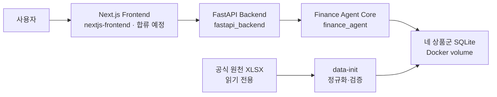

# gaeng3

미래에셋증권 AI Festival의 **금융상품 Agent** 프로젝트

사용자의 자연어 질문을 이해하고 주최 측 제공 데이터에서 국내채권, 국내·해외
ETF·ETN, 공모펀드를 조회·비교·계산한 뒤 근거와 기준일을 함께 제공하는 서비스 개발

이 문서는 프로젝트 전체 구조와 실행 방법을 안내함. 각 영역의 개발 방법은 해당
디렉터리 README에서 관리

## 1. 프로젝트 목표

- 여러 금융 조건이 포함된 자연어 상품 검색
- 상품 상세 정보 조회와 두 상품 비교
- 상품 수·평균·최솟값·최댓값·순위 등의 정확한 계산
- 검색 결과와 금융 용어의 근거 기반 설명
- 데이터로 확인할 수 없는 질문은 추측하지 않고 한계 안내 또는 역질문

핵심 원칙은 LLM이 금융상품과 숫자를 임의로 만들어내지 않도록 하는 것

- Python과 SQLite가 조건 검색·정렬·계산 수행
- 검증기가 상품명·수치·순위·기준일·출처 재검사
- LLM은 허용된 범위에서 질문 해석과 검증된 결과 설명 담당
- 검증에 실패하면 근거 없는 답변 대신 안전한 정해진 답변 제공

## 2. 현재 구성

| 영역 | 현재 상태 |
| --- | --- |
| 데이터 | 공식 XLSX에서 네 상품군 SQLite를 자동 생성·검증하는 경로 구현 |
| Ontology | 공식 파일명 Turtle 5개를 field registry에서 자동 생성·문법·정합성 검사 |
| AI Agent | 검색·비교·집계·근거 생성·결과 검증 구현 |
| Backend | FastAPI `GET /health`, 내부용 `POST /answer`, 평가용 `GET /answer` 구현 |
| Frontend | 동료의 `nextjs-frontend/` 코드 합류 후 연결 예정 |
| LLM | 로컬 Qwen은 내부 개발에만 사용, HyperCLOVA X는 크레딧·실제 API 규격 확보 후 연결 |
| 자동 검증 | AI Core pytest 466개와 Backend 34개·문서·Docker 검증 경로 관리 |

세부 기능과 평가 결과는 [AI Agent 작업공간](finance_agent/README.md)에서 관리

## 3. 전체 구조



현재 Agent Core는 별도 HTTP 서버가 아니라 Backend 이미지에 설치되어 같은 프로세스
안에서 실행. 향후 Frontend가 합류해도 루트의 Compose가 전체 서비스를 관리

## 4. 저장소 구조

```text
gaeng3/
├── compose.sh                        # 전체 Docker 실행 진입점
├── rehearse.sh                       # Docker·경계·테스트·문서 전체 리허설
├── docker-compose.yml               # 현재 data-init·Backend 서비스 구성
├── nextjs-frontend/                 # Next.js 화면(합류 예정)
├── ontology/                        # 제출용 공통·상품군별 Turtle 5개
├── fastapi_backend/                 # FastAPI API·Docker·HTTP 테스트
│   └── README.md                     # Backend 개발 안내
├── finance_agent/                   # 검색·검증·답변 생성 Agent Core
│   └── README.md                     # Agent 개발·평가 안내
├── docs/                             # 팀 공통 문서와 기술 제안서 자료
│   └── README.md                     # 문서 읽는 순서
├── CONTRIBUTING.md                   # 브랜치·커밋·PR 규칙
└── THIRD_PARTY_NOTICES.md            # 템플릿·외부 구성요소 고지
```

`nextjs-frontend/`는 아직 현재 브랜치에 없는 예정 경로. 동료 코드가 합류하면 해당
디렉터리 README에서 화면 개발·테스트 방법을 관리

## 5. 전체 시스템 실행

모든 Docker 명령은 `fastapi_backend/`가 아니라 저장소 루트 `gaeng3/`에서 실행

### 5.1 최초 준비

Docker가 실행 중인지 확인하고 환경 설정 파일을 최초 한 번 생성

```bash
docker info
test -f fastapi_backend/.env || \
  cp fastapi_backend/.env.example fastapi_backend/.env
```

기본 원천 데이터 경로는 프로젝트의 `2. Data/1. Raw/1.금융상품`. 다른 위치를
사용한다면 `fastapi_backend/.env`의 `FINANCE_RAW_DATA_DIR` 수정

### 5.2 실행

```bash
./compose.sh up --detach --wait
```

한 명령으로 다음 작업 수행

1. Backend 이미지 빌드
2. 공식 XLSX에서 네 상품군 SQLite 생성 또는 재사용
3. 데이터 무결성과 상품군 확인
4. 데이터 준비 성공 후 FastAPI Backend 시작
5. Backend가 정상 상태가 될 때까지 대기

`nextjs-frontend/`와 Compose `frontend` 서비스가 추가된 뒤에도 같은 명령으로 전체
서비스를 실행할 예정

### 5.3 상태와 API 확인

```bash
./compose.sh ps --all
curl --fail http://127.0.0.1:18001/health
```

기본 Backend 주소는 `http://127.0.0.1:18001`. `fastapi_backend/.env`에서
`BACKEND_PORT=18002`로 변경했다면 확인 주소도 `18002` 사용

질문 한 건을 직접 보내는 예시

```bash
curl --fail-with-body \
  --request POST \
  --header 'Content-Type: application/json' \
  --data '{"schema_version":"1.0","request_id":"manual-001","question":"매수 가능한 국내채권을 매수수익률 높은 순으로 3개 보여줘.","locale":"ko-KR"}' \
  http://127.0.0.1:18001/answer
```

위 `POST /answer`는 Frontend가 상품·근거·상태를 세부적으로 받기 위한 내부 API다.
주최 측 평가 규격을 확인하는 `GET /answer`는 다음처럼 호출한다.

```bash
curl --get --fail-with-body \
  --data-urlencode 'question_id=Q-001' \
  --data-urlencode 'question=현재 판매 가능한 원화채권 중 AA- 이상 종목 알려줘' \
  http://127.0.0.1:18001/answer
```

API 명세 화면은 `http://127.0.0.1:18001/docs`에서 확인

### 5.4 로그 확인

```bash
# 데이터 준비 결과
./compose.sh logs data-init

# Backend 실시간 로그
./compose.sh logs --follow backend
```

실시간 로그 확인을 끝내려면 `Ctrl+C` 입력

### 5.5 종료와 재실행

```bash
# 컨테이너 종료, 생성된 SQLite volume은 보존
./compose.sh down

# 코드 변경 후 이미지 재빌드와 실행
./compose.sh up --detach --wait
```

정규화된 SQLite까지 지우고 공식 XLSX부터 다시 준비할 때만 다음 명령 사용

```bash
./compose.sh down --volumes
./compose.sh up --detach --wait
```

`down --volumes`는 Compose가 생성한 정규화 데이터 volume만 삭제. 읽기 전용으로
연결한 공식 원본 XLSX는 삭제하지 않음

### 5.6 실행 문제가 있을 때

- Docker 권한 오류: `id`에 `docker` 그룹이 있는지 확인한 뒤 재로그인
- 포트 충돌: `fastapi_backend/.env`의 `BACKEND_PORT` 변경
- Backend 상태 이상: `./compose.sh logs data-init backend` 확인
- 자세한 진단과 HTTP 스모크: [Backend README](fastapi_backend/README.md) 참고

루트 [compose.sh](compose.sh)는 한글 프로젝트 경로에서 일부 Docker Compose 버전이
이미지 build context를 찾지 못하는 문제까지 처리하는 프로젝트 공식 실행 진입점

### 5.7 한 명령 전체 리허설

기본 Docker 기동, 공모펀드 잠금 확인, Backend·공식 GET 14건 스모크,
개발/제출 경계 검사, Agent·Backend 전체 테스트와 문서 검사를 한 번에 실행

```bash
PYTHON_BIN=/home/haeyeongcho/miniforge3/envs/gaeng3-dev/bin/python \
  ./rehearse.sh
```

이미 최신 이미지를 빌드했다면 `--no-build` 사용. 공식 범위 확인 후 로컬 LLM
흔적을 제거한 제출 후보에서는 `--submission`을 붙이며, 현재 개발 저장소에서는
관련 파일이 남아 있으므로 이 옵션이 실패하는 것이 정상

## 6. 영역별 개발 안내

| 작업 | 시작 문서 | 실행 위치 |
| --- | --- | --- |
| 전체 시스템 실행 | 이 README | 저장소 루트 |
| FastAPI·Docker·HTTP 계약 | [Backend README](fastapi_backend/README.md) | 저장소 루트 또는 `fastapi_backend/` |
| Agent·검색·검증·평가 | [AI Agent README](finance_agent/README.md) | `finance_agent/` |
| Ontology 생성·검사 | [Ontology 제출 계약](finance_agent/docs/ontology.md) | `finance_agent/` |
| 팀 문서·기술 제안서 | [문서 안내](docs/README.md) | `docs/` |
| 기술 제안서 작성 | [기술 제안서 허브](docs/proposal/README.md) | `docs/proposal/` |
| 협업·커밋·PR | [CONTRIBUTING](CONTRIBUTING.md) | 저장소 전체 |

## 7. LLM과 데이터 원칙

- 평가·제출 경로의 LLM은 공식 규칙에 따라 HyperCLOVA X만 사용
- 로컬 Qwen은 크레딧과 실제 HCX API 규격을 확보하기 전 내부 회귀·E2E·장애 검증에만 사용
- 공식 범위 확인 후 제출 후보에서 로컬 모델 관련 코드·설정·의존성 제거 및 검사
- 답변의 상품명·수치·순위·출처는 제공 데이터와 결정론적 코드로 검증
- 공식 데이터와 외부 데이터가 충돌하면 공식 데이터 우선
- 원천 XLSX, 생성 DB, 평가 응답, 로그와 모델 가중치는 Git에 포함하지 않음

세부 기준은 [현재 프로젝트 기준](finance_agent/docs/project-baseline.md)과
[제출용 모델 경계](finance_agent/docs/submission-model-boundary.md)에서 관리

## 8. 문서와 담당

처음 프로젝트를 확인한다면 다음 순서로 읽는 것을 권장

1. 이 README에서 프로젝트와 실행 방법 확인
2. [저장소 문서 안내](docs/README.md)에서 목적에 맞는 문서 선택
3. 코드 작업 전 [CONTRIBUTING](CONTRIBUTING.md) 확인
4. 담당 영역의 README에서 개발·검증 방법 확인

| 역할 | 담당자 |
| --- | --- |
| Frontend & Backend | 임현호 |
| AI Agent | 조해영 |
| Financial Domain | 박재모 |
