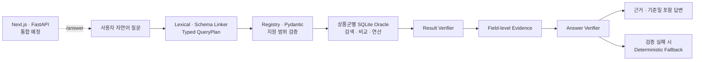

# gaeng3

미래에셋증권 AI Festival 금융상품 Agent

사용자의 자연어 질문을 해석해 국내채권, 국내·해외 ETF·ETN과 공모펀드를
조회·비교·연산하고, 사용한 데이터 근거와 기준일을 함께 제공하는 금융상품
AI Agent를 개발함

현재 저장소는 검증 가능한 AI Agent Core를 먼저 구축한 상태이며,
Next.js·FastAPI 애플리케이션 통합과 HyperCLOVA X 연결을 준비하고 있음

## 1. 목표

단순 키워드 검색을 넘어 다음 질문을 처리하는 Agent 구현이 목표

- 여러 금융 조건이 포함된 자연어 상품 검색
- 상품 상세 정보 조회
- 같은 상품군의 정확한 두 상품 비교
- 상품군 간 질문은 의미·단위가 검증된 범위부터 단계적으로 확장
- 정렬, 순위, 집계와 계산
- 검색 결과와 금융 용어 설명
- 모호하거나 데이터로 확인할 수 없는 조건에 대한 역질문

핵심 설계 원칙은 **LLM이 검색 결과를 직접 만들어내지 않도록 하는 것**

- LLM은 자연어를 검증 가능한 `QueryPlan`으로 변환하고 결과 설명을 담당
- Python과 SQLite가 수치 필터, 정렬, 연산과 순위를 결정론적으로 처리
- Verifier가 반환 상품과 필드 단위 근거를 다시 검증
- 검증에 실패하면 근거 없는 답변 대신 안전한 결정론적 응답으로 전환

## 2. 현재 구현 상태

기준일: 2026-07-30

| 영역 | 상태 |
| --- | --- |
| 데이터 감사 | 4종 마스터 145,393행, 핵심 expectation 65/65 통과 |
| 해외 ETF·ETN | 정규화, SQLite, Oracle, Verifier, 50문항 평가 구현 |
| 국내 ETF·ETN | 정규화, SQLite, Oracle, Verifier, 50문항 평가 구현 |
| 국내채권 | 날짜·stale·신용등급 계약, Oracle, Verifier, 50문항 평가 구현 |
| 공모펀드 | parser development 40/40·최초 holdout 9/10, grounded answer 50/50, 공식 실행 비활성 |
| 근거 기반 답변 | 공모펀드 44개 grounded·6개 안전 차단, 폴백 0, 핵심 검증률 100% |
| 로컬 LLM | 격리된 Qwen/vLLM 개발 테스트 완료, 평가·제출 사용 금지 |
| HyperCLOVA X | 세 provider·fake transport·API 없는 전체 경로 8/8, 실제 HTTP 연결 대기 |
| Web·API | 프레임워크 독립 `/answer` 오류 adapter 12/12, FastAPI route 통합 대기 |
| 내부 red-team | 네 상품군 40문항, 수정 후 strict·safety·evidence 40/40 |

현재 AI Core 회귀 기준은 pytest 312개, Ruff lint·format과 문서 검사를 모두
통과한 상태

## 3. 아키텍처



상품군마다 원천 스키마와 품질 규칙은 다르지만 다음 계약을 공통으로 사용

```text
질문
→ QueryPlan
→ 상품군별 결정론적 도구
→ Result Verifier
→ Field-level Evidence
→ Answer Verifier
→ 검증된 최종 답변
```

## 4. 저장소 구조

```text
gaeng3/
├── finance_agent/
│   ├── packages/finance_agent_core/  # Agent Core Python package
│   ├── evaluation/                   # 재현 가능한 평가 기준선
│   ├── docs/                         # AI 설계·데이터·평가 문서
│   ├── scripts/                      # 감사·평가·로컬 LLM 실행 도구
│   ├── requirements/                 # pip 의존성
│   ├── environment.yml               # Conda 개발 환경
│   └── README.md                     # AI 작업공간 상세 안내
├── CONTRIBUTING.md                   # 개발 협업·커밋·PR 규칙
└── README.md
```

`finance_agent/`는 애플리케이션 템플릿과 독립적으로 개발하며, 향후 FastAPI가
`finance_agent_core`를 명시적인 요청·응답 계약으로 연결

## 5. AI Agent 개발 환경

Conda로 Python 런타임을 격리하고 pip로 프로젝트 의존성을 설치

```bash
cd finance_agent

conda env create -f environment.yml
conda run -n gaeng3-dev \
  python -m pip install -r requirements/dev.txt
```

이미 환경이 있다면 다음 명령으로 갱신

```bash
conda env update -n gaeng3-dev -f environment.yml
```

## 6. 검증

`finance_agent/` 디렉터리에서 실행

```bash
conda run -n gaeng3-dev python -m pytest -q
conda run -n gaeng3-dev python -m ruff check .
conda run -n gaeng3-dev python -m ruff format --check .
conda run -n gaeng3-dev python scripts/check-docs.py
```

공식 원천 데이터, 생성된 SQLite DB, 평가 응답, 로그와 로컬 모델 가중치는
Git에 포함하지 않음

## 7. LLM과 데이터 정책

- 평가와 제출 경로의 LLM은 HyperCLOVA X만 사용
- 로컬 Qwen은 HyperCLOVA X 연결 전 개발 파이프라인 검증에만 사용
- 다른 생성형 LLM 또는 VLM은 평가·제출 경로에서 사용 금지
- 답변의 수치, 조건, 순위와 출처는 코드가 검색·연산·검증
- 공식 제공 데이터와 외부 데이터가 충돌하면 공식 데이터를 우선
- 데이터로 확인할 수 없는 내용은 추측하지 않고 확인 불가 또는 역질문으로 처리
- 외부 금융 데이터는 출처, 수집일, 사용 조건과 충돌 처리 방식을 문서화

세부 정책은 [현재 프로젝트 기준](finance_agent/docs/project-baseline.md)에서 관리

## 8. 다음 작업

- 금융 도메인 담당자의 공모펀드 blind 100문항 독립 작성과 hash 봉인
- 사람 rubric으로 공모펀드 답변의 명확성·중복·비교 용이성 평가
- 공모펀드 true COMPARE intent의 생성·검증·폴백 평가
- 다른 작성자가 만든 blind 평가 문항 추가
- Next.js·FastAPI 애플리케이션 템플릿 통합
- 확정된 Backend DTO·오류 adapter를 Next.js·FastAPI shell에 연결
- HyperCLOVA X 실제 HTTP transport와 FastAPI `/answer` route 연결
- 허용 범위를 확인한 외부 비정형 금융 데이터와 문서 RAG 검토

## 9. 문서

- [개발 협업 가이드](CONTRIBUTING.md)
- [AI Agent 작업공간](finance_agent/README.md)
- [프로젝트 문서 인덱스](finance_agent/docs/project-index.md)
- [기술 제안서 작성 허브](docs/proposal/README.md)
- [데이터 감사 기준](finance_agent/docs/data-audit.md)
- [Field Registry와 QueryPlan 계약](finance_agent/docs/contracts.md)
- [재현 가능한 평가 기준선](finance_agent/evaluation/README.md)

## 10. 담당

| 역할 | 담당자 |
| --- | --- |
| Frontend & Backend | 임현호 |
| AI Agent | 조해영 |
| Financial Domain | 박재모 |

개발 브랜치, 커밋 메시지와 Pull Request 규칙은
[CONTRIBUTING](CONTRIBUTING.md)을 따름
