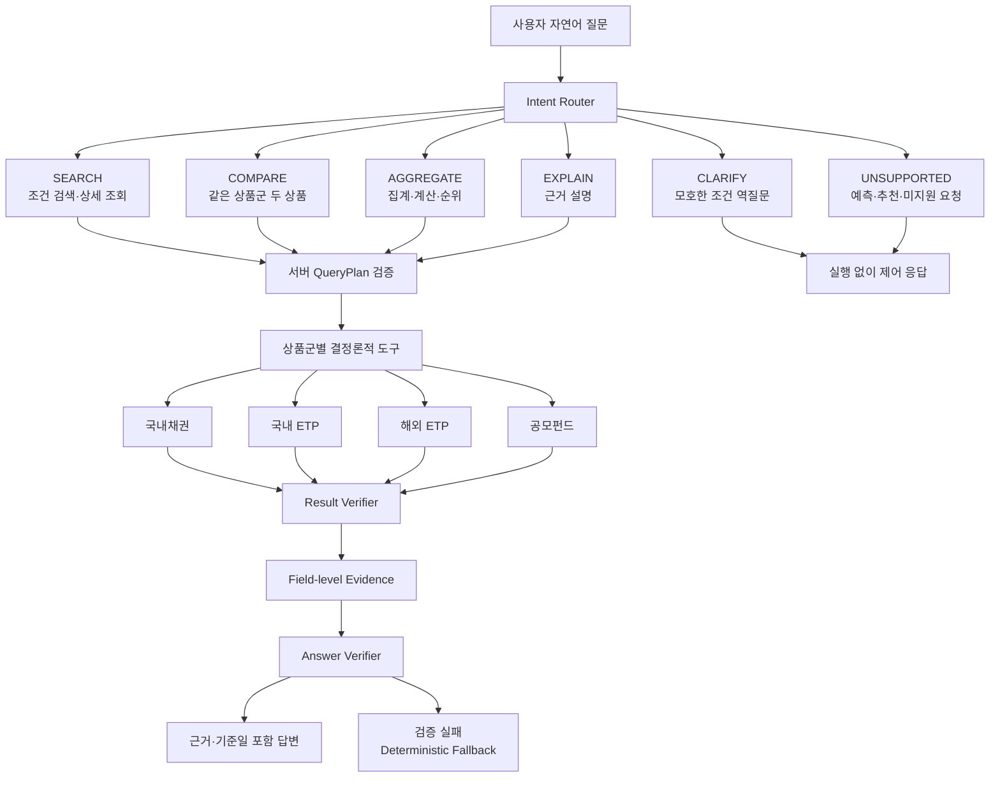

# 금융상품 Agent 주요 기능 흐름도

상태: 초안 v0.1

기준일: 2026-07-31

## 실행 원칙

- SEARCH는 지원 조건·정렬·limit만 실행
- COMPARE는 같은 상품군의 정확한 두 상품과 승인 필드만 실행
- AGGREGATE는 허용 함수·그룹·통화 정책을 서버가 결정
- EXPLAIN은 검증된 정형 evidence를 사용하며 실제 문서 corpus는 승인 대기
- CLARIFY·UNSUPPORTED는 Oracle과 답변 모델을 불필요하게 호출하지 않음
- 답변 검증 실패는 근거 없는 재생성이 아니라 결정론적 fallback으로 종료
