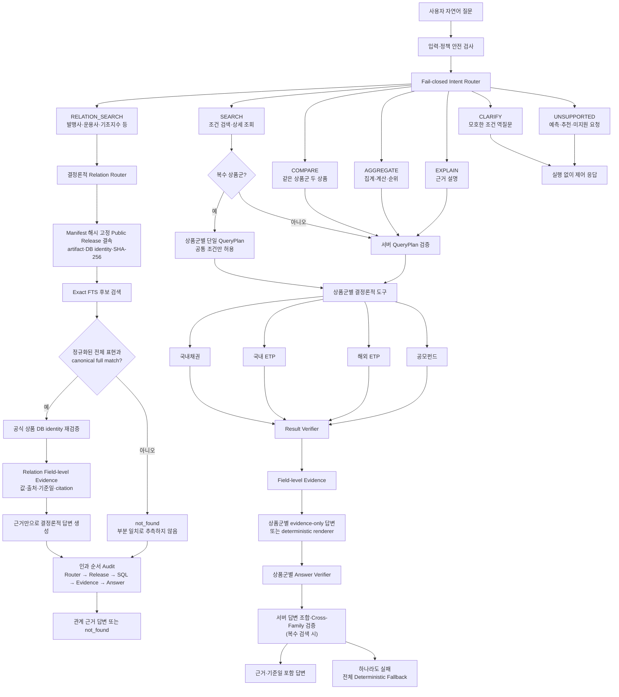

# 금융상품 Agent 주요 기능 흐름도

상태: 초안 v0.3 · P0-10 공개 관계 검색 로컬 검증 반영

기준일: 2026-08-20

실선으로 표시한 관계 검색 경로의 판정은 `local implementation verified`이며,
NCP 실제 배포 완료를 뜻하지 않는다.

## 실행 원칙

- SEARCH는 지원 조건·정렬·limit만 실행
- 복수 상품군 SEARCH는 각 상품군을 독립 검증하고 부분 결과를 보존
- 복수 상품군 답변 생성에는 해당 family의 질문·계획·evidence·manifest만 전달
- 서버가 family별 답변을 조합하고 교차 상품군 문구·비교·집계를 검증
- 상품군 간 직접 수치 비교·합산·우열 판단과 서로 다른 family 조건은 차단
- COMPARE는 같은 상품군의 정확한 두 상품과 승인 필드만 실행
- AGGREGATE는 허용 함수·그룹·통화 정책을 서버가 결정
- EXPLAIN은 검증된 정형 evidence를 사용하며 실제 문서 corpus는 승인 대기
- RELATION_SEARCH는 manifest에 해시로 고정된 public release 계약에서 허용한 관계만 실행하고,
  exact FTS 후보를 canonical 전체 일치와 공식 DB identity로 다시 검증
- 관계 검색은 현재 HyperCLOVA X claim provider를 사용하지 않고 필드 근거만으로
  결정론적 답변을 생성하며, 부분 표현은 유사 상품으로 넘기지 않고 `not_found`로 종료
- 공개 관계 경로의 NCP 실제 배포·관계 HCLX·alias 의미 blind는 후속 검증
- CLARIFY·UNSUPPORTED는 Oracle과 답변 모델을 불필요하게 호출하지 않음
- 답변 검증 실패는 근거 없는 재생성이 아니라 결정론적 fallback으로 종료
