# 금융상품 Agent 시스템 구성도

상태: 초안 v0.3 · 설명회 계약 반영

기준일: 2026-08-07

실선은 Agent Core와 FastAPI에서 검증된 경로, 점선은 외부 통합이 남은 경로다.

```mermaid
flowchart LR
    U["사용자"] -.-> WEB["Next.js UI<br/>통합 대기"]
    WEB -.-> API["내부 FastAPI POST /answer<br/>로컬 통합 완료"]
    CLIENT["주최 측 평가 client"] -.-> OFFICIAL["공식 GET /answer adapter<br/>FastAPI 구현 · 계약 테스트 완료"]
    OFFICIAL -.-> REQ
    API --> REQ["BackendAgentRequest"]

    REQ --> ROUTER["Fail-closed Intent Router"]
    ROUTER --> PLAN["서버 QueryPlan Compiler<br/>capability 검증"]
    PLAN -.->|"선택적 SEARCH 계획·근거 설명"| HCX["HyperCLOVA X<br/>실제 transport 대기"]
    HCX -.->|"서버 계획 exact-match gate"| PLAN

    PLAN --> SPLIT["단일 또는 복수 상품군<br/>단일-family 계획 분리"]
    SPLIT --> TOOLS["상품군별 결정론적 도구<br/>복수 SEARCH 병렬 실행"]
    TOOLS --> DB["정규화 SQLite<br/>채권 · 국내/해외 ETP · 공모펀드"]
    DB --> RV["Result Verifier"]
    RV --> EVIDENCE["Field-level Evidence<br/>비교 · 집계 · 문서 citation"]
    EVIDENCE --> FAMILY_ANSWER["상품군별 evidence-only 답변<br/>또는 deterministic renderer"]
    FAMILY_ANSWER --> AV["상품군별 Answer Verifier"]
    AV --> COMPOSE["서버 답변 조합<br/>Cross-Family Verifier"]
    COMPOSE --> DTO["BackendAgentResponse"]
    COMPOSE --> FALLBACK["하나라도 실패하면<br/>전체 Deterministic Fallback"]
    FALLBACK --> DTO

    DTO --> API
    DTO -.-> OFFICIAL
    API -.-> WEB
    OFFICIAL -.-> CLIENT

    REGISTRY["Field Registry<br/>현재 의미 정본"] --> TTL["Ontology Turtle 5개<br/>생성·문법·정합성 검사 완료"]

    CORPUS["승인된 외부 문서 corpus<br/>수집·검수 대기"] -.-> RAG["BM25 / SQLite FTS"]
    RAG -.-> EVIDENCE
```

## 현재 검증 완료

- 네 상품군 원천 감사·정규화 SQLite
- fail-closed Router와 capability matrix
- SEARCH·same-family COMPARE·AGGREGATE
- 복수 상품군 독립 SEARCH와 부분 결과 보존
- 독립 Result Verifier와 field-level evidence
- 상품군별 evidence-only grounded answer·Answer Verifier·교차 검증·전체 deterministic fallback
- 프레임워크 독립 Backend DTO와 service adapter
- FastAPI `/health`·`/answer`, 안전한 422 DTO와 실제 SQLite 로컬 HTTP smoke test
- 공식 `GET /answer` 다섯 문자열 adapter와 전 결과 HTTP 200 계약
- 도메인별 Ontology Turtle 5개와 field registry exact-match 검사
- Ubuntu SSH Docker build·데이터 준비·Backend HTTP smoke
- HyperCLOVA X fake transport·오류 계약

## 외부 통합 대기

- Next.js 실제 화면
- 공식 `GET /answer`의 공개 서버·평가 client 통신 재현
- HyperCLOVA X 실제 endpoint·인증
- 승인된 실제 비정형 금융 문서
- public 배포·평가 기간 API 운영

최종 제안서에서는 통합 완료 후 점선을 실선으로 바꾸고 실제 배포 구성과
모니터링 계층을 반영한다.
