# 금융상품 Agent 시스템 구성도

상태: 초안 v0.1

기준일: 2026-07-31

실선은 현재 Agent Core에서 검증된 경로, 점선은 외부 통합이 남은 경로다.

```mermaid
flowchart LR
    U["사용자"] -.-> WEB["Next.js UI<br/>통합 대기"]
    WEB -.-> API["FastAPI GET /answer<br/>통합 대기"]
    API -.-> REQ["BackendAgentRequest"]

    REQ --> ROUTER["Fail-closed Intent Router"]
    ROUTER --> PLAN["서버 QueryPlan Compiler<br/>capability 검증"]
    PLAN -.->|"선택적 SEARCH 계획·근거 설명"| HCX["HyperCLOVA X<br/>실제 transport 대기"]
    HCX -.->|"서버 계획 exact-match gate"| PLAN

    PLAN --> SPLIT["단일 또는 복수 상품군<br/>단일-family 계획 분리"]
    SPLIT --> TOOLS["상품군별 결정론적 도구<br/>복수 SEARCH 병렬 실행"]
    TOOLS --> DB["정규화 SQLite<br/>채권 · 국내/해외 ETP · 공모펀드"]
    DB --> RV["Result Verifier"]
    RV --> EVIDENCE["Field-level Evidence<br/>비교 · 집계 · 문서 citation"]
    EVIDENCE --> ANSWER["Grounded Answer /<br/>Deterministic Renderer"]
    ANSWER --> AV["Answer Verifier"]
    AV --> DTO["BackendAgentResponse"]
    AV --> FALLBACK["검증 실패 시<br/>Deterministic Fallback"]
    FALLBACK --> DTO

    DTO -.-> API
    API -.-> U

    CORPUS["승인된 외부 문서 corpus<br/>수집·검수 대기"] -.-> RAG["BM25 / SQLite FTS"]
    RAG -.-> EVIDENCE
```

## 현재 검증 완료

- 네 상품군 원천 감사·정규화 SQLite
- fail-closed Router와 capability matrix
- SEARCH·same-family COMPARE·AGGREGATE
- 복수 상품군 독립 SEARCH와 부분 결과 보존
- 독립 Result Verifier와 field-level evidence
- grounded answer·Answer Verifier·deterministic fallback
- 프레임워크 독립 Backend DTO와 service adapter
- HyperCLOVA X fake transport·오류 계약

## 외부 통합 대기

- Next.js 실제 화면
- FastAPI 공식 `/answer` route
- HyperCLOVA X 실제 endpoint·인증
- 승인된 실제 비정형 금융 문서
- Docker·배포·공개 API 운영

최종 제안서에서는 통합 완료 후 점선을 실선으로 바꾸고 실제 배포 구성과
모니터링 계층을 반영한다.
