# 금융상품 Agent 시스템 구성도

상태: 초안 v0.7 · P0-10 공개 관계 검색 릴리스 로컬 검증 반영

기준일: 2026-08-20

실선은 Agent Core·FastAPI·clean Docker에서 로컬 검증된 경로, 점선은 외부
통합이 남은 경로다. 실선의 판정은 `local implementation verified`이며
NCP 실제 배포를 의미하지는 않는다.

```mermaid
flowchart LR
    U["사용자"] -.-> WEB["Next.js UI<br/>통합 대기"]
    WEB -.-> API["내부 FastAPI POST /answer<br/>로컬 통합 완료"]
    CLIENT["주최 측 평가 client"] -.-> OFFICIAL["공식 GET /answer adapter<br/>FastAPI 구현 · 계약 테스트 완료"]
    OFFICIAL --> REQ
    API --> REQ["BackendAgentRequest"]

    REQ --> SAFE["입력·정책 안전 검사"]
    SAFE --> ROUTER["Fail-closed Intent Router"]
    ROUTER --> PLAN["서버 QueryPlan Compiler<br/>capability 검증"]
    PLAN -.->|"선택적 SEARCH 계획·근거 설명"| HCX["HyperCLOVA X<br/>실제 transport 대기"]
    HCX -.->|"서버 계획 exact-match gate"| PLAN

    PLAN --> SPLIT["단일 또는 복수 상품군<br/>단일-family 계획 분리"]
    SPLIT --> TOOLS["상품군별 결정론적 도구<br/>복수 SEARCH 병렬 실행"]
    TOOLS --> DB["정규화 SQLite<br/>채권 · 국내/해외 ETP · 공모펀드"]
    DB --> RV["Result Verifier"]
    RV --> EVIDENCE["Field-level Evidence<br/>비교 · 집계 · 문서 citation"]
    EVIDENCE --> FAMILY_ANSWER["상품군별 evidence-only 답변<br/>또는 deterministic renderer"]
    FAMILY_ANSWER --> AV["상품군별 Answer Verifier"]
    AV --> COMPOSE["서버 답변 조합<br/>Cross-Family Verifier"]
    COMPOSE --> DTO["BackendAgentResponse"]
    COMPOSE --> FALLBACK["하나라도 실패하면<br/>전체 Deterministic Fallback"]
    FALLBACK --> DTO

    ROUTER --> KROUTER["결정론적 Relation Router"]
    KROUTER --> KBIND["Manifest 해시 고정 Public Relation Release 결속"]
    SIGNED["해시 고정 AgentReleaseManifest 1.2 계약"] --> KBIND
    KHASH["read-only relation artifact·DB<br/>identity·SHA-256"] --> KBIND
    KBIND --> REL["Exact FTS 후보<br/>발행사 · 운용사 · 지수 · 자산 · 지역"]
    KBIND -->|"불일치·변조"| K503["health·질문 API 503<br/>fail-closed"]
    REL --> KFULL["canonical 전체 표현 exact match"]
    KFULL -->|"부분 표현"| KNF["not_found"]
    KFULL -->|"전체 일치"| KID["공식 상품 DB identity 재검증"]
    DB --> KID
    KID --> KEVIDENCE["Relation Field-level Evidence<br/>값 · 출처 · 기준일 · citation"]
    KEVIDENCE --> KANSWER["결정론적 관계 답변"]
    KANSWER --> KAUDIT["인과 순서 Audit"]
    KNF --> KAUDIT
    KAUDIT --> DTO

    DTO --> API
    DTO --> OFFICIAL
    API -.-> WEB
    OFFICIAL -.-> CLIENT

    REGISTRY["Field Registry<br/>현재 의미 정본"] --> TTL["Ontology Turtle 5개<br/>생성·문법·정합성 검사 완료"]

    CORPUS["실제 외부 문서 corpus<br/>출처·권한 승인 대기"] -.-> INTAKE["독립 review·HTTPS 출처<br/>권한·byte/normalized hash 봉인"]
    INTAKE --> RAG["BM25 / SQLite FTS<br/>검증된 새 색인 build"]
    RAG -.-> EVIDENCE
```

## 현재 검증 완료

- 네 상품군 원천 감사·정규화 SQLite
- fail-closed Router와 capability matrix
- SEARCH·same-family COMPARE·AGGREGATE
- 복수 상품군 독립 SEARCH와 부분 결과 보존
- 독립 Result Verifier와 field-level evidence
- 상품군별 evidence-only grounded answer·Answer Verifier·교차 검증·전체 deterministic fallback
- 프레임워크 독립 Backend DTO와 service adapter
- FastAPI `/health`·`/answer`, 안전한 422 DTO와 실제 SQLite 로컬 HTTP smoke test
- 공식 `GET /answer` 다섯 문자열 adapter, 답변/제어 200·일시 장애 503/504 계약,
  동일 요청 single-flight·안전 결과 replay
- 도메인별 Ontology Turtle 5개와 field registry exact-match 검사
- Ubuntu SSH Docker build·데이터 준비·Backend HTTP smoke
- HyperCLOVA X fake transport·오류 계약
- P0-5 외부 문서 독립 승인·사용 권한·해시·변조 차단·BM25 색인 build 계약
- P0-6 승인 상품 DB 관계 58,005개·공식 상품 ID 재검증·출처·기준일·변조 차단 계약
- P0-7 관계·문서 Typed Plan·서버 exact 권한·evidence Claim Verifier·전체 fallback 내부 계약
- P0-10 결정론적 관계 Router·manifest에 해시로 고정된 public release 결속·exact FTS 후보·canonical
  전체 일치·공식 DB identity 재검증·field evidence·결정론적 답변·인과적 Audit
- P0-10 집중 회귀 522/522, Agent Core 1,443 passed·2 skipped,
  Backend 358 passed·2 warnings
- clean Docker Backend smoke 8/8·공식 형식 GET 호환 smoke 8/8, 관계 3 products/3 citations,
  부분 표현 `not_found`, 변조 후 health·API 503
- 수치·실행 범위·한계의 정본은 [P0-10 machine-readable baseline](../../../finance_agent/evaluation/baselines/p0-10-public-relation-release-integration-v1.json)

## 외부 통합 대기

- Next.js 실제 화면
- NCP의 실제 서명 배포·공인 IP·평가 client 통신 재현
- 서명된 두 release 간 forward·rollback drill
- HyperCLOVA X 실제 endpoint·인증
- 관계 답변용 HyperCLOVA X claim provider
- 승인된 실제 비정형 금융 문서
- 제공 관계의 금융 alias·의미 독립 blind 검증
- public 배포·평가 기간 API 운영

최종 제안서에서는 통합 완료 후 점선을 실선으로 바꾸고 실제 배포 구성과
모니터링 계층을 반영한다.
