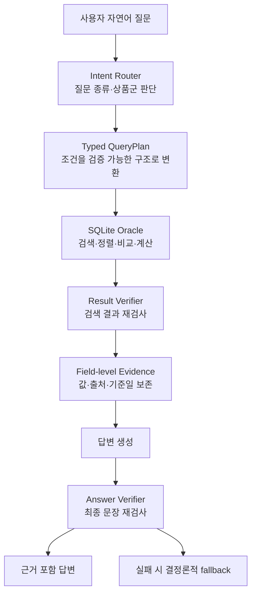

# finance_agent

금융상품 Agent의 검색·계산·검증·근거 생성과 평가 코드를 관리하는 AI 작업공간

프로젝트 전체 실행 방법은 [루트 README](../README.md), FastAPI 연동 방법은
[Backend README](../fastapi_backend/README.md)에서 관리. 이 문서는 Agent 개발자가
`finance_agent/` 안에서 작업할 때 필요한 내용만 설명

## 1. 이 디렉터리의 역할

### 포함하는 것

- 공식 금융상품 XLSX 감사와 정규화
- 국내채권·국내 ETF·ETN·해외 ETF·ETN·공모펀드 검색
- 상품 비교와 개수·평균·최솟값·최댓값·순위 계산
- 자연어 질문을 검증 가능한 `QueryPlan`으로 변환
- 검색 결과, 필드별 근거와 기준일 생성
- 결과와 최종 답변의 상품명·수치·순위·출처 검증
- 공개 회귀·blind·red-team·사람 평가를 위한 도구와 기준선
- 개발 전용 로컬 Qwen과 향후 HyperCLOVA X provider 계약

### 포함하지 않는 것

- 웹 화면과 사용자 인터페이스
- FastAPI route, 인증, CORS와 HTTP 서버 수명주기
- 전체 Docker Compose 운영
- 공식 원천 XLSX와 생성된 SQLite·평가 결과의 Git 보관

## 2. 처리 흐름



LLM은 수치 계산, 필터, 정렬, 상품 순위와 출처를 직접 만들지 않음. LLM을 사용하지
않아도 검색·계산·검증·안전 답변 경로를 실행할 수 있도록 설계

## 3. 현재 지원 범위

| 영역 | 지원 내용 |
| --- | --- |
| 국내채권 | 검색·상세·비교·집계·날짜·신용등급·근거 검증 |
| 국내 ETF·ETN | 검색·상세·비교·집계·근거 검증 |
| 해외 ETF·ETN | 검색·상세·비교·집계·교차 상품군 검색·근거 검증 |
| 공모펀드 | 검색·비교·집계·grounded answer 내부 검증, 공식 실행은 정책상 비활성 |
| 문서 검색 | 제공된 문서를 대상으로 하는 BM25·SQLite FTS 최소 기능 |
| Backend 연동 | 요청·응답 DTO, 오류 adapter와 JSON Schema 제공 |

세부 필드와 제한은 [Capability matrix](docs/capability-matrix.md), 최신 구현·평가 상태는
[현재 프로젝트 기준](docs/project-baseline.md)에서 확인

## 4. 디렉터리 구조

```text
finance_agent/
├── packages/finance_agent_core/  # 설치 가능한 Agent Core Python package
├── evaluation/                   # 평가 데이터·기준선·봉인 프로토콜
├── docs/                         # 설계·데이터 계약·평가 해석 문서
├── scripts/                      # 감사·평가·로컬 LLM 실행 도구
├── requirements/                 # base·dev pip 의존성
├── notebooks/                    # 재현 가능한 탐색 작업
├── reports/                      # 공유용 분석 보고서
├── artifacts/                    # 생성 DB·평가 출력, Git 제외
└── environment.yml               # Conda 개발 환경
```

### 디렉터리별 시작 문서

| 디렉터리 | 먼저 볼 문서 | 역할 |
| --- | --- | --- |
| `docs/` | [AI 기술문서 안내](docs/README.md) | 현재 기준·계약·설계·평가 해석 |
| `packages/` | [패키지 안내](packages/README.md) | 설치 가능한 Agent Core 코드 |
| `evaluation/` | [평가 README](evaluation/README.md) | 질문 세트·baseline·봉인 프로토콜 |
| `scripts/` | [스크립트 안내](scripts/README.md) | 데이터셋 생성·계약·평가 도구 |
| `requirements/` | [의존성 안내](requirements/README.md) | base·dev·로컬 LLM pip 의존성 |
| `notebooks/` | [노트북 안내](notebooks/README.md) | 재현 가능한 데이터 탐색 |
| `reports/` | [보고서 안내](reports/README.md) | 사람이 읽는 분석 전달 자료 |

`artifacts/`는 정규화 DB와 실행 결과가 만들어지는 로컬 작업 공간이며 Git에서 제외

## 5. 개발 환경

아래 명령은 저장소 루트가 아니라 `finance_agent/`에서 실행

```bash
cd finance_agent
```

Conda로 Python 런타임을 격리하고 pip로 개발 의존성을 설치

```bash
conda env create -f environment.yml
conda run -n gaeng3-dev \
  python -m pip install -r requirements/dev.txt
```

이미 환경이 있다면 갱신

```bash
conda env update -n gaeng3-dev -f environment.yml
conda run -n gaeng3-dev \
  python -m pip install -r requirements/dev.txt
```

## 6. 코드와 문서 검증

원천 데이터 없이 실행 가능한 기본 검증

```bash
conda run -n gaeng3-dev python -m pytest -q
conda run -n gaeng3-dev python -m ruff check .
conda run -n gaeng3-dev python -m ruff format --check .
conda run -n gaeng3-dev python scripts/check-docs.py
```

평가 명령과 결과 해석은 [평가 README](evaluation/README.md)를 기준으로 사용. 공개
회귀 결과는 개발 중 같은 문항을 보며 수정한 값일 수 있으므로 독립 blind 성능이나
공모전 점수로 해석하지 않음

## 7. 공식 데이터로 Agent Core만 실행

Docker 없이 특정 상품군의 정규화와 결정론적 Agent 경로를 확인하는 개발 예시

```bash
export FINANCE_DATA_DIR="/path/to/1.금융상품"

conda run -n gaeng3-dev \
  python -m finance_agent_core.storage \
  --dataset bond \
  --data-dir "$FINANCE_DATA_DIR"

conda run -n gaeng3-dev \
  python -m finance_agent_core.agent \
  --database artifacts/normalized/bond.sqlite3 \
  --provider mock \
  --output artifacts/e2e/bond-mock-response.json
```

`--dataset`은 `bond`, `domestic_etp`, `overseas_etp`, `fund` 중 하나를 사용

전체 시스템에서 네 상품군 DB를 자동 준비하고 FastAPI까지 실행하려면 이 명령 대신
[루트 실행 방법](../README.md#5-전체-시스템-실행)을 사용

## 8. Backend 연결 경계

Backend는 Agent 내부 SQL·검색·검증을 다시 구현하지 않고 다음 공개 계약을 사용

- 요청: `BackendAgentRequest`
- 응답: `BackendAgentResponse`
- 실행: `RoutedFinanceAgent`
- HTTP 변환: `execute_answer_request()`

계약 변경 시 [Backend DTO 문서](docs/backend-contract.md), Agent 계약 테스트와
`fastapi_backend/` 테스트를 함께 수정. Frontend와 Backend는 응답 문자열만 보지 않고
`status`, `answer_mode`, `fallback_used`, `products`, `comparisons`, `aggregates`,
`citations`, `as_of_dates`, `warnings`를 용도에 맞게 사용

## 9. LLM 사용 경계

- 평가·제출 LLM은 공식 규칙에 따라 HyperCLOVA X로 제한
- 로컬 Qwen은 질문 해석과 evidence-only 답변 생성의 내부 개발 테스트에만 사용
- 검색·계산·검증은 모델 provider와 분리해 모델 교체 후에도 동일하게 재검사 가능
- 공식 제출 범위 확인 후 로컬 provider·설정·스크립트·의존성을 제거하고 자동 검사

세부 정책과 실행법

- [제출용 모델 경계](docs/submission-model-boundary.md)
- [로컬 LLM 테스트 런타임](docs/local-llm.md)
- [HyperCLOVA X provider 계약](docs/hyperclova-provider.md)

## 10. 문서 읽는 순서

처음 Agent 작업을 시작한다면 다음 순서를 권장

1. [AI 기술문서 안내](docs/README.md)
2. [프로젝트 상세 문서 인덱스](docs/project-index.md)
3. [현재 프로젝트 기준](docs/project-baseline.md)
4. [Capability matrix](docs/capability-matrix.md)
5. [데이터 감사 기준](docs/data-audit.md)
6. [Field Registry와 QueryPlan 계약](docs/contracts.md)
7. [Backend DTO](docs/backend-contract.md)
8. [평가 README](evaluation/README.md)

연구 답변과 과거 프롬프트는 구현 정본이 아님. 현재 판단에는 문서 인덱스가 지정한
정본과 동결된 평가 기준선을 우선 사용
