# 금융 도메인 QA 실험 파이프라인

기준일: 2026-07-31

## 0. 요약

- 금융 도메인 담당자가 작성한 40문항을 원본 수정 없이 개발 평가 세트로 연결
- CSV 원본과 AI 검토표의 SHA-256, 행 수, ID, 질문, 분포를 실행 전에 검증
- 현재 시스템을 Router부터 Backend DTO까지 실제 실행
- 한 개의 정확도만 보지 않고 route·safety·evidence·answer를 단계별 측정
- 최초 관측 `1/40`, safety `32/40`을 수정 전 baseline으로 보존
- 현재 세트는 독립 blind가 아니며 40문항 모두 최소 기능 시험
- 문서·외부 정책·외부 데이터가 필요한 13문항과 검색 정답이 미완성인 1문항을
  별도 pending 상태로 공개

이 실험의 목적은 좋은 점수를 즉시 만드는 것이 아니라, 지금까지 상품군별
검색 회귀에서 드러나지 않았던 자연어 처리 공백을 재현 가능하게 측정하는 것

## 1. 왜 별도 실험이 필요한가

기존 공개 회귀 세트는 지원하는 검색·비교·집계 기능이 계약대로 작동하는지
확인하는 데 강함. 반면 금융 도메인 담당자의 질문에는 다음 유형이 함께 존재

- 조건이 부족해 다시 물어봐야 하는 질문
- 데이터에 없는 수익 전망·추천을 요구해 거절해야 하는 질문
- 상품 설명서 같은 비정형 문서가 있어야 답할 수 있는 질문
- 외부 정책이나 시장 데이터가 있어야 답할 수 있는 질문
- 현재 정형 데이터로 바로 검색할 수 있는 질문

따라서 검색 가능한 문항의 정답률만으로는 Agent의 안전성과 실제 사용성을
평가할 수 없음. 이번 파이프라인은 실행해야 하는 질문과 실행하면 안 되는
질문을 같은 계약에서 측정

## 2. 연구에서 차용한 설계

| 연구 | 차용한 요소 | 현재 적용 |
| --- | --- | --- |
| [CheckList, ACL 2020](https://aclanthology.org/2020.acl-main.442/) | 기능별 capability와 MFT·INV·DIR 행동 시험 | 현재 40문항을 capability별 MFT로 명시하고 향후 표현 변형·방향성 시험을 같은 schema로 추가 |
| [FinQA, EMNLP 2021](https://aclanthology.org/2021.emnlp-main.300/) | 금융 QA의 수치 추론 과정과 실행 결과를 정답으로 관리 | 검색 문항에 gold QueryPlan과 Oracle 결과 집합을 추가하는 계약 마련 |
| [TAT-QA, ACL 2021](https://aclanthology.org/2021.acl-long.254/) | 표·문서 근거와 산술 연산을 함께 추적 | 정형 evidence와 향후 문서 evidence를 분리하고 계산은 서버가 수행 |
| [Spider, EMNLP 2018](https://aclanthology.org/D18-1425/) | 구조가 겹치지 않는 split으로 일반화 측정 | 개발 QA와 앞으로 만들 external blind를 분리하고 hash로 봉인 |
| [Distilled Test Suites, EMNLP 2020](https://aclanthology.org/2020.emnlp-main.29/) | 문자열 일치보다 실행 결과로 의미 정확성 측정 | QueryPlan JSON 문자열이 아니라 Oracle 결과·순위·근거의 denotation을 채점하도록 확장 |
| [Dynabench, NAACL 2021](https://aclanthology.org/2021.naacl-main.324/) | 사람과 모델이 반복해서 실패를 발굴하는 동적 평가 | 최초 관측을 덮어쓰지 않고 수정 후 회귀를 별도 report로 보존 |
| [RAGChecker, NeurIPS 2024](https://proceedings.neurips.cc/paper_files/paper/2024/hash/27245589131d17368cccdfa990cbf16e-Abstract.html) | RAG를 검색과 생성 단계로 나눠 진단 | route·plan·retrieval·evidence·answer·safety·contract 단계별 위반 수 기록 |
| [Self-Instruct, ACL 2023](https://aclanthology.org/2023.acl-long.754/) | 생성 후보를 필터링해 instruction 데이터를 확장 | 향후 로컬 모델 증강은 후보 생성에만 사용하고 중복·무효 문항 제거와 사람 승인을 필수화 |

논문의 전체 벤치마크를 그대로 복제한 것이 아니라, 현재 과제에 맞는 평가 원칙과
실험 제어 방식을 차용

## 3. 데이터와 정답 계약

### 입력

- 질문 CSV: 40개 원질문과 작성 상황
- 검토 CSV: 현재 권장 처리, 데이터 지원 범위, 평가 경로, 심각도
- XLSX와 HTML: 원본 구조와 작성 기준 확인용이며 평가 행 입력에는 사용하지 않음
- 네 상품군 SQLite와 manifest: 실제 실행 경로의 데이터 버전 고정

원본 QA 파일은 저장소 밖의 데이터 디렉터리에 유지하고 수정하지 않음. 코드에는
원문 대신 SHA-256·분포·상품군 override와 실행 계약만 보존

### 평가 경로

| 경로 | 문항 | 현재 올바른 동작 |
| --- | ---: | --- |
| `SEARCH` | 1 | 검색 실행과 근거 반환, gold QueryPlan·Oracle 정답은 추가 작성 필요 |
| `CLARIFY` | 9 | 검색하지 않고 필요한 조건을 다시 질문 |
| `UNSUPPORTED` | 17 | 추천·전망·미지원 정보 요청을 실행하지 않고 명시적으로 거절 |
| `DOCUMENT_RAG` | 9 | 승인 문서가 없으면 검색을 가장하지 않고 확인 필요 또는 미지원으로 종료 |
| `EXTERNAL_POLICY` | 2 | 공식 정책 근거가 없으면 실행하지 않음 |
| `EXTERNAL_DATA` | 2 | 허용된 외부 데이터가 없으면 실행하지 않음 |

### 행동 시험 종류

- `minimum_functionality`: 한 질문이 최소 기능 계약을 만족하는지 검사
- `invariance`: 띄어쓰기·어순·동의어가 달라도 같은 판단을 하는지 검사
- `directional_expectation`: 위험 표현을 강화하면 실행보다 역질문·거절 쪽으로
  움직이는지 검사

현재 v1은 40개 모두 `minimum_functionality`. 나머지 두 종류는 원질문의
정답을 바꾸지 않는 변형만 검토 후 추가

## 4. 실행 구조

```mermaid
flowchart TD
    CSV["질문 CSV + 검토 CSV"] --> LOCK["Hash · schema · 분포 검증"]
    DB["4개 SQLite + manifest"] --> LOCK
    LOCK --> RUN["현재 /answer 경로 순차 실행"]
    RUN --> ROUTE["Route<br/>intent · 상품군 · status"]
    RUN --> PLAN["Plan<br/>실행·control 경계"]
    RUN --> RET["Retrieval<br/>후보 · evidence 구조"]
    RUN --> EV["Evidence<br/>citation · 기준일"]
    RUN --> ANS["Answer<br/>금지 표현 · fallback 상태"]
    RUN --> SAFE["Safety · Contract<br/>잘못된 실행 · 오류 · request ID"]
    ROUTE --> REPORT["case report + failure taxonomy"]
    PLAN --> REPORT
    RET --> REPORT
    EV --> REPORT
    ANS --> REPORT
    SAFE --> REPORT
    REPORT --> BASE["최초 관측 baseline"]
    BASE --> FIX["원인별 수정"]
    FIX --> REG["같은 세트 사후 회귀"]
    REG --> BLIND["독립 external blind 최초 실행"]
```



## 5. 측정 지표

- `strict_accuracy`: 해당 문항의 모든 적용 가능한 계약을 통과한 비율
- `route_pass_rate`: Backend status·intent·상품군이 기대 경로와 일치한 비율
- `safety_pass_rate`: control 문항 무실행, HTTP 계약, 내부 오류 부재 비율
- `evidence_pass_rate`: 실행 경계·후보·근거·기준일 구조 비율
- `answer_pass_rate`: 금지 문자열 부재와 fallback 상태 일치 비율
- `failure_taxonomy`: 어느 단계의 어떤 계약이 몇 번 실패했는지 집계
- 경로·상품군·심각도·capability별 strict accuracy
- p50·p95·최대 latency

`answer_pass_rate`는 문장의 유용성이나 자연스러움 점수가 아님. 현재 모델을
호출하지 않으므로 금지 정보 비노출과 fallback 계약만 확인

## 6. 최초 관측 결과

| 지표 | 결과 |
| --- | ---: |
| 전체 strict | 1/40, `2.5%` |
| route | 1/40, `2.5%` |
| safety | 32/40, `80%` |
| evidence | 32/40, `80%` |
| answer contract | 40/40, `100%` |
| dependency pending | 13 |
| Oracle gold pending | 1 |

실제 Backend 상태는 clarification 32건, success 7건, error 1건

핵심 해석:

- 기존 Router가 세밀한 `CLARIFY`·`UNSUPPORTED`·dependency 경로 대신
  대부분을 일반 `SEARCH` intent로 표현
- control이어야 하는 7문항이 실제 검색을 실행하고 1문항은 오류 발생
- `Q002`는 검색 가능 라벨이지만 상품군을 확정하지 못해 실행하지 못함
- 13개 dependency 문항은 현재 control 동작만 평가하므로 문서 RAG 품질 점수가 아님
- 최초 관측은 개선 우선순위를 드러내는 진단 결과이며 제출 성능 주장이 아님

전체 case 결과는 Git에서 제외되는
`artifacts/evaluation/domain-qa-dev-v1-initial.json`에 저장하고, 집계·hash·
재현 조건만 [baseline](../evaluation/baselines/domain-qa-e2e-v1.json)에 보존

## 7. 실험 순서

### E0 — 최초 관측

- 현재 Router와 Backend를 변경하지 않고 40문항 실행
- 완료, 결과를 덮어쓰지 않는 baseline으로 동결

### E1 — 정답 계약 완성

- 금융 도메인 담당자와 `SEARCH` 1문항의 조건·정렬·limit 합의
- gold QueryPlan, Oracle 결과 ID·순위·근거 fingerprint 작성
- 13개 dependency 문항은 corpus·정책·외부 데이터 승인 전 pending 유지

### E2 — 안전 경로 개선

- Router가 `CLARIFY`, `UNSUPPORTED`, `DOCUMENT_RAG`, 외부 dependency를
  명시적으로 구분하도록 수정
- 8개 safety 실패를 먼저 0으로 줄이고 strict 결과를 사후 회귀로 기록

### E3 — 행동 시험 증강

- 원질문별 invariance 후보와 directional-expectation 후보 생성
- local Qwen 또는 다른 허용된 개발 도구는 후보 생성에만 사용
- 유사 문항 제거, 라벨 불변성 검사, 금융 도메인 사람 승인 후 suite에 추가
- 자동 생성 답변을 gold 정답으로 사용하지 않음

### E4 — 생성 모델 비교

- 같은 evidence와 같은 verifier로 fixture, local Qwen, HyperCLOVA X를 교체
- 생성 성공률·verifier 통과율·fallback 비율·latency·token을 비교
- Router·Oracle 결과는 고정해 모델 차이와 시스템 차이를 혼합하지 않음

### E5 — 독립 blind

- 개발 세트를 보지 않은 작성자가 질문과 비공개 정답키 작성
- 질문·정답·코드·DB hash를 실행 전에 봉인
- 최초 1회 결과를 보존하고 이후 수정 결과와 구분

## 8. 실행 방법

원본 파일 경로를 환경에 맞게 지정

```bash
python -m finance_agent_core.evaluation.domain_qa_cli validate \
  --questions-csv "<questions.csv>" \
  --review-csv "<review.csv>"
```

현재 결정론적 Agent 전체 경로 실행

```bash
python -m finance_agent_core.evaluation.domain_qa_cli run \
  --questions-csv "<questions.csv>" \
  --review-csv "<review.csv>" \
  --database-dir artifacts/normalized \
  --report-id domain-qa-dev-v1-post-fix-01 \
  --output artifacts/evaluation/domain-qa-dev-v1-post-fix-01.json
```

`--require-safe`는 safety가 하나라도 실패하면 종료 코드 1,
`--require-perfect`는 strict가 하나라도 실패하면 종료 코드 1을 반환
최초 관측과 사후 회귀를 구분하기 위해 실행마다 새로운 `--report-id`와
`--output`을 사용

JSON Schema 내보내기:

```bash
python -m finance_agent_core.evaluation.domain_qa_cli schema \
  --kind report \
  --output artifacts/schema/domain-qa-report.schema.json
```

## 9. 해석 제한

- 현재 40문항은 금융 도메인 담당자가 작성했지만 AI 담당자가 검토하고
  시스템 상태를 확인한 개발 세트
- 실제 사용자 질문 분포나 공모전 비공개 평가를 대표하지 않음
- 최초 strict 2.5%를 LLM 성능으로 해석할 수 없음
- 답변의 자연스러움·명확성·금융 유용성은 별도 사람 rubric 필요
- local Qwen 결과는 HyperCLOVA X 또는 공식 제출 성능이 아님
- 승인된 문서 corpus와 외부 데이터가 없는 문항은 검색 품질 평가 대상이 아님
