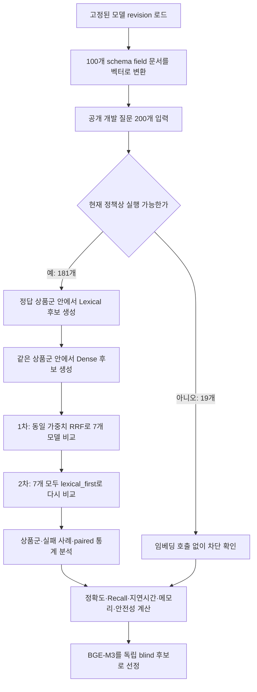

# Schema Dense CPU 임베딩 모델 비교 실험 상세 보고서

- 측정일: 2026-08-12
- 평가 장치: CPU 전용
- 평가 상태: 공개 개발 7개 모델 전수 비교·paired 통계·실패 분석 완료
- 현재 결정: `BAAI/bge-m3` + `lexical_first`를 독립 blind 1순위 후보로 선정
- 비교 유지 후보: `nlpai-lab/KURE-v1` + `lexical_first`
- 운영 상태: production OFF

이 문서는 임베딩 모델을 처음 접하는 사람도 실험의 목적, 방법, 지표, 결과와 한계를
순서대로 이해할 수 있도록 작성한 상세 보고서다

처음 읽는 경우에는 `0. 한눈에 보는 결론` → `2. 먼저 알아둘 용어` → `6. 실험 절차`
→ `8. 평가 지표` → `9. 실험 결과` → `13. 주의할 점` 순서로 읽으면 된다

팀원에게 공유할 때는 핵심 지표 카드·모델 비교 차트·전체 상세 내용을 한 파일에 담은
[팀 공유용 HTML 완성본](evaluation-schema-embedding-cpu.html)을 먼저 전달하면 된다

## 0. 한눈에 보는 결론

우리가 해결하려는 문제는 **상품을 직접 찾는 것**이 아니라, 사용자의 표현을 데이터베이스의
정확한 필드와 연결하는 것이다

예를 들어 사용자가 “운용 비용이 낮고 규모가 큰 해외 ETF”라고 질문하면 다음과 같이
해석해야 한다

| 사용자 표현 | 연결해야 할 데이터 필드 예시 |
| --- | --- |
| 운용 비용 | `total_expense_ratio` |
| 규모 | `aum` |
| 해외 ETF | `product_family=overseas_etp` |

기존의 단어 기반 검색인 Lexical만 사용했을 때보다, 의미 기반 검색인 Dense를 보조로
붙였을 때 다음과 같이 개선됐다

| 핵심 지표 | Lexical만 사용 | BGE-M3 보조 사용 | 실제 증가 |
| --- | ---: | ---: | ---: |
| 정확한 필드 묶음을 찾은 질문 | 167/181, 92.27% | **175/181, 96.69%** | **8문항, +4.42%p** |
| 상위 5개 안에서 찾은 정답 필드 | 511/527, 96.96% | **521/527, 98.86%** | **10필드, +1.90%p** |
| 상위 10개 안에서 찾은 정답 필드 | 별도 동결값 없음 | **527/527, 100%** | 모든 정답 필드 포함 |
| CPU 질문 처리 지연시간 p95 | 해당 없음 | **약 91.10ms** | 사전 기준 250ms 이내 |
| 차단 질문의 임베딩 호출 | 해당 없음 | **0/19회** | 19문항 모두 호출 전 차단 |

따라서 현재 1순위는 `BAAI/bge-m3`와 `lexical_first` 결합 방식이다

다만 이번 추가 분석에서 다음 사실도 확인했다

- `lexical_first`를 1차 상위 4개만이 아니라 7개 모델 모두에 적용해 비교 완료
- 정확히 맞힌 질문 8개 증가는 모두 해외 ETF·ETN 질문에서 발생
- 국내채권·국내 ETF·ETN·공모펀드는 기존 Lexical strict exact가 이미 100%여서 추가 증가 없음
- BGE-M3와 KURE-v1은 strict exact가 175/181로 같고, 질문 단위 paired bootstrap
  95% 구간도 BGE 우위를 확정하지 못함
- BGE-M3의 strict exact 실패 6문항도 정답 필드 자체는 모두 top-5 안에 있었으며,
  정답 개수만큼의 앞 순서 안에 다른 후보가 끼어 실패
- Recall@5에서 빠진 6필드는 정답 필드가 6~7개인 네 질문에서 top-5에 최대 5개만
  담을 수 있어 발생했으며, Recall@10은 527/527

### 이 실험만으로 어디까지 결정할 수 있는가

| 결정 | 현재 판단 | 이유 |
| --- | --- | --- |
| 공개 개발용 1순위 후보 선정 | **가능** | 7개 전수 비교, 안전·속도·실패 분석 완료 |
| 독립 blind에 올릴 비교 후보 선정 | **가능** | BGE-M3 1순위, KURE-v1 비교 유지 |
| 최종 임베딩 모델 확정 | **아직 불가** | 모델 차이가 작고 개선이 해외 ETP에 집중 |
| 점수 기반 OOD 기권 기준 확정 | **아직 불가** | 성공·실패 cosine 점수가 겹치며 외부 OOD가 없음 |
| Backend 사용자-visible 경로 활성화 | **아직 불가** | 독립 blind·OOD test·shadow 검증이 남음 |

다만 이 결과는 모델과 결합 방식을 고르는 데 사용한 **공개 개발 질문 200개**에서 얻은
결과다. 처음 보는 독립 질문에 대한 성능이나 실제 공모전 점수를 의미하지 않으므로,
독립 blind 평가와 모호한 질문에 대한 기권 기준을 통과하기 전에는 운영 기능을 켜지 않는다

## 1. 이 실험이 답하려는 질문

팀의 기본 검색 전략은 다음과 같다

1. 먼저 단어와 별칭이 직접 일치하는지 Lexical 방식으로 확인
2. 단어가 직접 일치하지 않거나 표현이 모호하면 Dense 임베딩으로 의미가 가까운 필드를 보조 검색
3. 두 방식이 만든 후보를 합친 뒤 서버 규칙이 허용 여부를 최종 검토
4. 승인된 필드만 SQL hard filter, 정렬, 집계에 사용

이 실험은 위 흐름 중 2번에 사용할 모델을 고르기 위해 다음 질문에 답한다

- 한국어 금융상품 질문에서 어떤 임베딩 모델이 정답 필드를 가장 잘 찾는가
- Dense를 단독으로 쓰는 것보다 Lexical의 보조로 쓸 때 실제로 도움이 되는가
- 기존 Lexical 결과를 해치지 않도록 어떤 결합 방식이 적절한가
- CPU만 사용해도 실용적인 속도로 실행할 수 있는가
- 차단 질문을 임베딩 모델에 보내지 않는 안전 규칙이 지켜지는가
- 라이선스, 원격 코드, 메모리 등 운영 부담까지 고려하면 어떤 후보가 적절한가

이 실험은 다음 질문에는 답하지 않는다

- 최종적으로 어떤 금융상품을 검색해야 하는가
- SQL 조건과 계산 결과가 정확한가
- 질문의 상품군을 Router가 정확히 판단하는가
- HyperCLOVA X가 설명 답변을 얼마나 잘 생성하는가
- 실제 공모전 평가 점수가 얼마인가

즉, 전체 Agent가 아니라 **질문 표현과 DB 필드를 연결하는 작은 부품**만 분리해 비교한
실험이다

## 2. 먼저 알아둘 용어

### 2.1 Schema와 field

- Schema: 데이터베이스에 어떤 정보가 어떤 형식으로 저장되는지 정한 구조
- Field: 그 구조 안의 개별 정보 항목
- Canonical field ID: 시스템 전체에서 하나의 뜻으로 사용하는 표준 필드 이름

예를 들어 해외 ETF 데이터에 상품명, 티커, 총보수율, AUM이 있다면 각각이 field다

### 2.2 Schema linking

Schema linking은 사용자 문장을 데이터베이스 필드와 연결하는 과정이다

```text
“설정된 지 오래된 펀드”
          ↓
“설정된 지”는 설정일을 뜻한다고 해석
          ↓
inception_date 필드 후보 생성
```

이 연결을 잘못하면 이후 SQL이 정확해도 엉뚱한 열을 검색하므로, Agent의 첫 번째 정확도
병목이 될 수 있다

### 2.3 Lexical 검색

Lexical 검색은 글자, 단어, 별칭이 직접 겹치는지를 중심으로 찾는 방식이다

- 장점: 빠르고 결과를 설명하기 쉬움
- 장점: “총보수율”처럼 등록된 용어가 그대로 나오면 매우 정확함
- 단점: “운용 비용”처럼 다른 말로 표현하면 놓칠 수 있음

현재 시스템의 기본값이며 Dense가 이를 대체하지 않는다

### 2.4 임베딩과 Dense 검색

임베딩 모델은 문장을 숫자 벡터로 바꾼다. 뜻이 비슷한 문장은 벡터 공간에서도 가깝게
배치되는 경향이 있다

```text
“운용 비용” ──임베딩──> [0.12, -0.31, ...]
“총보수율”   ──임베딩──> [0.10, -0.29, ...]
```

Dense 검색은 이 숫자 벡터의 유사도를 이용해 의미가 가까운 필드를 찾는 방식이다

- 장점: 같은 뜻을 다른 표현으로 말한 질문을 보완할 수 있음
- 단점: 의미가 비슷하지만 실제로는 다른 필드를 섞을 수 있음
- 단점: 모델 실행 비용과 운영 복잡도가 추가됨

이 실험에서 임베딩 모델은 답변을 생성하지 않는다. 특히
`Qwen3-Embedding-0.6B`도 이름에 Qwen이 들어가지만 여기서는 **답변 생성용 LLM이 아니라
문장을 벡터로 바꾸는 전용 임베딩 모델**로 사용했다

### 2.5 Cosine similarity

두 벡터가 같은 방향을 가리키는 정도를 비교하는 값이다. 모든 벡터를 길이 1로
정규화한 뒤 내적을 계산했으므로 이 실험의 내적 점수는 cosine similarity와 같다

점수가 높을수록 의미가 가깝다고 보는 방식이지만, 점수 자체가 “정답일 확률”을 뜻하지는
않는다

### 2.6 Gold field와 top-k

- Gold field: 사람이 미리 정한 정답 필드
- top-k: 모델이 점수가 높다고 반환한 앞쪽 k개 후보
- top-5: 앞의 5개 후보
- top-10: 앞의 10개 후보

질문 하나에 정답 필드가 여러 개일 수 있다. 예를 들어 “보수가 낮고 AUM이 큰 상품”에는
`total_expense_ratio`와 `aum` 두 개가 모두 정답이다

### 2.7 Hybrid와 기권

- Hybrid: Lexical과 Dense 결과를 결합하는 방식
- Abstention 또는 기권: 확신이 부족할 때 임의로 실행하지 않고 추가 질문이나 한계 안내로 전환하는 것
- OOD: 학습·개발 범위와 다른 질문 또는 지원 범위 밖 질문

금융 Agent에서는 많이 답하는 것보다, 잘못된 필드로 실행하지 않는 것이 더 중요할 수
있으므로 기권 기준도 필요하다

### 2.8 모델 설정표에 나오는 용어

- Token: 모델이 문장을 나눠 읽는 기본 조각. 한 글자나 한 단어와 정확히 같지는 않음
- Dimension: 문장을 표현하는 숫자의 개수. 1024차원이면 문장 하나가 숫자 1024개로 변환됨
- Pooling: 여러 token의 정보를 문장 벡터 하나로 합치는 방법
  - CLS: 문장 전체를 대표하도록 학습된 첫 token 사용
  - Mean: 실제 입력 token 벡터의 평균 사용
  - Last token: 문장의 마지막 유효 token 벡터 사용
- Prefix: `query:`처럼 입력의 역할을 모델에 알려주는 짧은 머리말
- Instruction: “이 질문에 필요한 DB 필드를 찾아라”처럼 작업 자체를 설명하는 문장
- Revision: 모델 파일의 특정 Git commit. 같은 모델 이름 아래 파일이 바뀌어도 실험을 재현하도록 고정
- Remote code: 모델 저장소가 제공하는 별도 Python 구현. 편리하지만 실행 전 코드 검토와 버전 고정 필요
- MoE: 여러 expert 모듈 중 입력마다 일부를 골라 계산하는 Mixture of Experts 구조

차원이 크거나 파라미터가 많다고 이 과제에서 자동으로 더 정확한 것은 아니다. 입력 형식,
학습 데이터, pooling, 실제 질문과 schema 문서의 특성이 함께 결과를 결정한다

## 3. 평가 데이터는 어떻게 구성했는가

### 3.1 질문 200개

기존에 공개 개발용으로 관리하던 네 상품군의 core 질문을 합쳤다

| 상품군 | 질문 수 | 원본 suite |
| --- | ---: | --- |
| 국내채권 | 50 | `bond_core_50.json` |
| 국내 ETF·ETN | 50 | `domestic_etp_core_50.json` |
| 해외 ETF·ETN | 50 | `overseas_etp_core_50.json` |
| 공모펀드 | 50 | `fund_core_50.json` |
| 합계 | **200** | 네 suite 통합 |

현재 안전 정책을 적용하면 다음 두 그룹으로 나뉜다

- 실행 가능한 질문: 181개
- 모호성, 미지원 조건 등의 이유로 차단해야 하는 질문: 19개
- 실행 질문에 표시된 정답 필드: 총 527개

527개가 181개보다 큰 이유는 한 질문에 필터, 정렬, 비교를 위한 필드가 여러 개 필요할 수
있기 때문이다

### 3.2 Schema field 문서 100개

임베딩 모델이 검색할 대상은 실제 금융상품 행이 아니라 표준 필드 설명문 100개다

각 설명문은 다음 정보를 조합해 만든다

- 표준 필드 ID
- 사람이 읽는 한글 라벨
- 등록된 별칭
- 원천 데이터의 컬럼명
- 값의 자료형
- 단위
- 허용된 열거값
- 필드 해석 시 주의사항

예시는 다음과 같은 형태다

```text
field_id: total_expense_ratio
label: 총보수율
aliases: 총보수, 운용 비용, 비용 비율
value_type: number
unit: percent
notes: 상품이 부담하는 총 보수 비율
```

실제 문서 문자열은 field registry에서 결정론적으로 생성하므로 모델마다 내용이 달라지지
않는다

### 3.3 정답 상품군을 미리 제공한 이유

이번 실험에서는 각 질문이 국내채권인지, 국내 ETP인지, 해외 ETP인지, 공모펀드인지
정답 상품군을 미리 제공했다. 그래야 Router 오류와 임베딩 모델의 field-linking 오류가
섞이지 않고, 임베딩 모델 자체의 역할만 비교할 수 있기 때문이다

따라서 이 수치는 실제 전체 Agent 성능보다 좁은 범위의 컴포넌트 성능이다

## 4. 비교한 모델과 특성

모든 모델은 모델 이름만 고정한 것이 아니라 Hugging Face revision까지 고정했다. 나중에
모델 저장소의 기본 버전이 바뀌어도 같은 가중치를 다시 사용할 수 있게 하기 위함이다

| 모델 | 공식 특성과 선정 이유 | 이 실험에서 사용한 방식 | 차원·라이선스 |
| --- | --- | --- | --- |
| **BGE-M3** | 100개 이상 언어와 dense·sparse·multi-vector 검색을 지원하는 범용 다국어 모델 | dense 기능만 사용, 별도 지시문 없음, CLS pooling, 최대 512 token | 1024, MIT |
| **KURE-v1** | BGE-M3를 약 200만 개의 한국어 query-document 데이터로 추가 학습한 한국어 검색 특화 후보 | 일반 한국어 질문·필드 문서 입력, CLS pooling, 최대 512 token | 1024, MIT |
| **Qwen3-Embedding-0.6B** | 100개 이상 언어, 지시문 입력, 가변 차원을 지원하는 0.6B 임베딩 모델 | 금융 schema 검색용 지시문을 질문에 추가, last-token pooling, 최대 512 token | 1024, Apache-2.0 |
| **KoE5** | multilingual-E5-large를 약 70만 개 한국어 triplet 데이터로 추가 학습한 한국어 E5 계열 | 질문에 `query:`, 문서에 `passage:` 추가, mean pooling | 1024, MIT |
| **multilingual-E5-large-instruct** | 다국어 질문에 작업 지시문을 함께 넣도록 설계된 E5 계열 | 금융 schema 검색 지시문을 질문에 추가, mean pooling | 1024, MIT |
| **Arctic Embed L v2** | 다국어 검색과 긴 문맥, 압축 가능한 표현을 목표로 한 Snowflake 모델 | 질문에 `query:` 추가, CLS pooling, 최대 512 token | 1024, Apache-2.0 |
| **Nomic Embed v2 MoE** | 여러 expert 중 일부만 사용하는 MoE 구조, 다국어 검색용 768차원 모델 | `search_query:`와 `search_document:` 추가, mean pooling | 768, Apache-2.0 |

공식 모델 카드의 최대 문맥 길이가 8K 또는 32K인 모델도 있지만, schema 설명문과 질문이
짧고 공정한 CPU 비교가 목적이므로 모든 후보를 최대 512 token으로 제한했다. 따라서 이
실험은 각 모델의 장문 처리 능력을 비교한 실험이 아니다

### 4.1 BGE-M3

- 공식 모델 카드상 dense, sparse, multi-vector 세 가지 검색 기능을 제공
- 이번 실험에서는 다른 후보와 같은 조건을 만들기 위해 dense 벡터 하나만 사용
- KURE-v1의 기반 모델이므로 범용 다국어 모델과 한국어 추가 학습 모델을 비교하는 기준점
- 별도 원격 Python 코드를 실행하지 않아 운영 구성이 비교적 단순
- [공식 모델 카드](https://huggingface.co/BAAI/bge-m3)

### 4.2 KURE-v1

- 고려대학교 NLP & AI 연구실이 공개한 한국어 검색 특화 모델
- BGE-M3를 한국어 query-document-hard-negative 데이터로 추가 학습
- 한국어 특화 학습이 이 금융 schema 문제에서도 이점을 주는지 확인하기 위해 포함
- 최종 정확 문항 수는 BGE-M3와 같았고, Recall@5는 정답 필드 1개 차이
- [공식 모델 카드](https://huggingface.co/nlpai-lab/KURE-v1)

### 4.3 Qwen3-Embedding-0.6B

- 생성형 Qwen과 같은 계열이지만, 이 모델의 용도는 텍스트 임베딩
- 작업별 지시문을 질문에 붙일 수 있고 32~1024 범위의 출력 차원을 지원
- 본 실험에서는 정보 손실을 줄이기 위해 1024차원을 사용
- 공식 권장 방식에 맞춰 금융상품 schema field 검색 작업을 설명하는 지시문을 추가
- 이 입력 구성에서는 다른 후보보다 낮았지만, 이를 Qwen 계열의 일반 성능으로 확대 해석하면 안 됨
- [공식 모델 카드](https://huggingface.co/Qwen/Qwen3-Embedding-0.6B)

### 4.4 KoE5

- multilingual-E5-large를 한국어 검색 데이터로 추가 학습한 모델
- E5 계열의 권장 입력 형식인 `query:`와 `passage:`를 구분해 사용
- Dense 단독 Recall@5는 7개 중 3위였지만, 동일 가중치 RRF가 Lexical 순위를 많이
  바꾸면서 정확 필드 묶음 성능이 낮아짐
- [공식 모델 카드](https://huggingface.co/nlpai-lab/KoE5)

### 4.5 multilingual-E5-large-instruct

- 94개 언어를 표시하고, 질문에 검색 작업을 설명하는 한 문장 지시문을 요구하는 모델
- 24개 layer와 1024차원 embedding을 사용
- 이 실험에서는 “한국어 금융상품 질문에서 필요한 DB schema field를 찾는다”는 고정
  지시문을 사용
- 같은 E5 계열이라도 한국어 추가 학습 모델인 KoE5와 결과가 달랐음
- [공식 모델 카드](https://huggingface.co/intfloat/multilingual-e5-large-instruct)

### 4.6 Snowflake Arctic Embed L v2

- 다국어 검색과 검색 효율을 목적으로 공개된 모델
- 공식 모델 카드는 8192 token 문맥과 1024차원 표현을 지원하지만 이번에는 512 token만 사용
- 최종 후보에서 BGE-M3보다 정확 문항 1개, 정답 필드 1개가 적었음
- [공식 모델 카드](https://huggingface.co/Snowflake/snowflake-arctic-embed-l-v2.0)

### 4.7 Nomic Embed v2 MoE

- 8개 expert 중 top-2를 활성화하는 Mixture of Experts 구조
- 총 파라미터는 약 475M, 추론 시 활성 파라미터는 약 305M이라고 공식 카드에 명시
- 768차원으로 다른 대형 후보의 1024차원보다 벡터가 작고, 본 실험에서는 CPU p95가 가장 짧았음
- 반면 이 실험 프로세스의 peak RSS는 약 3.97GiB로 다른 최종 후보보다 컸음
- 모델 전용 Python 구현을 불러오기 위해 `trust_remote_code=True`가 필요하므로 공급망
  검토와 두 번째 코드 revision 관리가 필요
- [공식 모델 카드](https://huggingface.co/nomic-ai/nomic-embed-text-v2-moe)

## 5. 공정한 비교를 위해 고정한 조건

| 항목 | 고정값 |
| --- | --- |
| 장치 | CPU only |
| CPU | Intel Xeon Silver 4510 |
| 논리 CPU | 24개 |
| PyTorch 사용 thread | 12개 |
| batch size | 16 |
| 최대 입력 길이 | 512 token |
| 벡터 정규화 | L2 normalization |
| 유사도 | 정규화 벡터의 dot product, 즉 cosine similarity |
| Dense 후보 범위 | 정답 상품군에 속한 registry field만 |
| 질문 | 동일한 공개 개발 질문 200개 |
| Schema 문서 | 동일한 100개 |
| Python | 3.12.13 |
| PyTorch | 2.13.0+cpu |
| Transformers | 5.15.0 |
| Sentence Transformers | 5.7.0 |
| Hugging Face Hub | 1.27.0 |

모델별로 pooling이나 입력 prefix가 다른 이유는 모델 설계자가 권장한 사용법이 서로
다르기 때문이다. 모든 모델에 똑같은 prefix를 강제로 넣는 대신, 각 모델의 공식 사용법을
따르되 질문, schema 문서, CPU, thread, batch, 최대 길이와 평가 수식은 동일하게 유지했다

CPU를 선택한 이유는 GPU가 없어서 임시로 낮은 품질의 실험을 한 것이 아니다. schema
문서가 100개로 작고 문서 벡터는 미리 한 번 계산할 수 있으므로, 실제 질문 시에는 질문
벡터 하나와 작은 후보 집합만 처리하면 된다. 팀의 서버 환경에서 GPU 없이도 목표 지연시간을
충족하는지 직접 확인하고, 모델별 조건을 동일하게 만들기 위해 CPU 전용으로 비교했다

각 모델의 고정 revision은 다음과 같다

| 모델 | 고정 revision |
| --- | --- |
| BGE-M3 | `5617a9f61b028005a4858fdac845db406aefb181` |
| KURE-v1 | `d14c8a9423946e268a0c9952fecf3a7aabd73bd9` |
| Qwen3-Embedding-0.6B | `97b0c614be4d77ee51c0cef4e5f07c00f9eb65b3` |
| KoE5 | `bc6d284c60fe5a973e74c1751b92594c9f581213` |
| multilingual-E5-large-instruct | `274baa43b0e13e37fafa6428dbc7938e62e5c439` |
| Arctic Embed L v2 | `ac6544c8a46e00af67e330e85a9028c66b8cfd9a` |
| Nomic Embed v2 MoE | `1066b6599d099fbb93dfcb64f9c37a7c9e503e85` |
| Nomic 원격 코드 | `nomic-ai/nomic-bert-2048@7710840340a098cfb869c4f65e87cf2b1b70caca` |

## 6. 실험 절차



단계별로 풀어 쓰면 다음과 같다

1. 모델 ID, 라이선스, 차원, pooling, 입력 template와 revision이 등록값과 같은지 검사
2. 최초 다운로드 후 네트워크 없이 고정 snapshot을 로드
3. 100개 schema field 설명문을 한 번에 임베딩하고 메모리에 보관
4. 각 질문에 기존 Lexical linker를 적용해 필드 후보 순위를 생성
5. 실행 가능한 질문만 임베딩해 같은 상품군의 schema field와 cosine similarity 계산
6. Dense 상위 10개 후보 생성
7. Lexical과 Dense 순위를 지정된 결합 방식으로 합침
8. 181개 실행 질문의 gold field와 비교해 품질 지표 계산
9. 19개 차단 질문에서 provider 호출 횟수가 0인지 확인
10. registry 밖 또는 상품군 밖 필드가 한 번이라도 나오는지 검사
11. 질문별 Dense 처리 시간을 기록해 p50, p95, max 계산
12. 프로세스 peak RSS를 기록해 메모리 부담 비교

## 7. 왜 두 단계로 비교했는가

### 7.1 1차: 동일 가중치 RRF screening

RRF, 즉 Reciprocal Rank Fusion은 두 검색 결과에서 높은 순위에 나온 항목에 점수를 주어
합치는 방식이다. 이 실험의 1차 비교에서는 Lexical과 Dense에 같은 가중치를 줬다

각 필드의 결합 점수는 다음과 같다

```text
RRF 점수 = Lexical 가중치 / (60 + Lexical 순위)
         + Dense 가중치   / (60 + Dense 순위)
```

1차에서는 두 가중치를 모두 1로 고정했다. 예를 들어 어떤 필드가 Lexical 1위, Dense
3위라면 다음 점수를 받는다

```text
1 / (60 + 1) + 1 / (60 + 3)
```

장점은 두 방식이 공통으로 높게 본 후보를 위로 올릴 수 있다는 점이다. 단점은 Dense가
틀렸을 때 이미 정확한 Lexical 순서를 바꿀 수 있다는 점이다

### 7.2 2차: Lexical 우선 결합

팀의 실제 로드맵은 Lexical과 서버 규칙을 기본값으로 두고 Dense는 표현 해석을 돕는
보조 장치로 사용한다. 최초에는 1차 상위 네 모델만 확인했지만, 선택 편향을 줄이기 위해
최종 보고 전 7개 모델 모두에 `lexical_first`를 적용해 다시 비교했다

```text
Lexical 후보: [A, B, C]
Dense 후보:   [B, D, E]
최종 후보:    [A, B, C, D, E]
```

규칙은 단순하다

1. Lexical 후보와 순서를 그대로 보존
2. 이미 있는 필드는 중복 제거
3. Lexical에 없던 Dense 후보만 뒤에 추가
4. 최종 상위 10개까지만 유지

이 방식은 Dense가 기존의 강한 Lexical 후보를 밀어내지 못하게 하면서, Lexical이 아무
후보를 만들지 못했거나 후보가 부족한 경우를 보완한다

## 8. 평가 지표를 어떻게 읽어야 하는가

지표마다 분모가 다르므로 백분율만 서로 직접 비교하면 안 된다

| 지표 종류 | 분모 | 무엇을 세는가 |
| --- | ---: | --- |
| Exact field-set | 실행 질문 181개 | 질문 하나의 필드 묶음을 완전히 맞혔는가 |
| Recall@5·@10 | 정답 필드 527개 | 정답 필드가 후보 안에 들어왔는가 |
| 누락 회수율 | Lexical이 놓친 필드 16개 | Dense가 기존 누락을 찾았는가 |
| 차단 무호출 | 차단 질문 19개 | 모델 호출 전에 모두 막았는가 |

Exact는 질문을 같은 비중으로 평균내는 질문 단위 지표이고, 이 보고서의 Recall은 527개
정답 필드를 한데 모아 계산하는 필드 단위 지표다

### 8.1 Exact field-set accuracy

한 질문에 필요한 필드 묶음을 빠짐없이, 불필요한 필드 없이 정확히 찾았는지를 본다

질문마다 정답 필드 개수가 다르므로, 정답이 N개라면 예측 상위 N개의 집합을 정답 집합과
비교한다. 순서는 보지 않고 집합이 완전히 같아야 성공이다

```text
정답: [total_expense_ratio, aum]

예측 A: [aum, total_expense_ratio]  → 성공, 순서만 다름
예측 B: [aum, issuer]               → 실패, 정답 하나 누락
예측 C: [aum, total_expense_ratio, issuer]
        → 상위 2개가 정답이면 성공, 상위 2개에 issuer가 끼면 실패
```

전체 계산은 다음과 같다

```text
Exact field-set accuracy = 완전히 맞힌 질문 수 / 실행 질문 수
```

이 실험에서 가장 중요한 1차 품질 지표다. 잘못된 필드 하나가 SQL 실행 의미를 바꿀 수
있기 때문이다

### 8.2 Recall@5

전체 정답 필드 중 상위 5개 후보 안에 포함된 비율이다

```text
Recall@5 = 모든 질문의 top-5에서 찾은 정답 필드 수 / 전체 정답 필드 수
```

예를 들어 정답 필드가 전체 100개이고 그중 97개가 각 질문의 top-5 안에 들어갔다면
Recall@5는 97%다

이 실험은 181개 질문에 정답 필드가 총 527개 있으므로 BGE-M3 결합 결과는 다음과 같다

```text
521 / 527 = 98.8615%
```

Exact는 질문 단위의 완전한 성공을 엄격하게 보고, Recall은 필드 단위로 얼마나 많이
살렸는지를 본다. 두 지표를 함께 봐야 한다

### 8.3 Recall@10

Recall@5와 같지만 상위 10개 후보까지 본다. 후보 생성 단계가 상위 10개를 다음 서버
규칙에 넘긴다면, 정답이 후보 풀 안에 살아 있는지 확인하는 안전망 지표다

BGE-M3 최종 결과는 527/527, 100%다. 그러나 상위 10개 안에 정답이 있다는 사실만으로
최종 1위 선택이나 SQL 실행이 정확하다는 뜻은 아니다

### 8.4 Dense-only Recall@5

Lexical을 합치지 않고 임베딩 모델만 사용했을 때의 Recall@5다. 모델의 순수한 의미
검색 능력을 비교하는 진단 지표다

최종 시스템은 Dense 단독으로 실행하지 않으므로 이 수치가 최종 성능은 아니다. 예를
들어 BGE-M3의 Dense-only Recall@5는 397/527, 75.33%지만 Lexical과 안전하게 결합하면
521/527, 98.86%가 된다

### 8.5 놓친 필드 회수율

기존 Lexical top-5가 놓친 정답 필드 16개 중 Dense top-5가 몇 개를 발견했는지 본다

```text
놓친 필드 회수율 = Dense top-5가 찾은 Lexical 누락 필드 / Lexical 누락 필드 16개
```

BGE-M3는 15/16, 93.75%다

이 값이 최종 Recall 증가 10개와 다른 것은 모순이 아니다. Dense가 자체 top-5에서
15개를 발견했더라도, Lexical 우선 결합의 최종 top-5에는 기존 후보가 먼저 들어가므로
모든 Dense 후보가 5개 자리 안에 들어가는 것은 아니기 때문이다

### 8.6 MRR

MRR, 즉 Mean Reciprocal Rank는 각 질문에서 **첫 번째 정답 필드가 얼마나 앞에
나오는지** 평가한다

```text
1위에서 첫 정답 발견 → 1/1 = 1.0
2위에서 첫 정답 발견 → 1/2 = 0.5
5위에서 첫 정답 발견 → 1/5 = 0.2
```

질문별 reciprocal rank의 평균이 MRR이다. 기존 Lexical MRR은 0.994475로 첫 정답은
대부분 매우 앞에 있었다. 다만 MRR은 여러 정답 중 첫 번째만 보기 때문에, 필요한 모든
필드를 찾았는지는 Exact와 Recall로 따로 확인해야 한다

### 8.7 nDCG@5

nDCG@5는 정답 필드가 상위 5개 안에서도 앞쪽에 배치될수록 높은 점수를 주는 순위 품질
지표다

- 정답이 1위에 있으면 큰 점수
- 정답이 5위에 있으면 더 작은 점수
- 질문마다 가능한 최고 점수로 나눠 0~1 범위로 정규화

기존 Lexical nDCG@5는 0.981472였다. 매우 높지만 Exact가 92.27%였다는 사실과 함께
보면, 첫 후보의 순위는 좋더라도 여러 필드의 완전한 묶음에서 누락이 있었음을 알 수 있다

### 8.8 Precision

Precision은 반환한 후보 중 정답이 차지하는 비율이다. 원시 실험 보고서에는 반환된
후보 수를 기준으로 한 Precision@5와 고정 5칸을 분모로 한 지표도 기록한다

하지만 질문별 정답 필드가 대개 5개보다 적고, 이번 단계의 목적이 다음 서버 규칙에 넘길
후보를 놓치지 않는 것이므로 의사결정의 대표 지표로는 Exact와 Recall을 우선했다

### 8.9 p50, p95, max 지연시간

- p50: 질문의 절반이 이 시간 이내에 처리됨
- p95: 질문의 95%가 이 시간 이내에 처리됨
- max: 가장 오래 걸린 한 질문의 시간

p95가 91.10ms라면 100개 질문 중 약 95개는 Dense 후보 생성이 91.10ms 이내라는
의미다. 평균보다 느린 꼬리 구간을 볼 수 있어 운영 판단에는 p95를 사용했다

이 시간은 모델이 이미 메모리에 올라온 warm 상태의 단일 컴포넌트 시간이다. Docker
시작, HTTP, SQL, HyperCLOVA X, 동시에 들어오는 여러 요청 시간은 포함하지 않는다

### 8.10 Peak RSS

운영체제가 관찰한 실험 프로세스의 최대 상주 메모리다. 모델 가중치만의 크기가 아니라
Python, PyTorch, tokenizer, 임시 계산 메모리 등을 포함한다

따라서 서로 같은 환경에서 운영 부담을 비교하는 참고값으로는 쓸 수 있지만, 다른 서버의
실제 메모리 사용량을 그대로 예측하는 값은 아니다

### 8.11 백분율과 퍼센트포인트

92.27%에서 96.69%로 오른 차이는 4.42%가 아니라 **4.42%p, 퍼센트포인트**라고
표현한다

```text
96.69% - 92.27% = 4.42%p
```

상대 개선율을 계산하면 약 4.79%지만, 이 보고서에서는 오해를 줄이기 위해 절대 차이인
퍼센트포인트를 사용한다

## 9. 실험 결과

### 9.1 기존 Lexical baseline

| 지표 | 결과 | 쉬운 해석 |
| --- | ---: | --- |
| Exact field-set | 167/181, 92.27% | 181문항 중 167문항의 필드 묶음을 완전히 맞힘 |
| Recall@5 | 511/527, 96.96% | 정답 필드 527개 중 511개가 top-5 안에 있음 |
| MRR | 0.994475 | 첫 정답 필드는 거의 항상 맨 앞에 있음 |
| nDCG@5 | 0.981472 | 정답 필드가 전반적으로 상위에 잘 배치됨 |
| 놓친 정답 필드 | 16개 | Dense가 보완할 핵심 대상 |

Lexical만으로도 매우 강하다. 따라서 Dense의 목표는 이를 대체하는 것이 아니라, 남은
표현 차이와 누락을 안전하게 줄이는 것이다

### 9.2 1차 동일 가중치 RRF 결과

| 모델 | Dense만 Recall@5 | RRF exact | RRF Recall@5 | 누락 회수 | CPU p95 |
| --- | ---: | ---: | ---: | ---: | ---: |
| **BGE-M3** | 397/527, 75.33% | **170/181, 93.92%** | 516/527, 97.91% | 15/16, 93.75% | 93.41ms |
| **KURE-v1** | 384/527, 72.87% | 167/181, 92.27% | 516/527, 97.91% | 15/16, 93.75% | 94.13ms |
| **Nomic v2 MoE** | 368/527, 69.83% | 166/181, 91.71% | **518/527, 98.29%** | 15/16, 93.75% | **51.94ms** |
| **KoE5** | 374/527, 70.97% | 153/181, 84.53% | 515/527, 97.72% | 12/16, 75.00% | 94.05ms |
| **multilingual-E5 instruct** | 334/527, 63.38% | 157/181, 86.74% | 515/527, 97.72% | 12/16, 75.00% | 76.64ms |
| **Arctic L v2** | 351/527, 66.60% | 158/181, 87.29% | 515/527, 97.72% | 15/16, 93.75% | 95.56ms |
| **Qwen3 Embedding** | 302/527, 57.31% | 123/181, 67.96% | 506/527, 96.02% | 10/16, 62.50% | 80.47ms |

1차 결과에서 확인한 핵심은 다음과 같다

- Dense 단독 성능은 모든 모델이 강한 Lexical baseline보다 낮음
- 동일 가중치 RRF는 일부 모델에서 기존 Lexical 순서를 해쳐 exact를 낮춤
- Qwen3 Embedding은 이 질문, schema 문서, 지시문, pooling 구성에서 Lexical Recall까지 낮춤
- 한국어 특화 설명만으로 KURE-v1이나 KoE5가 자동으로 우승하지 않음
- 공개 범용 benchmark 대신 실제 과제 필드와 질문으로 비교해야 함을 확인

### 9.3 2차 Lexical 우선 결합 결과

1차 순위에 따른 선택 편향을 막기 위해 7개 모델 모두를 `lexical_first`로 다시 비교했다

| 순위 | 모델 | Exact | Lexical 대비 | Recall@5 | Lexical 대비 | Recall@10 | CPU p95 | Peak RSS |
| ---: | --- | ---: | ---: | ---: | ---: | ---: | ---: | ---: |
| 1 | **BGE-M3** | **175/181, 96.69%** | **+8문항, +4.42%p** | **521/527, 98.86%** | **+10필드, +1.90%p** | 527/527, 100% | 91.10ms | 2.38GiB |
| 2 | **KURE-v1** | **175/181, 96.69%** | **+8문항, +4.42%p** | 520/527, 98.67% | +9필드, +1.71%p | 527/527, 100% | 92.13ms | 2.38GiB |
| 3 | **Nomic v2 MoE** | 174/181, 96.13% | +7문항, +3.87%p | **521/527, 98.86%** | **+10필드, +1.90%p** | 527/527, 100% | **49.74ms** | 3.97GiB |
| 4 | **Arctic L v2** | 174/181, 96.13% | +7문항, +3.87%p | 520/527, 98.67% | +9필드, +1.71%p | 527/527, 100% | 96.77ms | 2.25GiB |
| 5 | **Qwen3 Embedding** | 172/181, 95.03% | +5문항, +2.76%p | 517/527, 98.10% | +6필드, +1.14%p | 524/527, 99.43% | 82.64ms | 2.31GiB |
| 6 | **multilingual-E5 instruct** | 171/181, 94.48% | +4문항, +2.21%p | 520/527, 98.67% | +9필드, +1.71%p | 526/527, 99.81% | 86.23ms | **1.56GiB** |
| 7 | **KoE5** | 170/181, 93.92% | +3문항, +1.66%p | 520/527, 98.67% | +9필드, +1.71%p | 527/527, 100% | 95.94ms | 2.29GiB |

`Peak RSS`는 모델 가중치만이 아니라 Python·PyTorch·tokenizer·임시 메모리를 포함한
프로세스 최대치다. 지연시간과 메모리는 실행마다 조금 달라질 수 있으므로 품질이 같은
모델의 운영 부담을 비교하는 참고값으로 사용했다

## 10. 모델별 결과 해석

### 10.1 BGE-M3

- Exact는 KURE-v1과 공동 1위
- Recall@5는 Nomic과 공동 1위
- 기존 Lexical보다 정확 질문 8개, top-5 정답 필드 10개 증가
- p95 91.10ms로 사전 허용 기준 250ms 안에 충분히 들어옴
- Nomic처럼 원격 코드를 허용하지 않아도 됨
- 품질과 운영 단순성을 함께 고려한 최종 1순위

### 10.2 KURE-v1

- Exact 175/181로 BGE-M3와 완전히 같음
- Recall@5는 520/527로 BGE-M3보다 정답 필드 **1개** 적음
- 질문별 strict 성공이 BGE와 완전히 같은 것은 아니며 BGE만 맞힌 1개, KURE만 맞힌 1개 존재
- paired bootstrap exact 차이의 95% 구간이 `-1.66%p ~ +1.66%p`로 0을 포함
- 한국어 특화 모델로 매우 경쟁력 있는 2순위이며 blind에서 순위가 뒤집힐 가능성도 있음

### 10.3 Nomic v2 MoE

- Recall@5는 BGE-M3와 같음
- Exact는 174/181로 BGE-M3보다 질문 **1개** 적음
- p95 49.74ms로 7개 후보 중 가장 빠름
- peak RSS 약 3.97GiB로 다른 후보의 약 2.3GiB보다 큼
- 고정된 원격 코드를 별도로 검토하고 허용해야 하는 운영 부담이 있음

### 10.4 Arctic L v2

- Exact는 Nomic과 같은 174/181
- Recall@5는 520/527로 BGE-M3보다 필드 **1개** 적음
- peak RSS 약 2.25GiB로 BGE·KURE보다 작음
- 품질은 매우 근접하지만 BGE-M3보다 우선할 명확한 이점은 이번 설정에서 확인되지 않음

### 10.5 KoE5

- Dense 단독 Recall@5는 374/527로 Nomic과 Arctic보다 높았음
- 그러나 동일 가중치 RRF에서는 잘못된 Dense 순위가 Lexical 순서를 바꿔 exact가
  153/181까지 낮아짐
- `lexical_first`에서는 170/181, 93.92%로 회복했지만 BGE보다 5문항 낮고 사전
  `+2%p` 품질 문턱에는 못 미침
- 모델 자체가 나쁘다는 뜻이 아니라, 이 결합 방식과 schema-linking 문제에서는 궁합이
  좋지 않았다는 뜻

### 10.6 multilingual-E5-large-instruct

- Dense 단독 Recall@5 334/527
- RRF exact 157/181로 Lexical baseline보다 낮음
- `lexical_first` exact는 171/181, Recall@5는 520/527로 공개 품질 문턱을 통과
- peak RSS 약 1.56GiB로 7개 중 가장 작지만 Recall@10에서 정답 필드 1개가 빠짐
- 지시문 기반 범용 다국어 모델의 장점이 이 짧은 한국어 schema field 문제에서는
  충분히 나타나지 않음
- 다른 지시문을 고르면 결과가 달라질 수 있으나, 같은 공개 질문으로 지시문을 반복
  최적화하면 과적합 위험이 있어 이번 비교에서는 한 개의 고정 지시문만 사용

### 10.7 Qwen3-Embedding-0.6B

- Dense 단독 Recall@5 302/527로 7개 중 가장 낮음
- 동일 가중치 RRF exact 123/181, Recall@5 506/527로 기존 Lexical보다 악화
- `lexical_first`에서는 exact 172/181, Recall@5 517/527로 크게 회복했지만 BGE보다
  각각 3문항·4필드 낮고 Recall@10도 524/527
- 최신 모델이나 더 큰 계열이라는 이유만으로 특정 과제에 더 좋은 것은 아님을 보여줌
- 최대 문맥, 가변 차원 같은 강점은 매우 짧은 schema 문서 실험에서 활용되지 않음
- 이 결과는 **현재 고정 지시문·512 token·CPU·schema 문서 100개** 조건의 결과일 뿐,
  Qwen3 Embedding의 일반적인 검색 성능을 평가한 결론이 아님

## 11. 왜 최종 후보가 BGE-M3인가

품질 차이는 매우 작다

- BGE-M3와 KURE-v1의 Exact 차이: 0문항
- BGE-M3와 KURE-v1의 Recall@5 차이: 1필드
- BGE-M3와 Nomic의 Recall@5 차이: 0필드
- BGE-M3와 Nomic의 Exact 차이: 1문항

따라서 숫자 0.1% 단위만 보고 압도적 우승이라고 표현하면 안 된다. 다음 운영 조건까지
함께 보아 BGE-M3를 **blind에 올릴 첫 후보**로 정했다

1. Exact 공동 최고
2. Recall@5 공동 최고
3. Recall@10 100%
4. CPU p95 250ms 기준 통과
5. MIT 라이선스
6. 별도 원격 코드 불필요
7. Nomic보다 낮은 실험 프로세스 peak RSS
8. 모델과 코드 revision 관리가 상대적으로 단순

이 결정은 BGE-M3를 즉시 production에 쓰겠다는 결정이 아니다. 독립 blind에서 KURE-v1
등과 순위가 달라질 수 있으므로 현재 상태는 “BGE-M3 우선 검증”이다

### 11.1 상품군별로도 고르게 좋아졌는가

아니다. 전체 개선은 해외 ETP에 집중됐다

| 상품군 | 실행 질문 | Lexical exact | BGE 결합 exact | Lexical Recall@5 | BGE 결합 Recall@5 |
| --- | ---: | ---: | ---: | ---: | ---: |
| 국내채권 | 48 | 48/48, 100% | 48/48, 100% | 125/125, 100% | 125/125, 100% |
| 국내 ETF·ETN | 47 | 47/47, 100% | 47/47, 100% | 136/137, 99.27% | 136/137, 99.27% |
| 공모펀드 | 44 | 44/44, 100% | 44/44, 100% | 132/133, 99.25% | 132/133, 99.25% |
| 해외 ETF·ETN | 42 | 28/42, 66.67% | **36/42, 85.71%** | 118/132, 89.39% | **128/132, 96.97%** |

전체 exact 증가 8문항과 Recall@5 증가 10필드가 모두 해외 ETP에서 나왔다. 이는
해외 ETP의 영문 식별자·AUM·날짜·이름 표현이 현재 Lexical 규칙에 덜 잡혔고 Dense가
그 빈틈을 보완했다는 뜻이다

반대로 다른 세 상품군에서 Dense의 추가 효과를 증명한 것은 아니다. 해당 공개 질문은
Lexical exact가 이미 100%여서 더 좋아질 여지가 없었기 때문이다. 외부 blind에서는
국내채권·국내 ETP·공모펀드에도 Lexical이 직접 모르는 우회 표현을 충분히 넣어야 한다

### 11.2 기존 파일의 development·holdout 분할

| 내부 분할 | 실행 질문 | Lexical exact | BGE 결합 exact | Lexical Recall@5 | BGE 결합 Recall@5 |
| --- | ---: | ---: | ---: | ---: | ---: |
| development | 152 | 140/152, 92.11% | 146/152, 96.05% | 426/439, 97.04% | 434/439, 98.86% |
| holdout | 29 | 27/29, 93.10% | 29/29, 100% | 85/88, 96.59% | 87/88, 98.86% |

여기서 이름이 `holdout`인 29문항도 이미 저장소에 공개되어 모델·결합 방식 선택에 함께
사용했다. 따라서 29/29를 독립 blind 성능이라고 부르면 안 된다

### 11.3 BGE-M3 strict exact 실패 6문항

| 질문 ID | 유형 | 핵심 정답 | strict 앞 순서에 끼어든 후보 | 정답이 top-5에 있는가 |
| --- | --- | --- | --- | --- |
| `etp-core-022` | 식별자 | `isin` | `product_name` | 예 |
| `etp-core-024` | 상품명 | `product_name` | `isin` | 예 |
| `etp-core-032` | AUM | `aum` | `trading_currency` | 예 |
| `etp-core-033` | AUM | `aum` | `trading_currency` | 예 |
| `etp-core-034` | AUM | `aum` | `trading_currency` | 예 |
| `etp-core-041` | 기준일 | `dynamic_as_of` | `static_as_of` | 예 |

6문항 모두 해외 ETP이며 정답 필드는 top-5 안에 남아 있었다. 실패는 정답 필드 자체를
완전히 잃은 것이 아니라, 정답 개수만큼의 가장 앞 후보를 비교하는 strict 지표에서
관련 있지만 다른 필드가 먼저 들어온 순위 문제다

따라서 다음 서버 단계가 top-5 후보 전체를 규칙으로 재검토하면 복구할 여지가 있다.
다만 이 사실이 strict 실패를 없애 주는 것은 아니므로 최초 blind에서도 같은 방식으로
그대로 점수를 낸다

### 11.4 Recall@5의 용량 한계

`detp-041`, `etp-core-001`, `etp-core-002`, `fund-033`은 질문 하나의 정답 필드가
6~7개다. top-5에는 구조적으로 최대 5개만 담을 수 있으므로 네 질문에서 합계 6필드가
빠졌다

```text
일반 Recall@5           = 521 / 527 = 98.86%
top-5 최대 용량 분모    = Σ min(정답 필드 수, 5) = 521
용량 보정 진단값        = 521 / 521 = 100%
```

용량 보정값은 공식 대표 지표를 바꾸기 위한 것이 아니다. 일반 Recall@5 98.86%를 그대로
보고하되, 빠진 6필드가 모델이 의미를 몰라서가 아니라 top-k 크기 때문에 생겼음을 설명하는
보조 진단이다. Recall@10은 527/527로 모든 정답 필드를 포함했다

### 11.5 paired bootstrap으로 본 모델 차이

같은 질문에서 두 방식의 성공·실패를 짝지은 뒤 질문 181개를 복원추출하는 paired
bootstrap을 seed `20260812`로 10,000회 수행했다

| 비교 | 관측 exact 차이 | exact 차이 95% 구간 | 관측 Recall@5 차이 | Recall 차이 95% 구간 |
| --- | ---: | ---: | ---: | ---: |
| BGE 결합 − Lexical | **+4.42%p** | **+1.66 ~ +7.73%p** | **+1.90%p** | **+0.78 ~ +3.10%p** |
| BGE 결합 − KURE 결합 | 0.00%p | -1.66 ~ +1.66%p | +0.19%p | 0.00 ~ +0.59%p |
| BGE 결합 − Nomic 결합 | +0.55%p | -1.10 ~ +2.76%p | 0.00%p | 0.00 ~ 0.00%p |

이 공개 세트 안에서는 BGE 결합이 Lexical보다 일관되게 좋아졌다. 그러나 BGE와 KURE,
BGE와 Nomic의 exact 구간은 0을 포함하므로 BGE가 새 질문에서도 확실히 이긴다고 말할
수 없다. BGE는 품질이 공동 최상위이면서 원격 코드가 필요 없고 운영이 단순해 1순위로
둔 것이며, KURE는 독립 blind 비교 후보로 유지한다

이 bootstrap 구간도 공개 181문항을 다시 뽑아 계산한 내부 불확실성이다. 외부 사용자
분포에 대한 신뢰구간이나 통계적 일반화 보증은 아니다

### 11.6 현재 cosine 점수로 기권 기준을 만들 수 있는가

| 그룹 | 질문 수 | top-1 점수 중앙값 | top-1과 top-2 차이 중앙값 |
| --- | ---: | ---: | ---: |
| strict exact 성공 | 175 | 0.600643 | 0.020098 |
| strict exact 실패 | 6 | **0.615316** | 0.010091 |

실패 질문의 top-1 점수 중앙값이 성공 질문보다 오히려 높다. 성공 질문에도 margin이 거의
0인 사례가 있어 `점수 0.6 이상`, `margin 0.01 이상` 같은 임의 기준으로는 오류와 정답을
안전하게 분리할 수 없다

따라서 현재 공개 in-domain 질문만으로 OOD 기권 threshold를 만들지 않았다. 외부 작성
질문의 calibration 절반에서만 threshold를 고르고, 미리 분리한 test 절반에서 한 번
검증하는 절차를 별도로 동결했다

## 12. 안전성 검사

| 안전 항목 | 결과 | 의미 |
| --- | ---: | --- |
| 차단 질문의 임베딩 무호출 | 19/19 | 모호·미지원 질문은 모델 호출 전에 차단 |
| registry 밖 필드 후보 | 0건 | 코드에 등록되지 않은 임의 필드 생성 없음 |
| 상품군 밖 필드 후보 | 0건 | 예: 채권 질문에 펀드 전용 필드를 섞지 않음 |
| production 기능 | OFF | 평가가 끝나도 자동으로 운영 활성화하지 않음 |

임베딩 모델에게 허용한 권한은 **후보 필드 제안**뿐이다

- hard filter 결정 권한: 없음
- 정렬·집계 실행 권한: 없음
- SQL 직접 실행 권한: 없음
- 상품 선택 권한: 없음
- 최종 답변 생성 권한: 없음

후보가 만들어진 뒤 field registry, 상품군, QueryPlan 계약과 서버 규칙이 다시 검사하고
최종 승인해야 한다

Nomic 원격 코드는 모델 revision과 별개로 코드 저장소 revision도 고정했다. 고정 snapshot
경로만 넘기고, 파일·네트워크·프로세스 실행 관련 검사를 수행해 가중치의 최신 `main`을
몰래 다시 조회하지 못하게 했다

## 13. 결과를 해석할 때 주의할 점

### 13.1 독립 blind가 아님

모델과 결합 방식을 고르는 데 동일한 공개 200문항을 사용했다. 시험 문제를 보면서 후보를
고른 것과 같으므로 새 질문에 대한 일반화 성능은 아직 모른다

### 13.2 모델 간 차이가 작음

최상위 BGE·KURE·Nomic의 차이는 질문 0~1개 또는 필드 0~1개 수준이다. BGE와 KURE의
paired bootstrap exact 차이 구간도 0을 포함한다. 반복 실행의 지연시간 변동이나 새 질문
구성에 따라 순위가 바뀔 수 있으므로 독립 blind에서 함께 비교해야 한다

### 13.3 Router를 평가하지 않음

정답 상품군을 미리 제공했으므로 실제 사용자 질문에서 상품군을 잘못 고르는 문제는 이
수치에 포함되지 않는다

### 13.4 실제 상품 검색을 평가하지 않음

이 실험은 field 이름을 찾는 평가다. SQL, 필터 값, 정렬 방향, 상품 결과, 근거 DTO,
답변 문장 정확도는 별도 평가가 필요하다

### 13.5 OOD 기권 임계값이 없음

top-1 cosine 점수나 top-1과 top-2의 점수 차이가 어느 정도일 때 기권해야 하는지 아직
정하지 않았다. 공개 strict 실패 6개의 top-1 중앙값이 성공 175개보다 높아 현재 점수만으로
임의 threshold를 만들 수도 없다. 따라서 의미가 전혀 다른 질문에도 억지로 가까운 필드를
제시할 위험이 있으며, 외부 OOD calibration·test 전에는 production을 켜지 않는다

### 13.6 속도 측정 범위가 좁음

- 단일 warm 요청의 임베딩 컴포넌트만 측정
- 모델 최초 다운로드와 로딩 시간 제외
- Backend HTTP, Docker, SQL, HCLX 시간 제외
- 여러 사용자의 동시 요청 제외
- 한 대의 Xeon 서버에서 측정

### 13.7 모델의 모든 기능을 비교하지 않음

- BGE-M3의 sparse와 multi-vector 기능 미사용
- 긴 문맥 지원 모델도 512 token으로 제한
- Matryoshka 차원 축소 미비교
- GPU, ONNX, 양자화 미비교
- Cross-encoder reranker 미사용

따라서 이번 결론은 “현재 Schema Dense CPU dense-vector 설정” 안에서만 유효하다

## 14. 다음 독립 평가 계획

다음 단계는 공개 질문을 더 반복하는 것이 아니라, 겹치지 않는 질문으로 최초 1회
평가하는 것이다

평가 방법은 질문을 받기 전에
[Schema Dense 외부 blind protocol](../evaluation/protocols/schema-embedding-external-blind-v1.protocol.json)로
동결했다

1. 금융 도메인 담당자가 기존 200문항과 표현이 겹치지 않는 external blind 100문항 작성
2. 쉬운 동의어뿐 아니라 우회 표현, 복합 조건, 모호 질문, 지원 밖 질문 포함
3. 별도 검수자가 비공개 QueryPlan 정답과 disposition을 작성
4. 질문·정답·구현 commit의 SHA-256 commitment를 최초 공개 전에 생성
5. `BGE-M3`와 `KURE-v1`, `lexical_first`를 결과 확인 전에 함께 고정
6. 실행 질문은 Lexical·BGE·KURE exact와 Recall@5·@10을 paired 비교
7. 전체 질문을 ID hash로 미리 50/50 분리해 OOD threshold는 calibration에서만 선택
8. 고정 threshold를 test에 한 번만 적용해 OOD false accept 0건인지 확인
9. 차단 질문의 실제 운영 경로 임베딩 무호출 100%, registry·상품군 위반 0건 확인
10. CPU p95 250ms 이하 확인
11. 최초 report와 SHA-256을 수정 없이 보존하고 사후 수정 회귀와 분리
12. 모두 통과하면 Backend 규칙 뒤의 shadow 후보로만 연결

현재는 외부 질문·비공개 정답·commitment를 받지 않았으므로 독립 점수를 만들지 않았다.
AI 구현 담당자가 대신 질문을 만들어 점수를 채우는 것은 이 단계의 목적을 훼손한다

Shadow는 사용자의 실제 실행 결과를 바꾸지 않고 뒤에서 후보를 만들어 로그로 비교하는
단계다. 이 단계에서도 SQL hard filter와 서버의 최종 QueryPlan 승인 권한은 바꾸지 않는다

## 15. 재현 방법

`finance_agent/` 디렉토리에서 별도의 Conda + pip 환경을 사용한다

```bash
conda env create -f environment.embedding-eval.yml

conda run -n gaeng3-embedding-eval \
  python -m pip install --no-build-isolation \
  -r requirements/embedding-eval.txt
```

BGE-M3 최종 후보를 재실행하는 명령은 다음과 같다

```bash
conda run -n gaeng3-embedding-eval \
  finance-benchmark-schema-embeddings \
  --model bge-m3 \
  --fusion-strategy lexical_first \
  --cpu-threads 12 \
  --batch-size 16 \
  --require-contract
```

최종 비교에서는 위와 같은 설정으로 7개 모델을 RRF와 `lexical_first`에 각각 실행해
총 14개 원시 report를 만들었다. 질문별 paired bootstrap과 실패 분석은 다음 명령으로
다시 계산한다

```bash
conda run -n gaeng3-dev \
  python -m finance_agent_core.evaluation.schema_embedding_analysis_cli \
  --artifact-dir artifacts/evaluation/schema-embedding \
  --iterations 10000 \
  --seed 20260812 \
  --output evaluation/analysis/schema-embedding-cpu-public-v1-statistics.json
```

- 최초 모델 다운로드에는 네트워크 필요
- cache 준비 후 평가는 오프라인으로 실행
- 모델 가중치는 Hugging Face cache에만 저장하고 Git에는 넣지 않음
- 원시 결과 JSON은 `artifacts/evaluation/schema-embedding/`에 생성되며 Git에서 제외
- Git에는 아래 동결 baseline과 재현에 필요한 suite·registry·코드만 보존

팀 공유용 HTML은 다음 명령으로 Markdown 원문과 동결 수치를 다시 패키징한다

```bash
node scripts/build-schema-embedding-html.mjs
```

- `evaluation-schema-embedding-cpu.artifact.json`: 검증 가능한 보고서 입력
- `evaluation-schema-embedding-cpu.html`: 외부 파일이나 서버가 필요 없는 단일 HTML
- 생성기는 설치된 Codex Data Analytics plugin의 portable report builder를 사용
- plugin 위치가 기본 cache와 다르면 `DATA_ANALYTICS_PLUGIN_ROOT`로 root 지정

## 16. 근거 파일

### 실험 정의와 동결 결과

- [동결 baseline](../evaluation/baselines/schema-embedding-cpu-public-v1.json)
- [paired 통계·실패 분석](../evaluation/analysis/schema-embedding-cpu-public-v1-statistics.json)
- [HTML 차트·표 snapshot SQL](../evaluation/analysis/schema-embedding-cpu-public-v1-report.sql)
- [팀 공유용 HTML](evaluation-schema-embedding-cpu.html)
- [HTML 검증 artifact](evaluation-schema-embedding-cpu.artifact.json)
- [실험 suite](../packages/finance_agent_core/src/finance_agent_core/evaluation/suites/schema_embedding_cpu_public_v1.json)
- [모델 registry](../packages/finance_agent_core/src/finance_agent_core/evaluation/schema_embedding_models_v1.json)
- [field registry](../packages/finance_agent_core/src/finance_agent_core/config/field_registry.yaml)
- [외부 blind·OOD 동결 protocol](../evaluation/protocols/schema-embedding-external-blind-v1.protocol.json)
- [외부 평가 인계서](../evaluation/schema_embedding_external/README.md)

### 구현 코드

- [Schema Dense 평가 구현](../packages/finance_agent_core/src/finance_agent_core/evaluation/dense_schema_linker.py)
- [benchmark 계약](../packages/finance_agent_core/src/finance_agent_core/evaluation/schema_embedding_benchmark.py)
- [모델 loader](../packages/finance_agent_core/src/finance_agent_core/evaluation/schema_embedding_models.py)
- [benchmark CLI](../packages/finance_agent_core/src/finance_agent_core/evaluation/schema_embedding_benchmark_cli.py)
- [paired 통계·실패 분석 구현](../packages/finance_agent_core/src/finance_agent_core/evaluation/schema_embedding_analysis.py)
- [분석 CLI](../packages/finance_agent_core/src/finance_agent_core/evaluation/schema_embedding_analysis_cli.py)

### 공식 모델 카드

- [BAAI/bge-m3](https://huggingface.co/BAAI/bge-m3)
- [nlpai-lab/KURE-v1](https://huggingface.co/nlpai-lab/KURE-v1)
- [Qwen/Qwen3-Embedding-0.6B](https://huggingface.co/Qwen/Qwen3-Embedding-0.6B)
- [nlpai-lab/KoE5](https://huggingface.co/nlpai-lab/KoE5)
- [intfloat/multilingual-e5-large-instruct](https://huggingface.co/intfloat/multilingual-e5-large-instruct)
- [Snowflake/snowflake-arctic-embed-l-v2.0](https://huggingface.co/Snowflake/snowflake-arctic-embed-l-v2.0)
- [nomic-ai/nomic-embed-text-v2-moe](https://huggingface.co/nomic-ai/nomic-embed-text-v2-moe)

## 17. 최종 해석

이번 실험이 보여주는 핵심은 “임베딩 모델만 쓰면 된다”가 아니다

- 강한 Lexical 규칙을 기본값으로 유지
- BGE-M3는 표현 차이로 놓치는 필드를 보완
- 서버 규칙은 모델 후보를 다시 검증
- 불확실한 질문은 실행하지 않고 기권
- 공개 개발 결과와 독립 blind 결과를 구분

이 구조에서 BGE-M3는 현재 가장 균형이 좋은 **Schema Dense blind 후보**다. 독립 blind와
OOD 기권 검증을 통과하기 전까지는 실험 후보이며, production 기능은 계속 비활성으로
유지한다

따라서 “임베딩 모델을 고르기 위한 공개 후보 압축 실험을 충분히 했는가”에는 **예**라고
답할 수 있다. 7개 모델·두 결합 방식·상품군별 결과·실패 사례·paired 불확실성·CPU·안전을
같이 확인했기 때문이다

반면 “최종 운영 모델을 확정하기에 충분한가”에는 **아니오**라고 답해야 한다. 개선이
해외 ETP에 집중됐고 BGE와 KURE의 차이가 작으며, 독립 외부 질문과 OOD test가 아직 없기
때문이다. 다음 올바른 행동은 공개 질문을 더 튜닝하는 것이 아니라, 이미 동결한 protocol로
외부 blind를 최초 1회 실행하는 것이다
