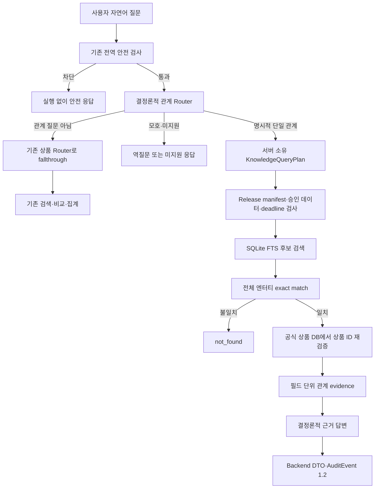

# P0-10 공개 관계 검색·릴리스 통합 인수인계

작성일: 2026-08-20

구현 commit: `82e62f3` → `6e972a8` → `eac71c0`

릴리스 QA 포맷 정리 commit: `6f34aba`

상세 기준선:
[P0-10 공개 관계 검색·릴리스 통합 baseline](../evaluation/baselines/p0-10-public-relation-release-integration-v1.json)

검증 범위:
[P0-10 고정 protocol](../evaluation/protocols/p0-10-public-relation-release-integration-v1.protocol.json)

## 0. 결과부터 보기

- P0-7까지 내부 CLI에서만 실행하던 관계 검색을 공개 Agent Router와 Backend 답변 경로에 연결 완료
- “한국주택금융공사가 발행한 국내채권 3개 보여줘” 같은 명시적 관계 질문을 공개 Docker API에서 실행 가능
- 관계 질문이 아니면 기존 상품 검색·비교·집계 경로로 그대로 전달해 기존 기능 유지
- 검색 후보가 나오더라도 회사명·지역·지수·자산유형의 전체 값이 정확히 일치할 때만 결과로 승인
- 부분 단어만 일치하는 후보는 결과에서 제거해 `not_found`로 처리
- 관계 검색과 수익률·금리·정렬 조건을 섞은 요청은 임의 해석하지 않고 역질문 또는 미지원 응답으로 종료
- 관계 결과는 현재 모델을 호출하지 않고 검증된 근거로 결정론적 답변 생성
- 공개 관계 경로에는 로컬 LLM이나 별도 HyperCLOVA X 주장 생성 provider를 연결할 수 없도록 차단
- `AgentReleaseManifest 1.2`가 관계 색인·승인 데이터·실행 설정을 하나의 공개 릴리스로 고정
- `AuditEvent 1.2`가 모든 관계 실행에 `relation_set_sha256`을 연결하고 실패·timeout이 발생한 실제 단계를 보존
- 빈 Docker volume에서 관계 산출물 생성, Backend 기동, 실제 질문, 변조 차단까지 확인
- 최종 고정 P0-10 회귀 522/522, Agent Core 전체 1,443 passed·2 skipped, Backend 전체 358 passed
- 실제 NCP 배포·서명·공인 IP와 관계 답변용 HyperCLOVA X는 아직 검증하지 않았으므로 완료 주장 대상에서 제외

쉽게 말하면 P0-6의 “관계 검색 DB”와 P0-7의 “안전한 내부 실행기”를 사용자가 실제로
질문하는 공개 통로에 연결하고, 배포 파일이 바뀌면 답변하지 않도록 잠금장치까지 건 단계

## 1. 무엇이 달라졌는가

| 단계 | 변경 전 | 변경 후 |
| --- | --- | --- |
| 사용자 질문 | 관계 질문도 기존 상품 Router가 해석하거나 미지원 처리 | 전역 안전 검사 뒤 관계 전용 Router가 명시적 관계 질문만 분리 |
| 일반 상품 질문 | 기존 SEARCH·COMPARE·AGGREGATE 실행 | 관계 질문이 아니면 같은 기존 경로로 전달하는 fallthrough 유지 |
| 관계 실행 | P0-7 내부 JSON Plan·CLI에서만 실행 | 공개 `RoutedFinanceAgent`와 Backend DTO에서 실행 |
| 엔터티 검색 | FTS 후보 검색이 주된 검색 단계 | FTS는 후보만 만들고 전체 엔터티 exact match를 별도로 통과해야 결과 승인 |
| 답변 생성 | 내부 Claim Verifier와 결정론적 fallback 검증 | 공개 경로는 claim provider를 끄고 근거 기반 결정론적 답변만 사용 |
| 데이터 준비 | 상품군 SQLite 4개 준비 | 상품군 DB와 관계 artifact·SHA sidecar·관계 SQLite를 함께 준비 |
| 배포 고정 | P0-7 내부 release 후보만 존재 | `AgentReleaseManifest 1.2`의 `knowledge_retrieval`에 공개 활성 상태 포함 |
| 상태 확인 | 네 상품군 DB와 Audit·Shadow 상태 확인 | `relation_retrieval_status`를 추가하고 drift 발견 시 `/health` 503 |
| 감사 로그 | 일반 상품 실행의 release·dataset 연결 | 관계 집합 해시와 관계 실행의 성공·실패·timeout 인과관계까지 검증 |
| CI | 관계 artifact를 공개 릴리스에 넣는 신뢰 경로 없음 | 보호된 GitHub Environment의 artifact와 SHA를 승인 데이터 manifest에 교차 결합 |

P0-5·P0-6·P0-7·P0-8의 역사적 완료 상태는 수정하지 않음

- [P0-5 외부 문서 반입](p0-5-external-corpus-intake-2026-08-19.md)은 실제 승인 corpus 대기 상태 유지
- [P0-6 관계 색인](p0-6-provided-relation-retrieval-handover-2026-08-19.md)은 제공 데이터 관계 생성 근거 유지
- [P0-7 계획·주장 검증](p0-7-knowledge-claim-verifier-handover-2026-08-20.md)은 내부 계약 완료 기록 유지
- [P0-8 재시도 계약](p0-8-retry-contract-handover-2026-08-19.md)은 200·503·504와 동일 요청 처리 기록 유지
- P0-10은 위 결과를 폐기하거나 다시 정의한 문서가 아니라 공개 실행·릴리스 통합 successor

## 2. 사용자 질문이 답이 되는 흐름



### 관계 질문이 아닌 경우

- `DeterministicKnowledgeRouter`가 관계 표현을 찾지 못하면 `NOT_APPLICABLE` 반환
- `RoutedFinanceAgent`가 기존 `_answer_atomically()` 경로로 질문 전달
- 기존 상품 SEARCH·COMPARE·AGGREGATE의 Router·Oracle·Verifier·Evidence 계약 유지
- 관계 Router를 추가했다는 이유로 모든 질문이 관계 DB를 거치지 않음

### 관계 질문인 경우

- 기존 전역 안전 검사가 먼저 통과되어야 관계 Router 호출
- 상품군 하나, 관계 종류 하나, 엔터티 하나와 결과 개수 1~20만 허용
- 서버가 만든 `KnowledgeQueryPlan`만 실행하고 모델이 조건을 추가하거나 바꾸지 못함
- 검색 전후에 공개 릴리스, 승인 상품 DB, 관계 artifact와 deadline 재확인
- 결과마다 상품 ID·상품명·관계 값·원천 행·기준일·evidence ID 보존
- 공개 답변은 evidence만 사용하며 별도 생성 모델 호출 없음

## 3. 현재 지원하는 질문과 지원하지 않는 질문

### 지원 관계

| 관계 | 질문 예시 | 상품군 |
| --- | --- | --- |
| 발행사 `issued_by` | “한국주택금융공사가 발행한 국내채권 3개 보여줘” | 국내채권 |
| 운용사 `managed_by` | “미래에셋자산운용이 운용하는 국내 ETF 5개 보여줘” | 국내 ETF·ETN |
| 기초지수 `tracks_index` | “KOSPI 200을 추종하는 국내 ETF 3개 보여줘” | 국내 ETF·ETN |
| 투자지역 `invests_in_region` | “미국에 투자하는 해외 ETF 5개 보여줘” | 국내·해외 ETF·ETN |
| 자산유형 `classified_as_asset` | “자산유형이 주식인 해외 ETF 5개 보여줘” | 국내·해외 ETF·ETN |

### 아직 지원하지 않는 범위

| 요청 | 처리 | 이유 |
| --- | --- | --- |
| 해외 ETP 운용사·기초지수 | 미지원 | 제공 데이터에서 승인된 관계 출처 계약이 없음 |
| 공모펀드 운용사·자산·지역 관계 | 미지원 | 공모펀드 관계 source 계약이 없음 |
| 테마·편입종목·보유종목 | 미지원 | 현재 관계 색인에 없는 정보 |
| 설명서·약관·외부 문서 관계 | 미지원 | 실제 승인 문서 corpus가 없음 |
| 관계와 금리·수익률·AUM·정렬 조건의 한 요청 결합 | 역질문 또는 미지원 | 서로 다른 실행 계획을 임의로 합치지 않음 |
| 두 운용사 또는 두 관계를 한 번에 요청 | 역질문 | 단일 엔터티·단일 관계만 허용 |
| 추천·전망·수익 보장 | 미지원 | 제공 데이터 조회 범위를 벗어남 |
| CSV·엑셀 반출·지시 무시·SQL 공격 표현 | 미지원 | 공개 안전 경계에서 실행 차단 |
| alias·약칭·번역을 이용한 의미 검색 | 현재 보장하지 않음 | 전체 엔터티 exact match만 공개 승인 |

## 4. exact entity match가 필요한 이유

FTS는 빠르게 후보를 찾는 도구일 뿐 최종 정답 판정기가 아님

- 여러 단어가 있는 질문은 모든 자연어 token이 있는 후보를 우선 검색
- `S&P 500`과 `S P 500`처럼 공백·문장부호만 다른 표기는 안전한 정규화 후 같은 값으로 처리
- 대소문자, 유니코드 NFKC와 연속 공백 차이는 정규화 가능
- token 일부, 접두어, 부분 문자열만 같은 후보는 결과로 승인하지 않음
- 저장된 정규화 값도 원문 엔터티에서 다시 계산해 색인 내부 값만 무조건 신뢰하지 않음

예시

| 검색어 | 저장 값 | 결과 |
| --- | --- | --- |
| `test capital` | `Test Capital` | 전체 값 일치로 승인 |
| `Test` | `Test Capital` | 부분 token이므로 `not_found` |
| `Ｓ　＆　Ｐ　５００` | `S&P 500` | 문장부호·전각 정규화 후 전체 값 일치로 승인 |

이 정책은 검색 recall보다 잘못된 회사·지역·지수를 반환하지 않는 precision을 우선

구현과 회귀 근거

- [relations.py](../packages/finance_agent_core/src/finance_agent_core/retrieval/relations.py)의 `_fts_query()`와 `_canonical_entity_match()`
- [test_relation_retrieval.py](../packages/finance_agent_core/tests/test_relation_retrieval.py)의 부분 token·한영 표기 정규화 회귀

## 5. data-init이 만드는 관계 산출물

`data-init`은 상품군 DB를 만든 뒤 같은 승인 데이터에서 다음 세 파일을 생성

| 파일 | 역할 | 최종 권한 |
| --- | --- | ---: |
| `relation-retrieval-artifact.json` | 색인 SHA, 승인 데이터 manifest SHA, 논리 관계 집합 SHA를 묶는 canonical JSON | `0444` |
| `relation-retrieval-artifact.sha256` | 위 artifact 파일 원본 byte의 외부 SHA-256 anchor | `0444` |
| `provided-relations.sqlite3` | 발행사·운용사·기초지수·지역·자산유형 관계와 FTS 후보 색인 | `0444` |

생성 규칙

- 빈 staging 디렉터리에서 세 파일 생성 후 전체 검증을 통과해야 최종 경로로 이동
- symlink·hard link·쓰기 권한·SQLite sidecar·비정상 크기·비정규 JSON 거부
- 관계 색인과 상품 DB 3개가 같은 승인 manifest와 DB SHA를 가리키는지 확인
- 재사용할 때도 state 파일만 믿지 않고 파일 권한·SHA·SQLite 내용과 상품 DB를 다시 검사
- 검증되지 않은 기존 파일이 있으면 자동 덮어쓰지 않고 fail closed

Backend는 `/data` volume 자체를 `read_only: true`로 연결

- 개발 `data-init`만 전용 volume에 산출물 작성
- Backend는 세 파일을 읽을 수 있지만 수정할 수 없음
- 컨테이너 root filesystem도 read-only이며 `/tmp`만 제한된 tmpfs 사용

구현 근거

- [storage/prepare.py](../packages/finance_agent_core/src/finance_agent_core/storage/prepare.py)
- [루트 docker-compose.yml](../../docker-compose.yml)
- [test_relation_data_prepare.py](../packages/finance_agent_core/tests/test_relation_data_prepare.py)
- [test_data_prepare.py](../packages/finance_agent_core/tests/test_data_prepare.py)

## 6. 개발과 공개 릴리스의 SHA 신뢰 방식

### 개발 Compose

- `data-init`이 artifact와 `relation-retrieval-artifact.sha256`을 같은 준비 작업에서 생성
- Backend가 쓰기 불가능한 SHA sidecar를 읽어 artifact byte를 확인
- 개발자가 원천 데이터부터 반복 재현하기 위한 편의 경로
- 다음 환경변수를 사용

```text
FINANCE_RELATION_RETRIEVAL_ARTIFACT_FILE=/data/relation-retrieval-artifact.json
FINANCE_RELATION_RETRIEVAL_ARTIFACT_SHA256_FILE=/data/relation-retrieval-artifact.sha256
FINANCE_RELATION_INDEX_FILE=/data/provided-relations.sqlite3
```

### evaluation·production release

- 실행 중 같은 volume에서 만들어진 SHA sidecar를 신뢰점으로 사용하지 않음
- 보호된 배포 절차가 외부에서 승인한 SHA-256을 명시적 환경변수로 주입
- release Compose가 개발 sidecar 환경변수를 `!reset null`로 제거
- 명시적 SHA와 sidecar를 동시에 설정하거나 둘 다 설정하지 않으면 기동 거부

```text
FINANCE_RELATION_RETRIEVAL_ARTIFACT_SHA256=<64자리 승인 SHA-256>
```

공개 배포에서 “파일과 그 파일 옆에 있는 checksum이 함께 바뀌는 문제”를 막기 위한 분리

구현 근거

- [Backend 설정](../../fastapi_backend/app/config.py)
- [release Compose](../../fastapi_backend/docker-compose.release.yml)
- [관계 runtime wiring 회귀](../../fastapi_backend/tests/test_relation_runtime_wiring.py)
- [release Compose 계약 회귀](../../fastapi_backend/tests/test_release_deployment_contract.py)

## 7. AgentReleaseManifest 1.2 결합

`AgentReleaseManifest.schema_version`은 `1.2`

새 `components.knowledge_retrieval` 구성

```text
knowledge_retrieval
├── relation
│   ├── status = activated | disabled_not_activated
│   ├── artifact
│   │   ├── index_sha256
│   │   ├── approval_manifest_sha256
│   │   └── relation_set_sha256
│   └── artifact_file_sha256
└── document
    └── status = disabled_no_approved_corpus
```

공개 실행 시 확인하는 것

- release manifest가 관계 검색을 활성화했으면 Router와 `KnowledgeAgent`가 반드시 존재
- 실제 `KnowledgeAgent.release`가 manifest의 `PublicKnowledgeRetrievalRelease`와 정확히 같아야 함
- 내부 검증용 `KnowledgeRetrievalRelease`를 공개 릴리스에 연결할 수 없음
- manifest가 관계 검색을 껐으면 실행 Agent를 붙일 수 없음
- 관계 artifact의 승인 manifest SHA가 `approved_datasets` 구성과 같아야 함
- 요청 전후에도 release·binding과 in-process Agent 결합이 유지되는지 재검사

### 공개 relation claim provider는 비활성

- P0-10 공개 관계 답변은 모델 없이 결정론적으로 생성
- `PublicKnowledgeRetrievalRelease`에 `claim_provider`를 연결하면 구성 단계에서 거부
- 상품 답변용 HyperCLOVA X 설정과 관계 주장 생성 provider는 별도 경계
- 실제 관계 HyperCLOVA X provider를 열려면 모델·Prompt·응답 schema·Audit·fallback을 새 릴리스 계약으로 고정해야 함

구현 근거

- [release.py](../packages/finance_agent_core/src/finance_agent_core/release.py)
- [routed_service.py](../packages/finance_agent_core/src/finance_agent_core/agent/routed_service.py)
- [knowledge_service.py](../packages/finance_agent_core/src/finance_agent_core/agent/knowledge_service.py)
- [test_agent_release.py](../packages/finance_agent_core/tests/test_agent_release.py)

## 8. GitHub Environment와 승인 데이터 교차 결합

[Immutable NCP release workflow](../../.github/workflows/immutable-ncp-release.yml)은
`evaluation` 또는 `production` 보호 환경을 선택

보호 환경이 제공해야 하는 관계 자료

| 종류 | 이름 | 역할 |
| --- | --- | --- |
| Environment secret | `APPROVED_RELATION_RETRIEVAL_ARTIFACT_B64` | 승인 artifact의 strict base64 byte |
| Environment variable | `APPROVED_RELATION_RETRIEVAL_ARTIFACT_SHA256` | artifact byte의 외부 SHA-256 anchor |

Registry를 변경하기 전에 수행하는 검사

1. base64 문법을 엄격하게 검사하며 디코딩
2. JSON 중복 key·추가 필드·비정규 직렬화 거부
3. 외부 SHA-256과 실제 artifact byte 비교
4. `$RUNNER_TEMP` 아래에 신규 단일-link `0444` 파일로만 생성
5. artifact의 `approval_manifest_sha256`과 Agent release의 `approved_datasets.manifest.contract_sha256` 비교
6. manifest의 `knowledge_retrieval.relation`이 같은 artifact와 파일 SHA를 담는지 비교
7. 위 검사가 끝난 뒤에만 image build·Registry push·서명 단계 진행

즉 관계 색인만 다른 데이터 릴리스에서 가져오거나, 올바른 checksum과 잘못된 승인
데이터를 조합해 공개 manifest를 만드는 구성을 거부

로컬 계약과 fake workflow 테스트는 완료했지만 실제 보호 환경에서 workflow를 dispatch한
결과는 아직 없음

구현 근거

- [release_ci.py](../../fastapi_backend/scripts/release_ci.py)
- [immutable-ncp-release.yml](../../.github/workflows/immutable-ncp-release.yml)
- [test_release_ci_contract.py](../../fastapi_backend/tests/test_release_ci_contract.py)

## 9. health와 실행 중 변조 차단

`GET /health`의 `relation_retrieval_status`

| 값 | 의미 | HTTP |
| --- | --- | ---: |
| `disabled` | 관계 파일을 구성하지 않은 개발 또는 비활성 릴리스 | 다른 필수 상태가 정상일 때 200 |
| `ready` | 관계 Agent가 있고 준비 시점 파일 identity가 현재도 같음 | 다른 필수 상태가 정상일 때 200 |
| `degraded` | 구성했지만 Agent가 없거나 artifact·색인·상품 DB drift 감지 | 503 |

기동 시 깊은 검사

- artifact file SHA와 승인 SHA 일치
- relation index SHA·SQLite `quick_check`·논리 relation set 일치
- 승인 상품 DB 3개의 manifest·source·database SHA 일치
- relation artifact와 공개 AgentReleaseManifest 일치

요청과 health에서 반복하는 값싼 검사

- 준비 시 기록한 path·device·inode·size·mtime·ctime과 현재 파일 비교
- 경로 교체나 byte 추가처럼 파일 identity가 바뀌면 캐시된 성공을 사용하지 않음
- health는 `degraded`와 503 반환
- 관계 질문도 `dataset_unavailable` 503 반환
- 오류 DTO는 이미 신뢰한 `search` intent와 `bond` 같은 상품군을 보존

실측에서는 격리된 관계 SQLite 끝에 한 byte를 추가한 뒤 health와 관계 질문 모두 503 반환

구현 근거

- [health route](../../fastapi_backend/app/routes/health.py)
- [dependencies.py](../../fastapi_backend/app/dependencies.py)
- [test_health.py](../../fastapi_backend/tests/test_health.py)
- [test_relation_runtime_wiring.py](../../fastapi_backend/tests/test_relation_runtime_wiring.py)

## 10. AuditEvent 1.2와 실패 인과관계

관계 검색 공개 릴리스의 `runtime_controls.audit_schema_version`은 `1.2`

모든 관계 실행 이벤트에 가능한 경우 다음 값을 함께 보존

- `relation_set_sha256`: 실행한 논리 관계 집합의 SHA-256
- `plan_sha256`: 서버가 확정한 관계 계획의 SHA-256
- `product_families`: 실행 상품군
- `product_id_sha256s`, `evidence_id_sha256s`: 원문 대신 식별자 hash
- release manifest·DeploymentBinding·승인 데이터 연결 hash
- 같은 요청 안의 `invocation_id_sha256`과 증가하는 `event_sequence`

정상 관계 실행의 대표 단계

```text
safety → route → compiler → authority → sql → verifier → renderer → answer → request
```

실패·timeout 규칙

- 실패한 실제 경계를 `authority`, `sql`, `verifier`, `hclx`, `renderer` 중 하나로 기록
- timeout은 일반 `failed`가 아니라 `timed_out`으로 구분
- SQL이 끝나지 않았는데 verifier 성공을 남기거나, 실패 경계 없이 terminal failure만 있는 trace 거부
- 한 요청에 서로 다른 두 실패 원인을 중복 기록한 trace 거부
- terminal `answer`와 `request`가 앞 단계의 plan·family·relation set·결과 수와 같은지 검증
- 요청이 deadline 뒤에 끝났다면 늦은 성공을 반환하지 않고 timeout으로 종료
- 공개 relation claim provider가 비활성이므로 정상 P0-10 관계 실행에는 HCLX 단계가 없음

이 구조는 “실패했다”는 결과만 남기는 것이 아니라 어느 검증 경계에서 왜 종료됐는지
앞 단계와 연결해 확인하기 위한 것

구현 근거

- [observability.py](../packages/finance_agent_core/src/finance_agent_core/observability.py)
- [audit_validation.py](../packages/finance_agent_core/src/finance_agent_core/audit_validation.py)
- [test_observability.py](../packages/finance_agent_core/tests/test_observability.py)
- [test_audit_validation.py](../packages/finance_agent_core/tests/test_audit_validation.py)

## 11. fail-closed 기준

다음 상황에서는 관계 결과를 만들지 않음

| 상황 | 결과 |
| --- | --- |
| artifact·index 중 하나만 설정 | Backend 설정 거부 |
| SHA trust source가 0개 또는 2개 | Backend 설정 거부 |
| evaluation·production이 runtime sidecar 사용 | Backend 설정 거부 |
| release 활성 상태와 실제 Agent가 다름 | 시작 또는 요청 거부 |
| 내부 release를 공개 Agent에 연결 | 시작 거부 |
| artifact가 다른 승인 데이터 manifest를 가리킴 | release 생성·CI 거부 |
| artifact·SQLite·상품 DB SHA 불일치 | 시작 또는 요청 거부 |
| 파일 쓰기 가능·symlink·hard link·SQLite sidecar 발견 | 준비·시작 거부 |
| 시작 후 파일 교체·수정 | health 503, 관계 요청 503 |
| 부분 엔터티만 일치 | `not_found`, 상품 0건 |
| 관계와 미지원 수치 조건 혼합 | 역질문 또는 미지원, SQL 무실행 |
| provider·검증기 timeout | 검증된 fallback 또는 504 계약, 늦은 성공 폐기 |
| 감사 trace의 단계·인과관계 불완전 | Audit validator 거부 |

“문제가 있어도 가능한 만큼 답한다”가 아니라 근거 체인 전체를 신뢰할 수 있을 때만
관계 상품을 반환하는 기준

## 12. 실제 검증 결과

### 자동 회귀

| 범위 | 결과 | 해석 |
| --- | ---: | --- |
| P0-10 최종 고정 20파일 회귀 | 522/522, 20.07초 | 공개 Router·exact 검색·release·Audit·Backend·CI·rollback 계약 |
| Agent Core 전체 | 1,443 passed, 2 skipped, 33.68초 | 현재 Core 전체 기능 회귀 |
| Backend 전체 | 358 passed, warnings 2, 8.75초 | 현재 Backend 전체 회귀 |
| Python lint·format | 통과 | Core·Backend 전체 Ruff lint·format 검사 |

Backend warning 2건은 activation lock 동시성 시험의 Python fork deprecation warning

skip 2건은 기존 opt-in 검사

- 로컬 비공개 blind key가 없을 때 skip
- `FINANCE_STAGE2_DATABASE_DIR`가 없을 때 승인 DB 지문 재계산 skip

522/522는 고정한 시스템 계약을 다시 실행한 결과이며 독립 금융 질문 정확도,
LLM 성능 또는 공모전 예상 점수를 뜻하지 않음

### 깨끗한 Docker 전체 경로

| 확인 항목 | 실제 결과 |
| --- | --- |
| 격리 프로젝트 | `gaeng3-p010-review2` |
| 이미지 | `gaeng3-backend:p010-review2` |
| loopback 포트 | `18004` |
| 새 volume의 data-init | exit 0 |
| Backend health | `status=ok`, `relation_retrieval_status=ready`, 네 상품군 ready |
| Backend smoke | 8/8 |
| 공식 형식 GET 호환 smoke | 8/8 |
| 발행사 관계 질문 | 상품 3개, `relation_field` citation 3개 |
| 부분 엔터티 | `not_found` |
| 관계·수치 혼합 요청 | `unsupported`, SQL 무실행 |
| 관계 SQLite 한 byte 변조 후 health | HTTP 503 |
| 변조 후 같은 관계 요청 | HTTP 503, `dataset_unavailable` |
| 테스트 자원 | 격리 project·network·volume 제거 완료 |

실제 관계 질문

```text
한국주택금융공사가 발행한 국내채권 3개 보여줘
```

응답 계약에서 확인한 값

- `status=success`
- `intent=search`
- `product_families=[bond]`
- `answer_mode=deterministic`
- `query_plan.operation.kind=relation_search`
- 상품 3개
- `kind=relation_field` citation 3개
- 별도 LLM 호출 없음

기계 판독 가능한 수치·hash·한계는
[P0-10 baseline](../evaluation/baselines/p0-10-public-relation-release-integration-v1.json)을 정본으로 사용

## 13. 재현 방법

아래 명령은 저장소 루트에서 실행. 먼저 프로젝트 Conda 환경을 활성화

```bash
conda activate gaeng3-dev
```

### P0-10 고정 회귀

고정 대상 20개 파일은 protocol의 `test_files`를 사용

```bash
PYTHONPATH=fastapi_backend:finance_agent/packages/finance_agent_core/src \
  python -m pytest -q \
  --junitxml=finance_agent/artifacts/evaluation/p0-10-public-relation-release-integration-v1.xml \
  $(python -c 'import json; print(" ".join(json.load(open("finance_agent/evaluation/protocols/p0-10-public-relation-release-integration-v1.protocol.json"))["test_files"]))')
```

### 전체 회귀

```bash
PYTHONPATH=finance_agent/packages/finance_agent_core/src \
  python -m pytest -q finance_agent/packages/finance_agent_core/tests

PYTHONPATH=fastapi_backend:finance_agent/packages/finance_agent_core/src \
  python -m pytest -q fastapi_backend/tests
```

### 문서와 정적 검사

```bash
python -m ruff check \
  finance_agent/packages/finance_agent_core/src \
  finance_agent/packages/finance_agent_core/tests \
  fastapi_backend

python -m ruff format --check \
  finance_agent/packages/finance_agent_core/src \
  finance_agent/packages/finance_agent_core/tests \
  fastapi_backend

cd finance_agent
python scripts/check-docs.py
```

### 깨끗한 Docker smoke

공식 원천 데이터 경로를 `fastapi_backend/.env`에 먼저 설정

```bash
export BACKEND_HOST_UID="$(id -u)"
export BACKEND_HOST_GID="$(id -g)"
export COMPOSE_PROJECT_NAME=gaeng3-p010-review
export BACKEND_PORT=18004

./compose.sh up --detach --wait

PYTHONPATH=fastapi_backend:finance_agent/packages/finance_agent_core/src \
  python fastapi_backend/scripts/smoke.py \
  --base-url http://127.0.0.1:18004 \
  --expected-fund-execution-policy locked \
  --expected-relation-retrieval-status ready \
  --output /tmp/gaeng3-p010-smoke.json

./compose.sh down --volumes
```

`down --volumes`는 위 격리 `COMPOSE_PROJECT_NAME`이 만든 테스트 volume에만 사용

실제 운영 project나 이름을 확인하지 않은 volume에는 사용하지 않음

## 14. 주요 구현 파일

| 파일 | 역할 |
| --- | --- |
| [knowledge_router.py](../packages/finance_agent_core/src/finance_agent_core/agent/knowledge_router.py) | 명시적 관계 질문만 Plan으로 만드는 결정론적 공개 Router |
| [routed_service.py](../packages/finance_agent_core/src/finance_agent_core/agent/routed_service.py) | 전역 안전 검사, 상품 fallthrough, 공개 release 결합과 원자적 실행 |
| [knowledge_service.py](../packages/finance_agent_core/src/finance_agent_core/agent/knowledge_service.py) | 관계 검색·검증·deadline·readiness·답변 조립 |
| [knowledge_backend_adapter.py](../packages/finance_agent_core/src/finance_agent_core/agent/knowledge_backend_adapter.py) | 관계 evidence와 제어 결과를 기존 Backend DTO로 변환 |
| [relations.py](../packages/finance_agent_core/src/finance_agent_core/retrieval/relations.py) | FTS 후보, full-entity exact match, 공식 상품 ID 재검증 |
| [storage/prepare.py](../packages/finance_agent_core/src/finance_agent_core/storage/prepare.py) | 관계 산출물 세 개의 원자적 생성·재사용·0444 고정 |
| [release.py](../packages/finance_agent_core/src/finance_agent_core/release.py) | AgentReleaseManifest 1.2와 PublicKnowledgeRetrievalRelease |
| [observability.py](../packages/finance_agent_core/src/finance_agent_core/observability.py) | AuditEvent 1.2와 relation set 연결 필드 |
| [audit_validation.py](../packages/finance_agent_core/src/finance_agent_core/audit_validation.py) | 관계 성공·제어·실패·timeout의 인과관계 검증 |
| [Backend config](../../fastapi_backend/app/config.py) | 관계 파일과 exactly-one SHA trust source 설정 |
| [Backend dependencies](../../fastapi_backend/app/dependencies.py) | 공개 Agent와 release의 시작 시 배선·검증 |
| [health route](../../fastapi_backend/app/routes/health.py) | 관계 readiness와 drift의 200·503 판정 |
| [smoke.py](../../fastapi_backend/scripts/smoke.py) | 일반 상품·관계·제어·공식 형식 GET 호환 Docker smoke |
| [release_ci.py](../../fastapi_backend/scripts/release_ci.py) | 보호 환경 artifact materialization과 dataset 교차 결합 |
| [immutable-ncp-release.yml](../../.github/workflows/immutable-ncp-release.yml) | Registry 변경 전 QA·manifest·서명 흐름 |
| [docker-compose.yml](../../docker-compose.yml) | 개발 data-init과 Backend read-only volume 배선 |
| [docker-compose.release.yml](../../fastapi_backend/docker-compose.release.yml) | 공개 릴리스의 명시적 SHA-only 배선 |

## 15. 아직 검증하지 않은 것

### 실제 NCP 배포

- 보호된 GitHub Environment에서 workflow를 실제 dispatch하지 않음
- NCP Container Registry push와 exact digest 확인을 실제 수행하지 않음
- NCP Server 공인 IP에서 `/health`와 `/answer`를 호출하지 않음
- Sigstore로 서명된 실제 artifact와 image 검증을 운영 환경에서 수행하지 않음

### 실제 두 릴리스 rollback

- 로컬 fake·합성 rollback 계약은 존재
- 서명된 실제 N-1과 N 릴리스·각 전용 data volume으로 N-1 → N → N-1을 수행하지 않음

### 관계 HyperCLOVA X provider

- P0-10 공개 관계 답변은 결정론적 경로만 사용
- 실제 HyperCLOVA X 관계 주장 생성, 비용, latency, timeout, fallback 비율 미측정
- 이를 연결하려면 현재 public-provider-disabled 계약을 새 승인 릴리스로 변경해야 함

### 의미 검색과 독립 blind

- 약칭·계열사명·한영 alias·번역·오타를 이용한 의미 검색 미지원
- 구현자가 보지 않은 관계 질문과 비공개 gold의 독립 blind 미실행
- exact match는 오수락을 줄이는 안전 기준이며 자연어 일반화 성능을 증명하지 않음

### 승인 문서 corpus

- P0-5 반입 계약만 준비됐고 실제 승인 설명서·약관·용어집은 0건
- 문서 검색과 관계 검색을 함께 사용한 공개 RAG 성능은 주장하지 않음

## 16. 다음 담당자가 할 일

### 배포 담당

1. GitHub `evaluation`·`production` 보호 환경의 승인자와 secret·variable 설정
2. 실제 NCP immutable workflow 최초 dispatch
3. 생성 manifest의 `knowledge_retrieval.relation`과 승인 데이터 교차 결합 확인
4. NCP 공인 IP에서 health·관계·기존 공식 형식 GET 호환 smoke 수행
5. 서명된 실제 N-1·N 두 릴리스 rollback 수행

### AI Agent 담당

1. 금융 도메인 담당자가 봉인한 alias·독립 blind를 수정 전에 최초 1회 실행
2. exact only 기준의 정답률·기권률·오수락률 측정
3. 실제 HyperCLOVA X 관계 provider가 필요한지 결정론적 답변과 비교
4. 필요할 때만 provider·Prompt·schema·Audit·비용 gate를 새 release version으로 설계

### 금융 도메인 담당

1. 회사명·운용사·지수·지역·자산유형의 승인 alias 목록 작성
2. 원천 표기, 승인 alias, 검토자와 근거를 분리해 기록
3. 개발자가 보지 않은 관계 질문과 비공개 정답 준비
4. 문서 RAG 후보의 출처·권한·기준일 승인

## 17. 인계 판단

- 로컬 공개 관계 검색 구현과 고정 시스템 계약: 완료
- 기존 상품 경로 호환과 clean Docker 실행: 완료
- 관계 artifact·release·Audit·health fail-closed: 완료
- 기계 판독 가능한 P0-10 baseline: 완료
- 실제 NCP signed deployment: 미완료
- 실제 NCP 두 release rollback: 미완료
- 관계 HyperCLOVA X provider: 미완료·현재 공개 계약상 비활성
- alias·semantic 독립 blind: 미완료
- 승인 document corpus: 미완료

따라서 다음 담당자는 공개 관계 검색 코드를 다시 만드는 것이 아니라 실제 NCP 승격과
독립 금융 품질 검증부터 시작
