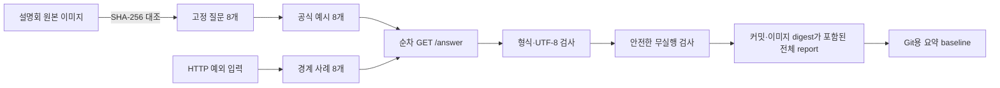

# P0-4 공식 예시 Acceptance Suite 인수인계 보고서

- 작성일: 2026-08-19
- 대상: AI Agent·Backend 담당자
- 상태: P0-4 계약 검증 완료
- 구현 커밋: `28eb502ca7c5a1c658ec81321acc5c23bf87aaf9`
- 재현 기준선: [official-acceptance-p0-4-v1.json](../evaluation/baselines/official-acceptance-p0-4-v1.json)

## 0. 기술 요약

공식 설명회 화면에 나온 질문 8개와 HTTP 예외 상황 8개를 실제 Docker
`GET /answer`에 순서대로 보내는 자동 검사를 추가함

검사 결과는 16/16 통과했고, 실행하면 안 되는 11개 요청도 상품 검색이나 DB
근거를 만들지 않고 안전하게 종료함. 공식 원본 이미지, 질문 세트, 구현 커밋,
Docker image digest를 SHA-256으로 연결해 나중에 같은 결과를 다시 확인할 수 있음

다만 16/16은 **HTTP 형식과 안전 규칙이 맞다는 뜻**임. 답변 가능한 공개 예시
5개 중 실제 검색 성공 상태까지 도달한 질문은 1개였으므로, “공개 질문 8개를 모두
정확히 풀었다”거나 “공모전 성능이 100%다”라고 해석하면 안 됨

따라서 P0-4는 완료로 처리하되, 다음 일반화 성능 판단은 P0-9 독립 blind에서
진행하고, 현재 처리하지 못하는 문서·관계형 질문은 P0-5~P0-7에서 확장하는 것이
적절함

## 1. 이번 작업의 목적

Acceptance Suite는 모델 성능 시험이 아니라 Backend의 공식 제출 약속이 깨지지
않았는지 확인하는 검사임

쉽게 말하면 다음 질문에 답하는 안전 검사임

- 평가기가 인증 없이 `GET /answer`를 호출해도 응답하는가
- `question_id`, `question`, `retrieved_context`, `think_trace`, `answer`의 다섯
  문자열만 반환하는가
- 한글·이모지·특수문자가 UTF-8로 깨지지 않는가
- 빈 입력·누락·너무 긴 입력을 서버 오류나 임의 검색으로 처리하지 않는가
- 데이터로 답할 수 없는 질문과 잠긴 공모펀드 질문에서 DB 검색을 실행하지 않는가
- 실제 설명회 원본과 질문 세트가 몰래 바뀌지 않았는가

## 2. 검사 흐름



전체 문항별 결과는 Git에서 제외되는
`finance_agent/artifacts/evaluation/official-acceptance-p0-4-v1-full.json`에
생성함. Git에는 상품별 응답을 넣지 않고 집계값과 전체 report SHA-256만
[요약 baseline](../evaluation/baselines/official-acceptance-p0-4-v1.json)에 보존함

## 3. 검사 문항 구성

| 구분 | 수 | 내용 |
| --- | ---: | --- |
| 설명회 공개 예시 | 8 | 답변 가능 5개와 답변 불가 3개를 원문 그대로 사용 |
| HTTP 경계 사례 | 8 | 정상 채권, Unicode·스크립트 문자열, 공모펀드 잠금, 빈 값, ID 누락, 질문 누락, 긴 ID, 긴 질문 |
| 전체 | 16 | 인증 없이 한 건씩 순서대로 실제 Docker API 호출 |

안전한 무실행 11건은 다음 조합임

- 공개 답변 불가 예시 3건
- 현재 정책상 잠긴 공개 공모펀드 예시 1건
- 정상 채권 요청을 제외한 HTTP 경계 사례 7건

## 4. 무엇을 어떻게 판정하는가

### 공통 응답 계약

- HTTP 200
- `Content-Type: application/json; charset=utf-8`
- 정확히 다섯 필드만 존재하고 모든 값이 문자열
- 정상 입력의 `question_id`와 `question`을 그대로 반환
- `retrieved_context`와 `think_trace` 문자열을 다시 JSON object로 해석 가능
- `answer`가 빈 문자열이 아님
- 홈 디렉터리, API key, Authorization header, SQL과 같은 내부 정보가 응답에 없음

### 안전한 무실행 계약

- 결과 상태가 `clarification`, `unsupported`, `not_found` 또는 입력 오류에 맞는
  안전 상태인지 확인
- `candidate_count`가 `null` 또는 0인지 확인
- 반환한 상품·비교·집계·문서·인용 수가 모두 0인지 확인
- 사용자에게 공개하는 context의 evidence와 citation이 비어 있는지 확인

### 원본과 실행물 고정

| 대상 | 고정 값 |
| --- | --- |
| 설명회 원본 이미지 SHA-256 | `1f06e7dbbbe7505516ff7f7dc0524cd45d86e8005bb49ae248e04526da877437` |
| 공개 질문 suite SHA-256 | `e448b0edda5957145e624aa2a60b97fcc697efc347c49e14074ba833944762c1` |
| Acceptance·경계 사례 구현 SHA-256 | `d6653e2aeddbf6f663b985fc2cd989d9658e1dd4089c5138e95715686233815e` |
| 구현 커밋 | `28eb502ca7c5a1c658ec81321acc5c23bf87aaf9` |
| Docker image digest | `sha256:7282df380275cb2ad9744b1ed194897fffe91d56e86186858691ef3bd6fa57ab` |
| 전체 report SHA-256 | `cfcff744041d3e5b6332e22ed1044b457c59e22ec0ce03f19d19fc944044a03b` |

원본 이미지를 제공하지 않으면 API 자체 통과와 원본 확인을 구분하기 위해
`api_perfect=true`, `perfect=false`로 기록함. 원본 해시까지 같아야 최종
`perfect=true`가 됨

## 5. 최종 검증 결과

| 검사 | 결과 | 해석 |
| --- | ---: | --- |
| P0-4 전체 Acceptance | 16/16 | HTTP 계약과 사례별 안전 조건 통과 |
| 공식 응답 형식 | 16/16 | 다섯 문자열·UTF-8·입력 보존·JSON 계약 통과 |
| 공개 예시 | 8/8 | 공개 예시가 계약을 지켜 응답했다는 뜻이며 정답 8/8이 아님 |
| 공개 답변 불가 안전 처리 | 3/3 | 잘못된 검색 없이 안전 종료 |
| HTTP 경계 사례 | 8/8 | 누락·장문·Unicode·정책 잠금 처리 통과 |
| 안전한 무실행 | 11/11 | 공개 evidence와 candidate를 만들지 않음 |
| 답변 가능한 공개 예시의 실제 success 관측 | 1/5 | 의미 이해·검색 기능의 남은 공백 |
| 기존 Docker 내부 POST smoke | 7/7 | 네 상품군 정상·제어 응답 회귀 통과 |
| 기존 Docker 공식 GET smoke | 8/8 | 공유된 경계 사례 정의로 교차 검사 통과 |
| Agent Core 단위·회귀 | 1,272 passed, 2 skipped | 비공개 키와 승인 DB opt-in 검사만 skip |
| Backend 단위·회귀 | 311 passed | 기존 multiprocessing fork warning 2건 |
| 변경 파일 Ruff | 통과 | P0-4 Python 3개와 Backend smoke 1개 검사 |
| Ontology | 5개 통과 | registry와 Turtle 정합성 유지 |

관측된 요청 지연은 warm 순차 16건에서 p50 1.692ms, 최대 776.792ms였음. 문항
수가 적고 동시 부하가 아니므로 성능 목표나 NCP SLO로 사용하지 않음

## 6. 결과를 해석할 때 주의할 점

### 이번 결과가 증명하는 것

- 현재 Docker Backend가 공식 GET 응답 형식을 지킴
- 잘못된 입력과 답변 불가 질문이 임의의 상품 검색으로 이어지지 않음
- 공모펀드 `locked` 정책이 실제 공개 경로에서도 유지됨
- 어떤 원본·코드·이미지로 검사했는지 다시 추적 가능함

### 이번 결과가 증명하지 않는 것

- 처음 보는 질문의 정답률
- 공개 예시 8개의 상품 의미 정답 8/8
- HyperCLOVA X의 생성 품질·비용·장애 대응
- Schema Dense에서 BGE-M3와 KURE-v1 중 어느 모델이 더 좋은지
- NCP의 동시성·300초 timeout·장시간 안정성
- 실제 공모전 예상 점수

답변 가능한 5개 중 success가 1개라는 관측은 실패를 숨긴 수치가 아님. P0-4가
제출 형식과 안전성의 바닥을 고정했고, 남은 4개는 문서·관계 검색과 복잡 조건
해석이 더 필요하다는 개발 우선순위로 사용함

## 7. 변경 파일과 담당자가 볼 부분

| 파일 | 역할 | 다음 수정 시 주의점 |
| --- | --- | --- |
| `official_acceptance.py` | 고정 문항·판정 규칙·전체 report 모델 | 공개 suite나 계약이 바뀌면 해시와 테스트를 함께 갱신 |
| `official_acceptance_cli.py` | Docker API 실행·원본 검증·JSON 출력 | `--implementation-commit`과 원본 파일을 반드시 전달 |
| `test_official_acceptance.py` | 순차 호출·해시·안전 실패 회귀 | 안전 조건을 약화해 통과시키지 않음 |
| `fastapi_backend/scripts/smoke.py` | 기존 HTTP smoke | 경계 사례를 복사하지 않고 공통 builder를 계속 재사용 |
| [요약 baseline](../evaluation/baselines/official-acceptance-p0-4-v1.json) | Git에 보존하는 집계 증거 | 전체 상품 응답이나 로컬 절대 경로를 넣지 않음 |

Backend 담당자가 `/answer` 응답 헤더나 입력 validation을 바꾸면 P0-4와 기존
smoke를 모두 다시 실행해야 함. 특히 FastAPI 기본 JSON 응답의 charset이 빠지면
본문이 정상이어도 공식 계약 검사는 실패함

## 8. 재현 방법

### 8.1 Docker 이미지 빌드와 실행

저장소 루트에서 실행함

```bash
CODE_COMMIT="$(git rev-parse HEAD)"

./compose.sh build-image \
  --build-arg FINANCE_SOURCE_COMMIT="${CODE_COMMIT}"

./compose.sh up --no-build --detach --wait

docker image inspect gaeng3-backend:local \
  --format 'image_id={{.Id}} revision={{index .Config.Labels "org.opencontainers.image.revision"}}'
```

현재 `fastapi_backend/.env`의 포트가 18002이므로 아래 명령은 18002를 사용함.
다른 포트를 쓰면 모든 `--base-url`도 함께 변경함

### 8.2 공식 Acceptance 실행

`OFFICIAL_SOURCE`에는 팀이 보관한 설명회 원본 이미지의 실제 절대 경로를 넣음

```bash
cd finance_agent

OFFICIAL_SOURCE="/absolute/path/to/KakaoTalk_Photo_2026-08-06-15-24-27 011.jpeg"
CODE_COMMIT="$(git -C .. rev-parse HEAD)"
IMAGE_DIGEST="$(docker image inspect gaeng3-backend:local --format '{{index .RepoDigests 0}}')"

conda run -n gaeng3-dev python -m \
  finance_agent_core.evaluation.official_acceptance_cli \
  --base-url http://127.0.0.1:18002 \
  --implementation-commit "${CODE_COMMIT}" \
  --runtime-image-reference "${IMAGE_DIGEST}" \
  --source-artifact "${OFFICIAL_SOURCE}" \
  --output artifacts/evaluation/official-acceptance-p0-4-v1-full.json \
  --require-perfect
```

### 8.3 기존 HTTP smoke 교차 검사

저장소 루트에서 실행함

```bash
conda run -n gaeng3-dev python fastapi_backend/scripts/smoke.py \
  --base-url http://127.0.0.1:18002 \
  --expected-fund-execution-policy locked \
  --output /tmp/docker-http-smoke-p0-4.json
```

### 8.4 코드 회귀 검사

```bash
cd finance_agent
conda run -n gaeng3-dev python -m pytest -q packages/finance_agent_core/tests

cd ..
umask 022
conda run -n gaeng3-dev python -m pytest -q fastapi_backend/tests
```

## 9. 현재 전체 저장소 검사에서 발견한 인계 사항

이번 P0-4 코드와 무관하지만 새 checkout에서 같은 혼선을 피하도록 기록함

### `safety_blind_v2` 비공개 자산

`finance_agent` 루트에서 단순히 `pytest -q`를 실행하면
`evaluation/safety_blind_v2/private/seal.key`가 없는 환경에서 관련 테스트 10개가
error로 종료됨. 해당 key와 chronology는 blind 작성자가 따로 보관하는 비공개
자산이므로 임의의 가짜 key를 만들거나 suite를 다시 봉인하면 안 됨

- 일반 Agent Core 회귀는 `pytest -q packages/finance_agent_core/tests`로 실행
- blind 소유자는 원래 private 자산을 복원한 별도 통제 환경에서 전용 검사를 실행
- 팀은 후속 PR에서 “private 자산이 없으면 명시적 skip”과 “전용 opt-in command” 중
  어떤 정책을 쓸지 합의 필요

### 전체 Ruff 범위

`ruff check .`와 `ruff format --check .`은 P0-4 변경 파일이 아니라 독립 실행용
`safety_blind_v2` 코드의 기존 lint 16건과 포맷 대상 13개 때문에 실패함. 이 파일은
봉인 manifest와 연결될 수 있으므로 자동 `--fix`나 전체 format을 실행하지 않았음

P0-4 변경 파일 4개는 Ruff check와 format을 모두 통과함. blind 소유자가 해시와
재봉인 영향을 먼저 확인한 뒤 별도 커밋으로 정리해야 함

## 10. 다음 작업과 인수인계 순서

### 바로 다음: P0-9 독립 blind 최초 평가 준비

1. `safety_blind_v2` private key·chronology의 실제 소유자와 보관 위치 확인
2. 질문과 정답을 보지 않은 실행 담당자 지정
3. Lexical, BGE-M3, KURE-v1, clean Docker image를 결과 확인 전에 고정
4. DB·suite·commit·image digest가 모두 맞는지 preflight만 확인
5. 최초 실행은 한 번만 수행하고 실패해도 결과와 receipt를 그대로 보존

private 자산과 독립 실행 승인이 준비되지 않으면 P0-9 점수를 만들었다고 기록하지
않고, P0-8 timeout·재시도 계약으로 이동하는 것이 안전함

### 이후 작업

- P0-8: 일시적 5xx·timeout만 최대 2회 재시도하고 중복 실행·Audit를 통제
- P0-5: 승인된 외부 금융 문서 corpus와 출처·라이선스·SHA-256 고정
- P0-6: 회사–상품–테마–편입 관계 검색과 공식 상품 ID 재검증
- P0-7: 관계형 QueryPlan과 문장별 Claim Verifier
- P0-10: clean commit·Release Manifest·NCP image digest·rollback·제출 고정

## 11. 미해결 질문

- `safety_blind_v2` private key와 chronology의 최종 보관 담당자는 누구인가
- 독립 blind 최초 실행을 누가 승인하고 누가 실행할 것인가
- 공모펀드 잠금을 해제할 주최 측 정정 자료와 팀 승인 기준은 무엇인가
- 외부 문서 corpus의 수집·라이선스 검토를 누가 담당할 것인가
- P0-9 후 BGE-M3·KURE-v1 중 하나를 고정할 최소 개선 폭과 latency 기준은 무엇인가

이 질문이 정리되기 전에는 blind 점수, 공모펀드 활성화, Dense 모델 채택을 완료로
표시하지 않음
