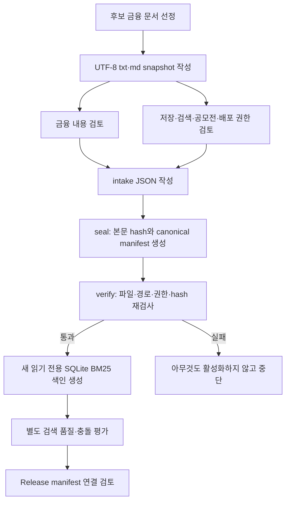

# P0-5 외부 금융 문서 반입 계약 인수인계

작성일: 2026-08-19

기준 코드 commit: `0d76042444ff06f7299b53c67bfc14b05dfb7c53`

검증 baseline: `evaluation/baselines/external-corpus-intake-contract-v1.json`

## 0. 한눈에 보기

- 금융 용어·상품 구조·위험 설명에 사용할 외부 문서를 안전하게 받는 틀 구현
- 실제 외부 문서는 아직 한 건도 저장하거나 활성화하지 않음
- 웹 crawler·자동 다운로드·PDF·OCR·번역도 추가하지 않음
- 금융 내용 검토자와 데이터 사용 권한 검토자를 서로 다른 사람으로 기록
- 저장·검색·공모전 사용·배포 포함 권한 네 가지가 모두 확인된 문서만 봉인 가능
- 출처 URL·수집 시각·기준일·라이선스·본문 SHA-256을 canonical manifest로 고정
- 봉인 뒤 한 byte라도 바뀌면 SQLite 색인 생성 전 중단
- 경로 탈출·심볼릭 링크·중복 JSON key·기존 출력 덮어쓰기도 차단
- 검증된 UTF-8 `.txt`·`.md`만 별도의 읽기 전용 SQLite FTS5/BM25 색인으로 생성 가능
- 현재 Release의 `document_bm25=disabled_no_approved_corpus`는 그대로 유지

즉 “외부 문서를 이미 사용한다”가 아니라 “팀이 문서를 선정하면 어떤 절차로 안전하게
받을지 준비됐다”는 단계다

## 1. 왜 필요한가

현재 Agent는 주최 측 정형 상품 데이터로 검색·비교·집계를 수행한다. 그러나 다음 질문은
정형 상품 행만으로 충분히 설명하기 어렵다

- ETF와 ETN의 구조 차이
- 채권 신용등급의 일반적인 의미
- 총보수와 기타 비용 용어
- 금융상품 위험등급을 읽는 방법

주최 측 규칙상 금융상품 관련 비정형 데이터를 팀이 수집해 활용할 수 있지만, 아무 웹
문서나 바로 검색에 넣으면 다음 문제가 발생한다

- 실제 출처와 수집 시점을 다시 확인하기 어려움
- 저장·평가·제출 서버 포함 권한이 서로 다를 수 있음
- 문서가 나중에 바뀌어도 같은 문서라고 오인할 수 있음
- 잘못된 파일이나 변조된 내용이 답변 근거로 들어갈 수 있음
- 외부 문서와 주최 측 제공 데이터가 충돌할 수 있음

P0-5 반입 계약은 문서 검색 알고리즘보다 먼저 이 경계를 고정한다

## 2. 전체 흐름



`seal`은 사람이 적은 내용이 옳다고 법적으로 판단하는 도구가 아니다. 두 검토자가 승인한
기록과 실제 snapshot bytes를 하나의 변경 불가능한 식별자로 묶는 도구다

## 3. 역할 분담

| 역할 | 확인할 내용 | 코드상 역할 이름 |
| --- | --- | --- |
| 금융 도메인 담당 | 금융상품 관련성, 설명 범위, 기준일, 오해 가능성, 주최 측 데이터와의 우선순위 | `finance_domain` |
| 데이터 사용 권한 담당 | 저장·검색·공모전 평가·배포 이미지 포함 가능 여부와 출처 표기 문구. 팀에서 AI·Backend 담당자 중 한 명을 지정 가능 | `data_rights` |
| AI Agent 담당 | UTF-8 snapshot, intake JSON, seal·verify·index 실행, hash와 receipt 보관. `data_rights`를 겸하면 그 ID를 투명하게 기록 | 실행 담당 |

두 review의 `reviewer_id`는 달라야 한다. 한 사람이 금융 내용과 권한을 모두 승인한 것처럼
기록하면 manifest 생성 전 차단한다

이 규칙은 법률 자문을 자동화하려는 목적이 아니다. 팀 내부에서 “누가 무엇을 확인했는지”를
빠뜨리지 않기 위한 최소 감사 장치다

## 4. 문서 한 건에 필요한 정보

| 필드 | 쉽게 말하면 |
| --- | --- |
| `document_id` | 문서가 바뀌어도 혼동하지 않을 고유 이름 |
| `relative_path` | corpus 폴더 안의 `.txt` 또는 `.md` snapshot 위치 |
| `title`·`publisher` | 화면과 근거 표시에 사용할 제목·발행기관 |
| `source_uri` | 원문을 다시 확인할 HTTPS 주소 |
| `collected_at_utc` | 팀이 snapshot을 확보한 UTC 시각 |
| `as_of` | 문서 내용의 기준일 |
| `language` | 현재 `ko` 또는 `en` |
| `purposes` | 정의·구조·위험·보수·운영·규정 중 사용할 범위 |
| `license_id`·`license_uri` | 확인한 라이선스 또는 사용 근거 |
| 권한 4종 | 저장·검색·공모전 사용·배포 포함 가능 여부 |
| `attribution_text` | 답변이나 제안서에서 표시할 출처 문구 |

본문의 `content_size_bytes`, 원본 byte `content_sha256`, 줄바꿈을 정규화한
`normalized_text_sha256`은 사람이 입력하지 않고 `seal`이 계산한다

## 5. intake JSON 작성 예시

아래 값은 형식 설명용이며 실제 승인 문서가 아니다. `example.com`, reviewer ID, 문서 경로와
승인 note를 그대로 사용하면 안 된다

```json
{
  "schema_version": "1.0",
  "spec_kind": "external_corpus_intake",
  "corpus_id": "external-finance-docs-v1",
  "status": "reviewed_for_sealing",
  "reviews": [
    {
      "reviewer_role": "data_rights",
      "reviewer_id": "REPLACE-RIGHTS-REVIEWER",
      "decision": "approved",
      "reviewed_at_utc": "2026-08-19T03:00:00Z",
      "note": "REPLACE WITH THE REVIEWED USAGE BASIS"
    },
    {
      "reviewer_role": "finance_domain",
      "reviewer_id": "REPLACE-FINANCE-REVIEWER",
      "decision": "approved",
      "reviewed_at_utc": "2026-08-19T03:00:00Z",
      "note": "REPLACE WITH THE REVIEWED FINANCIAL SCOPE"
    }
  ],
  "documents": [
    {
      "document_id": "replace-document-v1",
      "relative_path": "terms/replace-document.md",
      "title": "REPLACE TITLE",
      "publisher": "REPLACE PUBLISHER",
      "source_uri": "https://example.com/replace-source",
      "source_kind": "external_approved",
      "collected_at_utc": "2026-08-18T03:00:00Z",
      "as_of": "2026-08-18",
      "language": "ko",
      "media_type": "text/markdown",
      "purposes": ["definition"],
      "license": {
        "license_id": "REPLACE-LICENSE",
        "license_uri": "https://example.com/replace-rights",
        "storage_allowed": true,
        "retrieval_allowed": true,
        "competition_use_allowed": true,
        "deployment_bundle_allowed": true,
        "attribution_text": "REPLACE ATTRIBUTION"
      }
    }
  ]
}
```

배열 순서도 계약의 일부다

- review: `data_rights`, `finance_domain` 순서
- documents: `document_id` 오름차순
- purposes: 문자열 오름차순이며 중복 금지

## 6. 실행 방법

저장소 루트에서 다음처럼 실행한다

### 6.1 JSON schema 확인

```bash
cd finance_agent/packages/finance_agent_core
python -m finance_agent_core.retrieval.corpus_cli schema --kind intake
```

### 6.2 승인 manifest 봉인

```bash
python -m finance_agent_core.retrieval.corpus_cli seal \
  --spec /absolute/path/intake.json \
  --corpus-root /absolute/path/snapshots \
  --output /absolute/path/external-approved-corpus-v1.json
```

출력 파일이 이미 있으면 덮어쓰지 않는다. 새 version과 새 파일명을 사용해야 한다

### 6.3 봉인본과 snapshot 재검증

```bash
python -m finance_agent_core.retrieval.corpus_cli verify \
  --manifest /absolute/path/external-approved-corpus-v1.json \
  --corpus-root /absolute/path/snapshots \
  --output-receipt /absolute/path/external-corpus-verify-v1.json
```

### 6.4 별도 BM25 색인 생성

```bash
python -m finance_agent_core.retrieval.corpus_cli build-index \
  --manifest /absolute/path/external-approved-corpus-v1.json \
  --corpus-root /absolute/path/snapshots \
  --output-database /absolute/path/external-corpus-v1.sqlite3 \
  --output-receipt /absolute/path/external-corpus-index-v1.json
```

이 명령도 기존 SQLite를 덮어쓰지 않는다. 생성된 DB는 읽기 전용이며 상태가
`verified_index_not_release_activated`이므로 곧바로 제출 Agent가 쓰는 DB라는 뜻이 아니다

## 7. 자동 차단되는 경우

| 상황 | 결과 |
| --- | --- |
| 권한 네 가지 중 하나라도 `false` | intake 단계 실패 |
| 두 검토자의 ID가 같음 | 독립 검토 실패 |
| 검토 시각이 문서 수집보다 빠름 | 시간 순서 실패 |
| HTTP·credential 포함 URL | 출처 계약 실패 |
| 절대경로·`..`·역슬래시·PDF | 경로 계약 실패 |
| snapshot 경로에 symbolic link 존재 | 파일 읽기 전 실패 |
| UTF-8이 아니거나 BOM·NUL·빈 본문 | 텍스트 계약 실패 |
| byte 수나 SHA-256이 봉인본과 다름 | 색인 생성 전 실패 |
| approved manifest에 중복 JSON key 존재 | parse 단계 실패 |
| approved manifest가 canonical JSON이 아님 | 검증 실패 |
| manifest·receipt·SQLite 출력이 이미 존재 | 덮어쓰지 않고 실패 |

## 8. 구현·검증 근거

| 범위 | 결과 |
| --- | ---: |
| corpus 승인·변조 차단 + 기존 retrieval 대상 테스트 | 24 passed |
| Agent Core 전체 | 1,291 passed, 2 skipped |
| Ruff | 통과 |
| 네트워크·HCLX·로컬 LLM 호출 | 0회 |
| 실제 외부 문서 반입 | 0건 |

조건부 skip 2건은 기존과 같다

- 로컬 비공개 blind key가 없으면 skip
- `FINANCE_STAGE2_DATABASE_DIR`가 없으면 승인 DB artifact 검사를 skip

주요 코드

| 파일 | 역할 |
| --- | --- |
| `retrieval/corpus.py` | intake·license·review·manifest·hash·파일·index 계약 |
| `retrieval/corpus_cli.py` | `schema`, `seal`, `verify`, `build-index` 명령 |
| `retrieval/sqlite_fts.py` | 본문 정규화·hash와 BM25 색인 |
| `tests/test_corpus_approval.py` | 승인·변조·경로·덮어쓰기 fail-closed 테스트 |

## 9. 아직 하지 않은 일

- 실제 사용할 출처 목록 선정
- 실제 문서의 저장·평가·배포 사용 권한 승인
- PDF 원문 보관 또는 OCR parser 도입
- 실제 corpus 질문과 gold answer 작성
- BM25 검색 정확도·충돌·최신성·latency 평가
- 주최 측 제공 데이터와 외부 문서가 충돌할 때 문장 단위 처리
- 외부 문서 evidence를 Agent QueryPlan·Claim Verifier에 연결
- 승인 manifest·index SHA-256을 `AgentReleaseManifest`에 포함
- NCP 배포 image/volume에 corpus를 포함

## 10. P0-5를 실제로 완료하는 순서

1. 금융 도메인 담당자가 후보 출처·사용 목적·기준일 표 작성
2. 데이터 사용 권한 담당자가 네 권한과 출처 표기 문구 확인
3. AI 담당자가 UTF-8 text snapshot과 intake JSON 작성
4. 두 담당자가 intake 최종 내용을 다시 확인
5. `seal` 후 manifest SHA-256을 팀 채널에 기록
6. clean checkout에서 `verify`와 `build-index` 재현
7. 실제 문서 질문 세트로 BM25·출처·충돌 우선순위 평가
8. 기준을 통과한 manifest·DB hash만 새 Release schema에 연결
9. NCP에서 문서 질문 smoke와 rollback 검증
10. 그때 `document_bm25`를 활성 상태로 변경

실제 문서가 도착하기 전에는 1~4를 건너뛰어 가짜 manifest를 만들거나 합성 문서 결과를
P0-5 완료라고 보고하지 않는다
