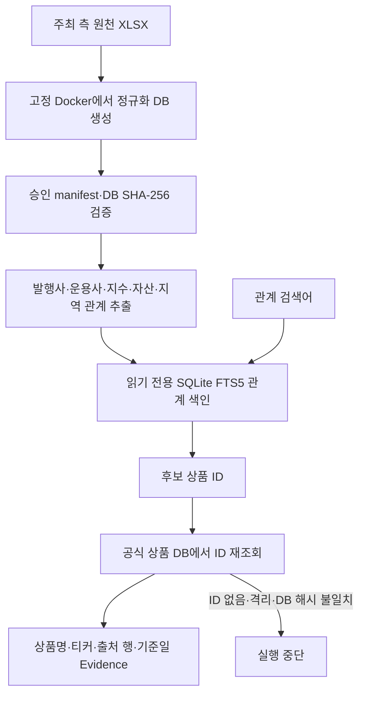

# P0-6 제공 데이터 관계 검색 기반 인수인계

작성일: 2026-08-19

기준 코드 commit: `1944f70c987c133f82ced4ec7d5a88c0693be587`

상세 baseline: `evaluation/baselines/p0-6-provided-relation-retrieval-v1.json`

## 0. 한눈에 보기

- 국내채권·국내 ETF·ETN·해외 ETF·ETN의 공식 제공 데이터에서 확인 가능한 관계를 별도 SQLite 색인으로 만드는 기능 구현
- 현재 관계는 발행사·운용사·기초지수·자산유형·투자지역 다섯 종류
- 승인 Docker 환경에서 만든 공식 상품 DB 3개로 실제 관계 58,005개 생성·검증
- 관계 검색이 찾은 상품 ID는 그대로 믿지 않고 공식 상품 DB에서 다시 조회한 경우에만 상품명·티커와 함께 반환
- 각 관계에는 원천 데이터 ID·행 번호·열 이름·기준일·DB 해시가 붙어 있어 어디서 나온 값인지 확인 가능
- GraphDB를 도입하지 않고 SQLite FTS5 키워드 검색으로 시작
- 공모펀드·테마·편입종목·외부 문서 관계는 확인된 출처가 없어 만들지 않음
- 사용자 Agent 답변 경로에는 아직 연결하지 않았으며 HyperCLOVA X·Qwen·임베딩 모델도 호출하지 않음

쉽게 말하면 지금까지는 상품표에서 조건에 맞는 행을 찾았다면, 이번에는 “어느 회사가
발행했는가”, “어느 운용사가 운용하는가”, “어떤 지수를 따르는가”처럼 상품과 다른
대상의 연결을 안전하게 찾을 수 있는 별도 색인을 만든 것임

## 1. 왜 이 기능이 필요한가

기존 정형 검색은 다음 질문에 강함

- 총보수가 0.1% 이하인 미국 주식형 ETF 찾기
- 신용등급 AA- 이상인 국내채권 찾기
- 두 상품의 AUM과 보수 비교하기

하지만 다음 질문은 하나의 숫자 조건만으로 처리하기 어려움

- 미래에셋이 운용하는 국내 ETF·ETN은 무엇인가
- 한국전력공사가 발행한 채권은 무엇인가
- KOSPI200을 기초지수로 사용하는 상품은 무엇인가

이런 질문은 `회사 → 상품`, `지수 → 상품` 관계를 먼저 찾아야 함. 다만 관계 검색기가
상품 ID를 잘못 만들거나 오래된 DB를 보면 잘못된 상품을 답할 수 있으므로, 최종 상품
정보는 반드시 공식 상품 DB에서 다시 확인하도록 설계

## 2. 전체 흐름



중요한 점은 관계 색인이 최종 상품 정보의 정본이 아니라는 것임. 관계 색인은 후보 ID만
찾고, 상품명과 티커는 공식 상품 DB에서 다시 읽음

## 3. 현재 만든 관계

| 관계 유형 | 쉽게 말하면 | 원천 canonical field | 현재 상품군 |
| --- | --- | --- | --- |
| `issued_by` | 이 회사가 발행한 상품 | `issuer` | 국내채권 |
| `managed_by` | 이 운용사가 운용하는 상품 | `manager` | 국내 ETF·ETN |
| `tracks_index` | 이 기초지수를 따르는 상품 | `base_index` | 국내 ETF·ETN |
| `classified_as_asset` | 이 자산유형으로 분류된 상품 | `asset_type` | 국내·해외 ETF·ETN |
| `invests_in_region` | 이 투자지역으로 분류된 상품 | `investment_region` | 국내·해외 ETF·ETN |

### 실제 관계 수

| 구분 | 관계 수 |
| --- | ---: |
| 국내채권 | 41,476 |
| 국내 ETF·ETN | 5,257 |
| 해외 ETF·ETN | 11,272 |
| 합계 | 58,005 |

관계 유형별 수는 다음과 같음

| 관계 유형 | 관계 수 | 서로 다른 대상 수 |
| --- | ---: | ---: |
| 발행사 | 41,476 | 8,018 |
| 운용사 | 1,733 | 96 |
| 기초지수 | 58 | 19 |
| 자산유형 | 7,369 | 14 |
| 투자지역 | 7,369 | 70 |

기초지수 관계가 58개뿐인 이유는 현재 국내 ETP 데이터에서 `base_index`가 유효하게
채워진 상품만 포함했기 때문임. 빈 값이나 품질이 `VALID`가 아닌 값은 관계로 만들지 않음

## 4. 실제 검색 예시

아래 결과는 설명용으로 새로 만든 답이 아니라 2026-08-19 실제 승인 DB와 관계 색인을
조회한 결과임

### 예시 1 — 운용사로 국내 ETP 찾기

검색어: `미래에셋`

관계: `managed_by`

| 순서 | 공식 상품 ID | 공식 DB에서 다시 읽은 상품명 |
| ---: | --- | --- |
| 1 | `KR70000D0009` | 미래에셋 TIGER NVDA-UST커버드콜증권상장지수투자신탁(채권혼합-파생재간접형)(합성) |
| 2 | `KR70001S0001` | 미래에셋 TIGER 26-04 회사채(A+이상)액티브증권상장지수투자신탁(채권) |
| 3 | `KR70008S0004` | 미래에셋 TIGER 미국배당다우존스타겟데일리커버드콜증권상장지수투자신탁(주식) |

세 관계의 기준일은 2026-06-15이며 원천 열은 `cu_fund_mgmt_co`

### 예시 2 — 발행사로 국내채권 찾기

검색어: `한국전력공사`

관계: `issued_by`

| 순서 | 공식 상품 ID | 상품명 | 원천 행 |
| ---: | --- | --- | ---: |
| 1 | `KR350101G355` | 한국전력공사 843 | 3,848 |
| 2 | `KR350101G488` | 한국전력공사 894 | 3,849 |
| 3 | `KR350101G7B6` | 한국전력공사채권 921 | 3,850 |

세 관계의 원천 대상 표기는 `한국전력공사(주)`, 기준일은 2026-07-11, 원천 열은
`PD_PBCM`

## 5. 무엇을 검증하는가

관계 검색 전에 다음을 검사

1. 상품 DB가 주최 측 원천 해시와 승인된 DB 해시에 정확히 일치하는지 확인
2. 관계 색인이 build 당시의 상품 DB 3개와 같은 해시를 가리키는지 확인
3. 관계 행 수와 전체 논리 관계 SHA-256이 manifest와 같은지 확인
4. 관계 ID·대상 ID가 서버 규칙으로 다시 계산한 값과 같은지 확인
5. FTS 검색 행이 실제 관계 행과 정확히 같은지 확인
6. SQLite sidecar가 없고 `quick_check`를 통과하는지 확인
7. 검색된 상품 ID가 공식 상품 DB에 존재하고 격리 상품이 아닌지 재확인

하나라도 다르면 일부 결과만 조용히 반환하지 않고 전체 요청을 실패 처리하는
`fail-closed` 방식

## 6. Evidence에 포함되는 정보

관계 검색 결과 하나에는 다음 정보가 포함됨

- 관계 ID와 관계 유형
- 대상 ID·종류·표기
- 상품군·상품 ID
- 공식 DB에서 다시 읽은 상품명·티커
- 관계를 만든 canonical field
- 원천 데이터 ID·행 번호·열 이름
- 기준일
- 원천 상품 DB SHA-256
- 전체 승인 manifest SHA-256
- 관계 검색 점수

따라서 나중에 답변이 “한국전력공사가 발행한 채권”이라고 말하면 어떤 원천 행과 열을
사용했는지 다시 확인 가능

## 7. 실행 방법

개발 환경을 설치한 뒤 `finance_agent/`에서 실행

### 관계 색인 생성

```bash
finance-relations build \
  --database-dir <승인된_DB_디렉토리> \
  --output-database <새로운_relations.sqlite3>
```

DB 디렉토리에는 다음 승인 파일이 필요

- `bond.sqlite3`
- `domestic_etp.sqlite3`
- `overseas_etp.sqlite3`

출력 파일이 이미 있으면 덮어쓰지 않고 실패

### 검색

```bash
finance-relations search \
  --index <relations.sqlite3> \
  --database-dir <승인된_DB_디렉토리> \
  --query 미래에셋 \
  --relation-type managed_by \
  --top-k 3
```

### 계약 schema 확인

```bash
finance-relations schema --kind request
finance-relations schema --kind response
finance-relations schema --kind manifest
```

## 8. 중요한 Docker 재현 규칙

실험 중 다음 사실을 확인

- conda 개발 환경: Python 3.12.13, SQLite 3.53.4
- 승인 Backend Docker: Python 3.12.13, SQLite 3.40.1
- 같은 원천 XLSX와 같은 Python 코드로 만들어도 SQLite 버전이 다르면 DB 파일의 바이트
  SHA-256이 달라질 수 있음
- conda에서 만든 DB는 논리 행과 파일 크기가 같아도 승인 byte hash와 달라 안전하게 거부됨
- 고정 Docker 이미지에서 다시 만든 네 DB는 승인 크기와 SHA-256이 모두 정확히 일치

따라서 제출·평가용 승인 DB는 conda에서 직접 만들지 않고 반드시 고정 Docker 환경에서
생성해야 함. conda DB는 개발용으로만 사용할 수 있으며 승인 release 근거로 사용하면 안 됨

## 9. 실제 성능 기준선

연구실 서버 CPU 순차 실행 결과

| 항목 | 결과 |
| --- | ---: |
| 관계 색인 생성 | 3.71초 |
| 관계 색인 크기 | 32,022,528 bytes |
| 생성 최대 RSS | 267,520 KB |
| 최초 검색·전체 검증 | 약 2,400 ms |
| 같은 프로세스 warm 검색 p50 | 4.846 ms |
| 같은 프로세스 warm 검색 p95 | 5.960 ms |

최초 2.4초에는 관계 색인 전체 검증, 승인 상품 DB 해시 확인, 상품 identity 최초 적재가
포함됨. warm 수치는 네 공개 예시를 각각 25회, 총 100회 순차 실행한 결과

이 수치는 NCP 동시성·장시간 운영·HCLX 호출 시간을 뜻하지 않음

## 10. 테스트 결과

| 범위 | 결과 |
| --- | ---: |
| P0-6 관계 전용 계약 | 14 passed |
| Agent Core 전체 | 1,305 passed, 2 skipped |
| Ruff | 통과 |
| 실제 승인 관계 | 58,005개 생성 |
| 실제 공개 smoke | 4/4 `found` |

skip 2건은 기존 조건부 검사

- 로컬 비공개 blind key가 없으면 skip
- Stage 2 승인 DB 환경변수가 없으면 skip

## 11. 현재 하지 않는 것

### 공모펀드 관계

공모펀드는 주최 측 데이터 정정과 팀 승인 전까지 잠금 상태. relation build와 search 모두
명시적으로 거부

### 테마·편입종목 관계

현재 주최 측 데이터에는 검증 가능한 테마·편입종목 관계 원천이 없음. 이름에서 추측해
관계를 만들지 않음

### 외부 문서 관계

P0-5 반입 계약은 있으나 실제 승인 외부 corpus가 0건이므로 외부 문서에서 관계를
추출하지 않음

### 의미 검색·번역

현재 FTS5 키워드 검색이므로 다음 표현을 자동으로 같은 뜻으로 보지 않음

- `미래에셋` ↔ `미래에셋자산운용`
- `미국` ↔ `United States of America`
- `S&P 500` ↔ 원천에 적힌 다른 지수 표기

동의어·번역 alias는 금융 도메인 검수 없이 임의 추가하지 않음. Schema Dense는 필드
의미 연결용이므로 상품 관계 값의 alias 문제와 구분해야 함

### 사용자 답변 연결

지금은 독립 검색 도구와 검증 계약만 완성. Intent Router·QueryPlan·Answer Verifier에는
아직 relation 연산을 추가하지 않았으므로 사용자 질문이 자동으로 이 경로를 타지 않음

## 12. 데이터 해석 시 주의사항

관계는 공식 데이터 값을 충실히 옮긴 것이지 금융적으로 올바르다는 별도 판정을 마친
것이 아님. 예를 들어 상품명과 투자지역 표기가 직관적으로 어색해 보여도 검색기가
임의 수정하지 않음

금융 도메인 담당자에게 다음 검토 요청 필요

1. 운용사 표기 96개의 동의어·법인명 정리 필요 여부
2. 투자지역 70개의 한글·영문 중복과 의미 차이
3. 자산유형 14개의 한글·영문 중복과 분류 기준
4. 기초지수 유효 관계가 58건뿐인 원인과 원천 결측 의미
5. 상품명과 관계 값이 직관적으로 충돌하는 사례의 원천 해석

검토 결과는 원천 값을 덮어쓰는 방식보다 별도 승인 alias·정정 layer로 관리하는 것이 안전

## 13. 파일 위치

| 파일 | 역할 |
| --- | --- |
| `retrieval/relations.py` | 관계 모델·색인 생성·검증·검색·공식 ID 재조회 |
| `retrieval/relation_cli.py` | build·manifest·search·schema CLI |
| `tests/test_relation_retrieval.py` | 변조·드리프트·재조회·잠금 회귀 |
| `evaluation/protocols/p0-6-provided-relation-retrieval-v1.protocol.json` | 평가 전 고정한 검증 계약 |
| `evaluation/baselines/p0-6-provided-relation-retrieval-v1.json` | 실제 관계 수·해시·성능·한계 |

관계 DB 자체는 생성 artifact이므로 Git에 넣지 않음. 향후 제출 후보가 되면
`AgentReleaseManifest`가 정확한 관계 DB SHA-256을 고정해야 함

## 14. 다음 권장 작업

1. P0-5 실제 외부 문서와 P0-9 private blind 자산이 준비됐는지 계속 확인
2. 금융 도메인 담당자가 관계 값·alias·이상 사례 검토
3. P0-7 Typed QueryPlan에 허용된 relation 연산만 추가
4. relation 결과마다 현재 Evidence DTO를 유지하고 Claim Verifier와 연결
5. 관계 검색이 실패하거나 근거가 없으면 기존 정형 검색으로 몰래 바꾸지 말고 역질문·미지원
6. Agent 연결 뒤 독립 relation 질문 세트로 오수락·정답 ID·근거·latency 평가
7. 검증된 경우에만 관계 색인 hash를 `AgentReleaseManifest`와 Docker release에 연결

현재 단계는 “관계 검색의 안전한 엔진과 실제 데이터 기준선”까지이며, “관계 질문에
답하는 완성 Agent”는 P0-7 이후 단계임
