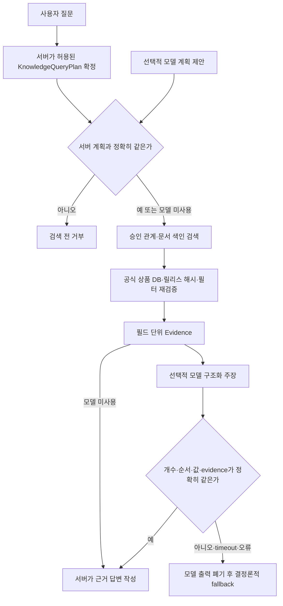

# P0-7 관계·문서 계획과 주장 검증 인수인계

작성일: 2026-08-20

기준 코드 commit: `ae1f7e539e2b09a1eef0739a3325050995770149`

상세 baseline: `evaluation/baselines/p0-7-knowledge-claim-contract-v1.json`

## 0. 한눈에 보기

- P0-6에서 만든 발행사·운용사·기초지수·자산유형·투자지역 검색을 안전한 내부 Agent 경로에 연결
- 관계 검색과 문서 검색에 허용된 조건만 담을 수 있는 별도 `KnowledgeQueryPlan` 추가
- 서버가 확정한 계획과 모델이 제안한 계획이 한 글자라도 다르면 DB 검색 전에 거부
- 모델이 작성할 수 있는 내용을 상품·관계·문서 근거의 구조화된 복사본으로 제한
- 상품명·상품 ID·관계 값·문서 발췌·evidence ID가 검색 근거와 정확히 같을 때만 통과
- 모델 timeout·오류·허위 상품·문서에 없는 문장이 발견되면 모델 출력을 버리고 서버가 근거로 만든 답변으로 교체
- 승인 관계 색인과 공식 상품 DB를 사용한 대표 질의 4개 모두 기대한 상품 3개씩 반환
- 전용 계약 22/22, Agent Core 전체 1,327 passed·2 skipped, Ruff 통과
- HyperCLOVA X와 로컬 Qwen은 호출하지 않았으며 실제 외부 문서 corpus도 사용하지 않음
- 기존 사용자 자연어 Router와 공개 `GET /answer`에는 아직 연결하지 않음
- 공개 활성화와 Docker release 고정은 P0-10에서 별도 검증 후 수행

쉽게 말하면 P0-6이 “관계를 찾는 검색 엔진”을 만들었다면, P0-7은 그 엔진 앞뒤에
허용 작업표와 검수자를 둔 단계임. 모델이 검색 조건이나 답의 상품을 마음대로 바꾸면
그 답을 사용하지 않음

## 1. 왜 이 단계가 필요한가

관계 검색기를 그대로 모델에 연결하면 다음 문제가 생길 수 있음

- 사용자가 운용사를 물었는데 모델이 발행사 관계로 바꿈
- 요청하지 않은 상품군이나 문서를 몰래 추가
- 검색은 3건인데 답변에서 네 번째 상품을 만들어 냄
- 문서에 없는 수익률·전망 문장을 추가
- 오래되거나 바뀐 SQLite 색인을 그대로 사용

따라서 모델을 “정답을 자유롭게 쓰는 사람”으로 두지 않고, 서버가 허용한 계획과
검색 근거를 구조화된 형식으로 다시 확인하는 보조 역할로 제한

## 2. 질문이 답이 되는 내부 흐름



현재 CLI 실행은 모델을 사용하지 않고 `서버 계획 → 검색 → 검증 → 결정론적 답변`
경로를 실행. 향후 HyperCLOVA X를 붙여도 검색 권한과 최종 사실은 서버가 계속 소유

## 3. `KnowledgeQueryPlan`이 허용하는 것

기존 정형 상품 검색용 QueryPlan을 무리하게 바꾸지 않고 관계·문서 전용 계획을 별도로
추가. 공개 API 호환성을 깨지 않으면서 P0-7을 독립 검증하기 위한 선택

### 관계 검색

- 연산: `relation_search`
- 한 요청에 관계 종류 하나만 허용
- 최대 20건
- 상품군과 관계 종류의 실제 조합만 허용
- 공모펀드 관계는 출처 계약이 없어 거부
- 임의 집계·수치 주장·알 수 없는 추가 필드는 거부

현재 조합은 다음과 같음

| 관계 | 뜻 | 허용 상품군 |
| --- | --- | --- |
| `issued_by` | 이 발행사가 발행한 상품 | 국내채권 |
| `managed_by` | 이 운용사가 운용하는 상품 | 국내 ETF·ETN |
| `tracks_index` | 이 기초지수를 따르는 상품 | 국내 ETF·ETN |
| `classified_as_asset` | 이 자산유형으로 분류된 상품 | 국내·해외 ETF·ETN |
| `invests_in_region` | 이 투자지역으로 분류된 상품 | 국내·해외 ETF·ETN |

### 문서 검색

- 연산: `document_search`
- 허용 출처: 주최 측 제공 문서 또는 팀 승인 외부 문서
- 문서 ID·기준일·승인 metadata 필터와 최대 20건만 허용
- 임의 URL 다운로드나 승인되지 않은 문서 접근은 하지 않음

실제 승인 외부 문서가 아직 0건이므로 이 경로는 합성 문서로 안전 계약만 검증한 상태

## 4. 서버 계획과 모델 계획의 권한 차이

최종 실행 권한은 서버에 있음

1. 서버가 질문에서 허용 가능한 계획을 확정
2. 복잡한 질문에서 모델 제안을 사용할 수 있으나 전체 계획이 서버 계획과 정확히 같아야 함
3. `query`, 관계 종류, 상품군, 문서, 날짜, `top_k` 중 하나라도 바뀌면 검색 전에 실패
4. 통과한 계획의 SHA-256과 연산 종류를 권한 영수증으로 보존

현재 P0-7은 이미 확정된 계획을 실행하는 내부 계약까지 구현. 자연어 질문을 이 계획으로
연결하는 공개 Router 작업은 아직 하지 않았으므로 사용자가 `GET /answer`로 관계 질문을
보내도 자동으로 이 경로를 타지 않음

## 5. 모델이 말할 수 있는 범위

모델 초안은 자유 문장이 아니라 다음 필드만 가진 JSON 목록

### 관계 주장

- 결과 순번과 evidence ID
- 관계 종류
- 상품군·상품 ID·상품명·티커
- 관계 대상 ID와 원천 표기

### 문서 주장

- 결과 순번과 evidence ID
- 문서 ID·제목
- 검색된 원문 발췌

다음 필드는 의도적으로 없음

- 자유 요약문
- 임의 숫자
- 수익률 전망
- 추천 문구
- 검색 근거에 없는 상품

모델 초안이 통과해도 최종 사용자 문장은 모델 문장을 그대로 노출하지 않고 서버가
검증된 evidence로 다시 작성. 자연스러운 표현보다 사실 안전성을 우선한 P0 기준선

## 6. Claim Verifier와 fallback

Claim Verifier는 모델 초안을 검색 evidence와 순서대로 비교

- 주장 수가 검색 결과 수와 같은지
- 관계 주장과 문서 주장이 섞이지 않았는지
- `result_1`, `result_2` 순서가 같은지
- 상품 ID·이름·관계 값 또는 문서 발췌가 정확히 같은지
- 각 주장의 evidence ID가 실제 근거를 가리키는지

하나라도 다르면 일부만 살리지 않고 모델 초안 전체를 버림. 그 뒤 서버가 이미 검증한
근거로 만든 결정론적 답변을 반환

검색 결과가 0건이면 모델을 호출하지 않고 “승인 데이터에서 찾지 못했다”는 안전 답변을
바로 반환. 근거가 없을 때 모델이 빈칸을 추측으로 채울 기회를 주지 않음

## 7. 색인과 릴리스 안전장치

P0-7 내부 릴리스 후보는 다음 값을 고정

- 관계 또는 문서 SQLite 파일 SHA-256
- 전체 승인 데이터 manifest SHA-256
- 논리 관계 집합 SHA-256
- 외부 문서가 있을 경우 corpus manifest와 파일 목록 SHA-256

실행할 때 다음도 검사

- 심볼릭 링크가 아닌 일반 파일인지 확인
- hard link가 하나뿐이고 쓰기 권한이 없는지 확인
- 512MiB 이하이며 `-wal`, `-shm`, `-journal` 파일이 없는지 확인
- 실행 전후 파일 identity와 SHA-256이 같은지 확인
- 관계 색인의 manifest와 공식 상품 DB가 build 당시 값과 같은지 확인
- 관계 결과의 상품 ID가 공식 상품 DB에 실제 존재하고 격리 상품이 아닌지 재확인
- 문서 SQLite가 `quick_check`와 필수 테이블 검사를 통과하는지 확인

이 릴리스는 상태값 자체가 `internal_verified_not_agent_release_activated`임. 운영용
`AgentReleaseManifest`에 아직 들어가지 않으므로 현재 검증 결과만으로 제출 기능을 켜면 안 됨

## 8. 실제 승인 데이터 확인

P0-6에서 만든 동일 관계 색인과 승인 상품 DB 3개를 사용해 새 P0-7 CLI 전체 경로를 실행

| 질문 요약 | 관계 | 결과 | 상위 공식 상품 ID |
| --- | --- | ---: | --- |
| 미래에셋이 운용하는 국내 ETP | `managed_by` | 3건 | `KR70000D0009`, `KR70001S0001`, `KR70008S0004` |
| 미국에 투자하는 국내 ETP | `invests_in_region` | 3건 | `KR70000J0003`, `KR70004G0002`, `KR70005A0007` |
| KOSPI200을 따르는 국내 ETP | `tracks_index` | 3건 | `KR7407160001`, `KR7407170000`, `KR7427110002` |
| 한국전력공사가 발행한 채권 | `issued_by` | 3건 | `KR350101G355`, `KR350101G488`, `KR350101G7B6` |

네 실행 모두 다음을 만족

- `status=found`
- `authority.status=authorized_exact_match`
- `answer.mode=deterministic`
- 내부 관계 릴리스 계약 SHA-256
  `3607d1b7dfbb9f446db808ee7b861899ab3e6b70c98fadff3c1c06f49fdd5cb1`
- 결과마다 고유 evidence ID 보존

이 4개는 P0-6에서 공개한 같은 smoke 질문이므로 독립 blind 성능으로 해석하면 안 됨

## 9. 테스트 결과

| 범위 | 결과 |
| --- | ---: |
| P0-7 전용 계약 | 22 passed |
| 관련 관계·문서·릴리스 회귀 | 82 passed |
| Agent Core 전체 | 1,327 passed, 2 skipped |
| 실제 승인 관계 CLI smoke | 4/4 |
| Ruff lint | 통과 |
| P0-7 변경 파일 format 검사 | 통과 |
| `git diff --check` | 통과 |

전용 22개에는 허용 조합, canonical 순서, 추가 필드 거부, exact 계획 gate, 정상 주장,
허위 상품, 허위 문서 발췌, provider 오류, not-found 무호출, 색인 권한·해시 drift,
빈 릴리스 거부, 자유 수치 필드 부재, CLI schema·중복 JSON key 거부가 포함

skip 2건은 기존 조건부 검사

- 로컬 비공개 blind key가 없으면 skip
- `FINANCE_STAGE2_DATABASE_DIR`가 없으면 승인 DB 지문 재계산을 skip

## 10. 재현 방법

개발 환경 설치 후 `finance_agent/`에서 실행

### 계약 schema 확인

```bash
python -m finance_agent_core.agent.knowledge_cli schema --kind plan
python -m finance_agent_core.agent.knowledge_cli schema --kind release
python -m finance_agent_core.agent.knowledge_cli schema --kind result
python -m finance_agent_core.agent.knowledge_cli schema --kind answer-draft
```

패키지를 다시 설치했다면 같은 명령을 `finance-knowledge-agent`로 실행 가능

### 관계 계획 실행

```bash
python -m finance_agent_core.agent.knowledge_cli execute \
  --plan <server-owned-plan.json> \
  --release <internal-knowledge-release.json> \
  --relation-index <relations.sqlite3> \
  --database-dir <approved-db-dir>
```

`approved-db-dir`에는 `bond.sqlite3`, `domestic_etp.sqlite3`,
`overseas_etp.sqlite3`가 필요

### 테스트

```bash
python -m pytest \
  packages/finance_agent_core/tests/test_knowledge_agent.py \
  -q

python -m pytest packages/finance_agent_core/tests -q
python -m ruff check packages/finance_agent_core/src packages/finance_agent_core/tests
```

## 11. 구현 파일

| 파일 | 역할 |
| --- | --- |
| `contracts/knowledge.py` | 관계·문서 전용 Typed Plan과 exact authority gate |
| `agent/knowledge_service.py` | 릴리스 검증, 관계·문서 검색, evidence 범위 검사, 답변 조립 |
| `answering/claims.py` | 구조화 주장 schema, Claim Verifier, 결정론적 fallback |
| `agent/knowledge_cli.py` | schema 출력과 내부 계획 재현 실행 |
| `release.py` | 관계·문서 내부 릴리스 artifact 계약 |
| `retrieval/sqlite_fts.py` | 문서 검색을 SQLite 읽기 전용 연결로 강제 |
| `tests/test_knowledge_agent.py` | 허용·변조·환각·오류·무호출 회귀 22개 |
| `evaluation/protocols/p0-7-knowledge-claim-contract-v1.protocol.json` | 완료 조건과 금지 주장 |
| `evaluation/baselines/p0-7-knowledge-claim-contract-v1.json` | 코드·릴리스·테스트·smoke 수치와 해시 |

## 12. 아직 하지 않은 것

### 공개 Router와 Backend 연결

기존 사용자 질문을 `KnowledgeQueryPlan`으로 바꾸는 공개 라우팅과 `GET /answer` 응답 연결은
하지 않음. 현재는 서버가 이미 확정한 JSON 계획을 내부 CLI로 실행하는 단계

### 실제 HyperCLOVA X 주장 생성

HyperCLOVA X 크레딧·최종 모델 설정·운영 조건을 고정한 뒤 structured claim provider를
연결해야 함. 다만 모델을 바꿔도 exact Plan gate와 Claim Verifier는 그대로 사용 가능

### 실제 외부 문서 RAG

P0-5 반입 코드는 준비됐지만 승인된 실제 corpus가 0건. 출처·권한 검수가 끝난 문서와
별도 검색 질문·gold가 생기기 전에는 문서 설명 성능을 주장하지 않음

### 관계 값 금융 검수

운용사·지역·자산·기초지수 표기의 동의어와 이상 사례는 금융 도메인 담당자 검토가 필요.
원천 값을 직접 수정하지 않고 승인 alias layer로 관리해야 함

### 독립 blind

P0-7 구현자가 보지 않은 관계·문서 질문과 정답으로 오수락·상품 ID·근거·fallback을
최초 1회 평가하지 않음. 실제 P0-9 자산이 확보되기 전까지 22/22를 일반화 성능으로
표현하지 않음

## 13. 다음 담당 작업

### AI Agent 담당

1. 이 branch를 P0-6 뒤에 순서대로 검토·병합
2. P0-9 private blind 자산이 오면 수정 전에 최초 1회 실행
3. P0-10에서 `KnowledgeRetrievalRelease`를 공개 `AgentReleaseManifest`에 포함
4. clean Docker image에서 Router·Backend 연결 후 relation 질문 HTTP smoke 수행
5. 실제 HyperCLOVA X claim provider를 붙이고 환각·timeout·비용을 측정

### Backend 담당

1. 공개 연결 전 `KnowledgeQueryPlan`, `KnowledgeAgentResult` schema 검토
2. 기존 다섯 문자열 공식 응답을 깨지 않는 adapter 설계
3. P0-7 오류를 무조건 200으로 숨기지 말고 기존 P0-8 retryable 정책과 맞춤
4. Audit에 plan SHA, release contract SHA, evidence ID, fallback mode를 기록

### 금융 도메인 담당

1. P0-6의 운용사 96개·지역 70개·자산유형 14개·기초지수 19개 표기 검토
2. 동의어·한영 alias를 추가할 경우 원천 값·승인 alias·검토자를 구분해 기록
3. 실제 외부 문서의 출처·사용 권한·기준일을 P0-5 양식으로 승인
4. 개발자가 보지 않은 관계·문서 blind 질문과 비공개 gold 준비

## 14. 병합 순서

이 작업은 stacked branch 구조

```text
PR #11 기반 haeyeongcho
  → P0-5 외부 문서 반입
  → P0-6 제공 관계 검색
  → P0-7 관계·문서 계획과 주장 검증
```

P0-7만 먼저 병합하면 P0-5·P0-6 모듈이 없어 동작하지 않음. 반드시 앞 branch를 먼저
병합하거나 P0-7 PR이 앞 commit을 포함한 상태인지 확인

현재 완료 범위는 “승인 관계·문서 근거를 임의 변경하지 못하는 내부 Agent 계약”까지임.
“사용자 관계 질문에 공개 API가 답하는 제출 후보”는 P0-10 연결·릴리스 검증 뒤에만 완료로
표시해야 함
