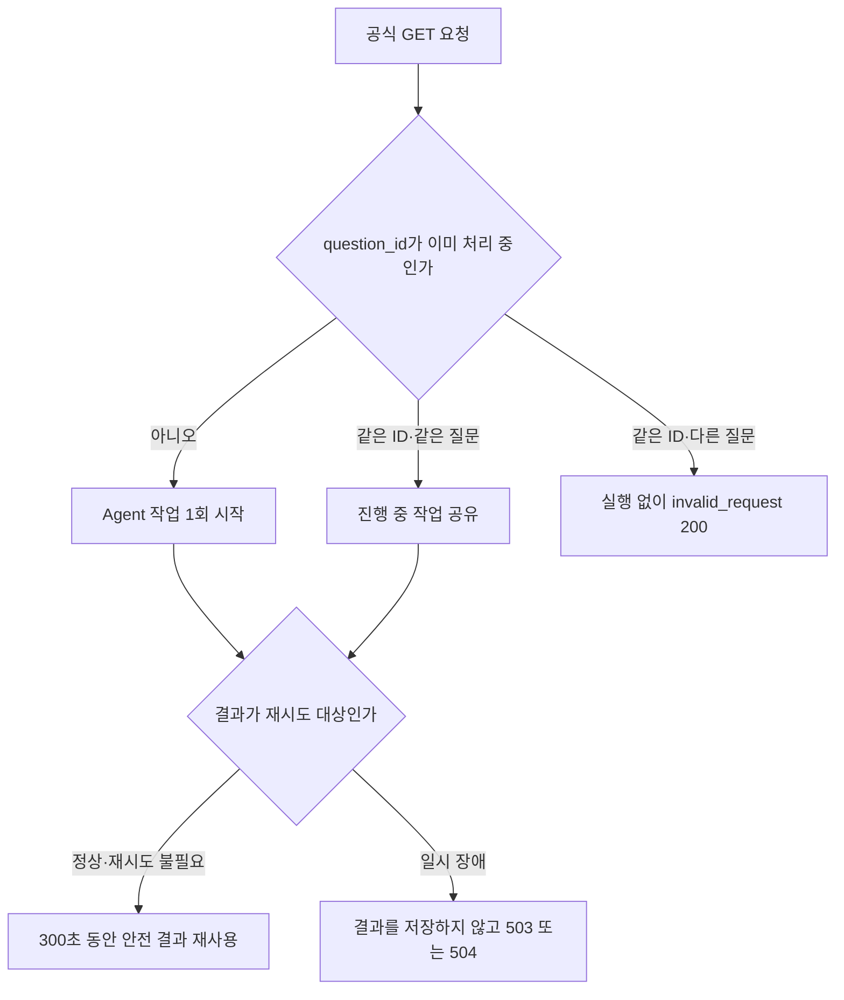

# P0-8 평가기 timeout·5xx 재시도 계약 인수인계

작성일: 2026-08-19
기준 코드 commit: `2ca044b0dfa318d32c5b04d4205e059024421f43`
상세 baseline: `evaluation/baselines/retry-contract-p0-8-v1.json`

## 0. 한눈에 보기

- 주최 측 평가기는 한 요청을 최대 300초 기다리고 timeout 또는 HTTP 5xx에서 최대 2회 다시 시도한다는 팀 로드맵을 반영
- 정상 답변·검색 결과 없음·역질문·미지원은 기존처럼 HTTP 200 유지
- 다시 시도하면 회복될 수 있는 provider·dataset·과부하 장애만 HTTP 503 반환
- 전체 요청 시간이 끝난 경우 HTTP 504 반환
- 200·503·504 모두 공식 응답의 다섯 문자열 필드는 동일하게 유지
- 같은 `question_id`와 같은 질문이 겹치면 Agent를 한 번만 실행
- 이미 안전하게 끝난 동일 요청이 300초 안에 다시 오면 저장된 결과를 재사용
- 503·504처럼 다시 실행해야 하는 결과는 저장하지 않음
- 서버가 HyperCLOVA X를 임의로 재호출하지 않고 외부 평가기의 재시도만 수용
- Agent Core 1,272개, Backend 320개, Docker 정상·503·504 시나리오 통과

## 1. 왜 바꿨는가

기존 공식 `GET /answer`는 내부 장애와 timeout도 HTTP 200으로 바꿨다. 이 방식은 응답
본문을 항상 안전하게 유지한다는 장점이 있지만, 평가기 입장에서는 정상적인 “답변 불가”와
잠시 뒤 회복될 수 있는 서버 장애를 구분할 수 없다

최신 팀 로드맵에는 다음 운영 조건이 기록되어 있다

- 문항당 대기 상한 300초
- timeout 또는 HTTP 5xx에서 최대 2회 재시도
- 미지원·역질문은 HTTP 200 유지
- 일시적인 인프라 장애만 HTTP 503/504 사용
- 같은 요청을 다시 받아도 Agent 실행·Audit·비용이 불필요하게 중복되지 않아야 함

따라서 P0-8은 답변 정확도를 바꾸는 기능이 아니라 평가 서버와 우리 서버 사이의 장애
신호와 중복 실행 규칙을 명확히 한 작업이다

## 2. 변경 전과 변경 후

| 상황 | 변경 전 | 변경 후 | 평가기 동작 |
| --- | ---: | ---: | --- |
| 정상 답변 | 200 | 200 | 완료 |
| 검색 결과 없음 | 200 | 200 | 완료 |
| 조건이 모호해 역질문 | 200 | 200 | 완료 |
| 지원하지 않는 질문 | 200 | 200 | 완료 |
| 잘못된 query parameter | 200 | 200 | 완료 |
| 재시도해도 회복되지 않는 내부 오류 | 200 | 200 | 완료 |
| 일시적인 provider·dataset·release 장애 | 200 | 503 | 최대 2회 재시도 가능 |
| 동시 실행 자리가 없는 과부하 | 200 | 503 | 최대 2회 재시도 가능 |
| 전체 요청 시간 초과 | 200 | 504 | 최대 2회 재시도 가능 |

중요한 점은 503·504에서도 JSON body가 사라지지 않는다는 것이다. 다음 다섯 필드는
항상 존재하고 모두 문자열이다

- `question_id`
- `question`
- `retrieved_context`
- `think_trace`
- `answer`

## 3. 같은 요청을 한 번만 실행하는 방법



내부 저장소에는 원문 `question_id`와 질문을 넣지 않는다

- 요청 key: `SHA-256(question_id)`
- 입력 일치 확인: `SHA-256(question)`
- 완료 결과 보관 시간: 300초
- 최대 완료 결과 수: 2,048개
- 실행 중 요청 수: 기존 프로세스 admission control 상한 사용

겹친 요청은 먼저 시작한 worker의 결과를 함께 기다린다. 첫 HTTP 연결이 취소되더라도
하나의 공유 작업은 내부 deadline까지 유지할 수 있으므로, 외부 재시도가 들어와도 같은
provider 호출과 SQL을 다시 시작하지 않는다

완료 결과 처리 규칙은 다음과 같다

- HTTP 200으로 끝날 안전 결과: 재사용 가능
- 내부 오류라도 `retryable=false`: 공식 HTTP 200으로 변환 후 재사용 가능
- `retryable=true` provider·dataset 실패: 재사용하지 않음
- outer timeout으로 아직 worker가 정리 중인 경우: 새 worker를 겹쳐 만들지 않고 기존 작업 공유
- 같은 ID에 다른 질문: Agent·SQL·HCLX를 실행하지 않고 `invalid_request`

## 4. HTTP 상태를 정하는 기준

단순히 내부 status가 `error`라는 이유만으로 5xx를 보내지 않는다. 내부
`BackendError.retryable` 값과 timeout 여부를 함께 본다

| 내부 상태 | 공식 GET HTTP | 설명 |
| --- | ---: | --- |
| `status != error` | 200 | 정상·제어 응답 |
| `error.retryable=false` | 200 | 다시 실행해도 회복되지 않는 안전 오류 |
| `error.retryable=true`, 내부 500·502·503 | 503 | 평가기 재시도 신호로 통합 |
| `error.retryable=true`, 내부 504 | 504 | timeout 신호 유지 |
| FastAPI 바깥쪽 deadline 초과 | 504 | `control_code=request_timeout` |
| admission 거절 | 503 | `control_code=request_overloaded` |

내부 `POST /answer` 계약은 바꾸지 않았다. POST는 기존처럼 상세 Backend DTO와
422·500·502·503·504를 그대로 사용한다

## 5. 시간 예산

- 평가기 상한: 300초
- 공식 GET 기본 outer deadline: 270초
- 남겨 둔 여유: 30초
- HyperCLOVA X 기본 timeout: 45초
- 동시 Agent 작업 기본 상한: 2개
- evaluation·production worker: 현재 1개로 제한

270초는 HCLX가 항상 270초를 써도 된다는 뜻이 아니다. 실제 HCLX call timeout과 SQL·
검증 단계 예산은 더 짧게 유지하고, NCP 실측 뒤 outer deadline도 줄일 수 있다. 30초는
네트워크 전달·직렬화·종료 여유를 남긴 운영 상한이다

## 6. Audit에서 확인하는 방법

각 HTTP 시도는 서로 다른 invocation으로 기록한다. 하지만 안전 결과 replay에서는 두 번째
HTTP invocation에 Agent 단계가 다시 생기지 않는다

정상 결과를 두 번 요청한 Docker Audit 결과

- HTTP invocation: 2개
- Agent 실행: 1개
- 두 번째 invocation reason: `idempotent_result_replayed`
- 두 번째 invocation의 SQL·Oracle·HCLX 단계: 없음

일시적인 dataset 장애를 두 번 요청한 Docker Audit 결과

- HTTP status: 503, 503
- HTTP invocation: 2개
- Agent 실행 시도: 2개
- `retryable_adapter_failure`: 2개
- `idempotent_result_replayed`: 0개

즉 성공 결과의 네트워크 재전송은 비용을 중복시키지 않고, 일시 장애의 다음 순차 시도는
실제로 다시 실행할 수 있다

## 7. 구현 파일

| 파일 | 역할 |
| --- | --- |
| `fastapi_backend/app/request_execution.py` | single-flight, SHA-256 identity, 300초 bounded replay cache |
| `fastapi_backend/app/routes/answer.py` | 공식 GET 200·503·504 분류와 replay Audit |
| `fastapi_backend/app/main.py` | application별 request coordinator 소유 |
| `fastapi_backend/app/dependencies.py` | route에 coordinator 전달 |
| `fastapi_backend/app/config.py` | 공식 outer deadline 기본 270초·300초 미만 검증 |
| `finance_agent_core/release.py` | release manifest에 270초 runtime control 고정 |
| `fastapi_backend/tests/test_request_execution.py` | 동시 join·replay·일시 실패·ID 충돌 단위 테스트 |
| `fastapi_backend/tests/test_answer.py` | 공식 HTTP status와 재실행 여부 route 테스트 |
| `fastapi_backend/tests/test_audit_runtime.py` | 두 transport invocation·한 Agent 실행 Audit 테스트 |

## 8. 검증 결과

### Python 회귀

| 범위 | 결과 |
| --- | ---: |
| P0-8 대상 retry·route·Audit·release | 98 passed |
| FastAPI Backend 전체 | 320 passed |
| Agent Core 전체 | 1,272 passed, 2 skipped |
| Ruff | 통과 |
| `git diff --check` | 통과 |

Agent Core skip 2건은 기존 조건부 검사다

- 로컬 비공개 blind key가 없으면 skip
- 승인 DB 경로 환경변수가 없으면 skip

Backend warning 2건은 기존 multiprocessing fork deprecation이며 P0-8 오류가 아니다

### Docker 회귀

사용 이미지

```text
gaeng3-backend@sha256:fab6ca1315ac276b5c6a98566ff016e4812d061afceba835e40187832995d2c1
```

| 시나리오 | 관측 결과 | 판정 |
| --- | --- | --- |
| 정상 제어 질문 동일 요청 2회 | 200·200, body 동일, Agent 1회, replay event 1개 | 통과 |
| 존재하지 않는 채권 DB 동일 요청 2회 | 503·503, Agent 실행 시도 2회, replay 0 | 통과 |
| outer deadline 0.000001초 | 504, `request_timeout`, 공식 다섯 문자열 | 통과 |

Docker fault는 제출 코드에 숨은 debug endpoint를 넣지 않고, 일회용 컨테이너의 DB 경로와
timeout 환경값만 바꿔 주입했다. 검증 컨테이너 3개는 결과 확인 후 제거했다

## 9. 재현 명령

```bash
cd fastapi_backend

python -m pytest \
  tests/test_request_execution.py \
  tests/test_answer.py \
  tests/test_audit_runtime.py \
  tests/test_release_startup.py \
  -q
```

저장소 루트에서 전체 회귀

```bash
python -m pytest fastapi_backend/tests -q
python -m pytest finance_agent/packages/finance_agent_core/tests -q
python -m ruff check \
  fastapi_backend/app/request_execution.py \
  fastapi_backend/app/routes/answer.py \
  fastapi_backend/app/dependencies.py \
  fastapi_backend/app/main.py
```

Docker 정상 실행 후 같은 요청을 두 번 보내면 두 응답은 200이어야 한다

```bash
curl --get \
  --data-urlencode 'question_id=P08-REPLAY-001' \
  --data-urlencode 'question=안전한 상품을 추천해 주세요.' \
  --write-out '\nHTTP_STATUS=%{http_code}\n' \
  http://127.0.0.1:18001/answer
```

Audit를 켠 환경에서는 두 번째 invocation에 `idempotent_result_replayed`가 있고 SQL·
HCLX 단계가 없는지 확인한다

## 10. 남은 한계와 다음 작업

### 아직 증명하지 않은 것

- 실제 주최 측 evaluator가 300초·최대 2회 규칙으로 우리 서버를 호출한 결과
- 실제 HyperCLOVA X 429·5xx·timeout에서의 NCP latency·token·비용
- NCP Load Balancer가 503·504를 변경하지 않고 전달하는지 여부
- `WEB_CONCURRENCY > 1`에서 프로세스 간 동일 요청 공유
- 평가기 재시도 간격과 동시 재전송 패턴

현재 evaluation·production은 `WEB_CONCURRENCY=1`을 강제하므로 process-local coordinator가
제출 후보 계약과 일치한다. worker 수를 늘리려면 Redis 같은 외부 저장소를 바로 도입하기보다
실제 QPS와 NCP 부하 측정 뒤 프로세스 간 idempotency가 필요한지 먼저 판단해야 한다

### 다음 권장 순서

1. 금융 도메인 담당자가 보관한 P0-9 blind 질문·비공개 gold·봉인 hash 확보
2. 확보 즉시 clean image로 P0-9 최초 1회 실행
3. blind 자산이 아직 없으면 P0-5 승인 외부 문서 manifest와 라이선스 표부터 준비
4. P0-6 관계 테이블·문서 BM25 검색 구현
5. P0-7 relation/document QueryPlan과 Claim Verifier 구현
6. 마지막으로 P0-10 NCP release·공인 IP smoke·rollback drill 수행

P0-8은 “서버가 답을 더 잘 찾는 기능”이 아니라 “장애가 나도 평가기가 올바르게 다시
시도하고, 같은 일을 중복 실행하지 않게 하는 안전장치”로 이해하면 된다
